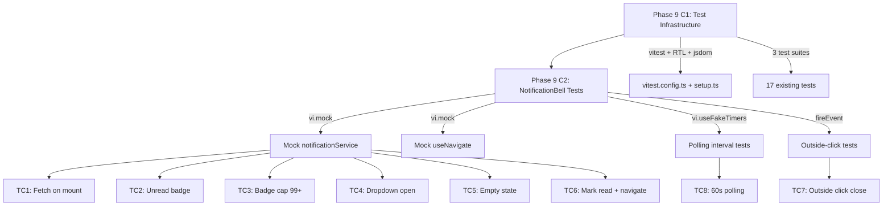
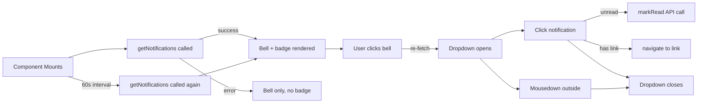
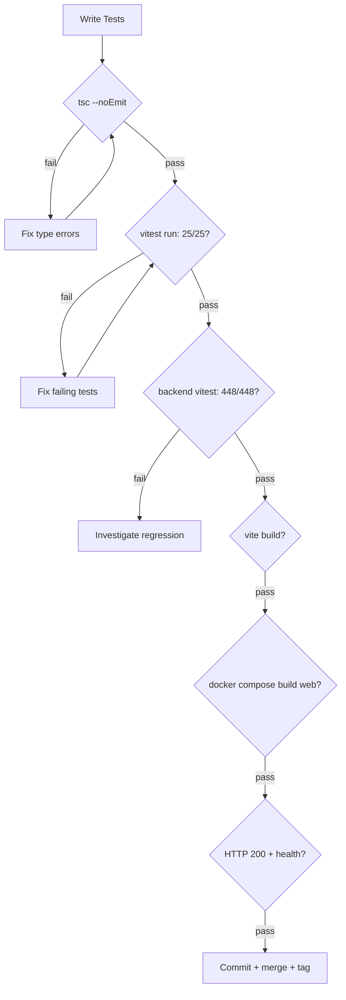

# Phase 9 C2 — NotificationBell Frontend Tests

**Date:** 2026-08-04
**Status:** SPEC READY
**Depends on:** Phase 9 C1 (frontend test infrastructure) — RELEASED
**Branch:** `feat/phase9-c2-notification-bell-tests` (to be created at implementation time)

---

## Problem Statement

NotificationBell.tsx is a 136-line component with polling, dropdown UX, API calls, navigation, and DOM event listeners. It is the most complex untested frontend component. Phase 9 C1 shipped the test infrastructure (vitest + RTL + jsdom + jest-dom) with 17 tests across 3 simpler components. C2 extends that coverage to the highest-risk untested component.

**Current state:**
- NotificationBell is live (mounted in Layout.tsx:181, student-only)
- Backend: 8 passing tests in `phase-e-notifications.test.ts`
- Frontend: **zero tests** for NotificationBell or notificationService

## Goals

1. Write 8 vitest+RTL tests for NotificationBell covering all critical interaction paths
2. Demonstrate mocking patterns for API services and react-router navigation
3. Demonstrate fake timer patterns for polling logic
4. Achieve 100% branch coverage of NotificationBell.tsx conditional logic
5. No production code changes (test-only commit)

## Non-Goals

- No backend changes
- No feature additions (mark-all-read, preferences, admin/lecturer notifications)
- No changes to NotificationBell.tsx source code
- No changes to notificationService.ts
- No integration/E2E tests — unit tests only
- No test coverage for Layout.tsx's conditional rendering of the bell

---

## Scope

### In Scope

| Item | Detail |
|------|--------|
| New test file | `src/__tests__/components/NotificationBell.test.tsx` |
| Test count | 8 test cases |
| Mocking | `notificationService` (vi.mock), `useNavigate` (vi.mock) |
| Timers | `vi.useFakeTimers()` for polling interval |
| DOM events | Outside-click simulation via `fireEvent.mouseDown` |

### Out of Scope

| Item | Reason |
|------|--------|
| Backend notification routes | Already tested (8/8 pass) |
| Layout.tsx bell mounting | Integration concern, not unit test scope |
| notificationService.ts unit tests | Thin wrapper over api.get/put — low value |
| Any `.tsx` source changes | Test-only phase |

### Assumptions

1. `vi.mock('../services/notificationService')` works at the module level (standard vitest pattern)
2. `vi.mock('react-router-dom', ...)` can provide a mock `useNavigate` while preserving other exports
3. jsdom supports `document.addEventListener('mousedown', ...)` for outside-click testing
4. `vi.useFakeTimers()` / `vi.advanceTimersByTime()` works with `setInterval` in useEffect
5. The `crypto.randomUUID()` polyfill in jsdom is available (used in existing tests)

---

## Component Analysis

### NotificationBell.tsx — Testable Behaviors

| Line(s) | Behavior | Test Case |
|----------|----------|-----------|
| 24-32 | Fetch notifications on mount | TC1 |
| 35-39 | Poll every 60s via setInterval | TC8 |
| 82-86 | Show unread badge when count > 0 | TC2 |
| 84 | Cap badge at 99+ when count > 99 | TC3 |
| 52-55 | Toggle dropdown on bell click | TC4 |
| 95-98 | Show "No notifications" empty state | TC5 |
| 57-71 | Mark read + navigate on notification click | TC6 |
| 42-50 | Close dropdown on outside mousedown | TC7 |
| 29-31 | Silently handle API errors | TC8 (implicit) |

### Dependencies to Mock

```
NotificationBell
  ├── notificationService.getNotifications() → { notifications, unreadCount }
  ├── notificationService.markRead(id) → void
  └── react-router-dom.useNavigate() → navigate(path)
```

---

## Test Cases

### TC1: Fetches notifications on mount and renders bell

**Setup:** Mock `getNotifications` returning 2 notifications, unreadCount=2
**Action:** Render component
**Assert:** Bell button with aria-label "Notifications" is in the document; `getNotifications` called once

### TC2: Shows unread count badge

**Setup:** Mock `getNotifications` returning unreadCount=3
**Action:** Render component, wait for fetch
**Assert:** Badge text "3" is visible

### TC3: Caps unread badge at 99+

**Setup:** Mock `getNotifications` returning unreadCount=150
**Action:** Render component, wait for fetch
**Assert:** Badge text "99+" is visible (not "150")

### TC4: Opens dropdown with notification list on bell click

**Setup:** Mock `getNotifications` returning 2 notifications with titles "Submission reviewed" and "NFT approved"
**Action:** Click bell button
**Assert:** Dropdown header "Notifications" visible; both notification titles visible

### TC5: Shows empty state when no notifications

**Setup:** Mock `getNotifications` returning empty array, unreadCount=0
**Action:** Click bell button
**Assert:** "No notifications" text visible

### TC6: Marks notification as read and navigates on click

**Setup:** Mock `getNotifications` returning 1 unread notification with `link: '/student/submissions'`; mock `markRead` resolving; mock `useNavigate`
**Action:** Click bell, then click the notification
**Assert:** `markRead` called with notification id; `navigate` called with `'/student/submissions'`; dropdown closes

### TC7: Closes dropdown on outside click

**Setup:** Mock `getNotifications`; render component
**Action:** Click bell (opens dropdown); fire mousedown on `document.body`
**Assert:** Dropdown is no longer visible

### TC8: Polls every 60 seconds

**Setup:** `vi.useFakeTimers()`; mock `getNotifications`
**Action:** Render component; advance timers by 60000ms
**Assert:** `getNotifications` called twice (once on mount, once after interval)
**Teardown:** `vi.useRealTimers()`

---

## Test File Structure

```typescript
// src/__tests__/components/NotificationBell.test.tsx

import { render, screen, fireEvent, waitFor } from '@testing-library/react';
import userEvent from '@testing-library/user-event';
import { describe, it, expect, vi, beforeEach, afterEach } from 'vitest';

// Mock notificationService
vi.mock('../../services/notificationService', () => ({
  notificationService: {
    getNotifications: vi.fn(),
    markRead: vi.fn(),
  },
  // Re-export Notification type won't matter at runtime
}));

// Mock react-router-dom
const mockNavigate = vi.fn();
vi.mock('react-router-dom', async () => {
  const actual = await vi.importActual('react-router-dom');
  return { ...actual, useNavigate: () => mockNavigate };
});

import NotificationBell from '../../components/NotificationBell';
import { notificationService } from '../../services/notificationService';

// Factory helpers
const makeNotification = (overrides = {}) => ({ ... });

describe('NotificationBell', () => {
  beforeEach(() => { vi.clearAllMocks(); });
  // ... 8 test cases
});
```

---

## Edge Cases and Failure Modes

| Edge Case | Expected Behavior | Covered By |
|-----------|-------------------|------------|
| API returns error on mount | No crash, no badge, bell still renders | TC1 (implicit — error path is catch-silent) |
| API returns error on markRead | Best-effort, notification still navigates | TC6 (can add negative variant) |
| Notification has `link: null` | No navigation call, dropdown still closes | TC6 (boundary — assert navigate NOT called) |
| unreadCount = 0 | No badge span rendered | TC5 (implicit) |
| unreadCount = 100 | Badge shows "99+" | TC3 |
| Click already-read notification | markRead NOT called, still navigates | TC6 (boundary) |
| Unmount during fetch | No state update on unmounted component | Not tested (React 18 handles gracefully) |
| Multiple rapid bell clicks | Re-fetch called, toggle state correct | Not tested (low risk) |

---

## Touched Files

| File | Action | Lines |
|------|--------|-------|
| `src/__tests__/components/NotificationBell.test.tsx` | CREATE | ~120 |

**Total production code changes: 0**
**Total test code additions: ~120 lines**

---

## Acceptance Criteria

1. `npx vitest run` passes with **25/25 tests** (17 existing + 8 new)
2. `npx tsc --noEmit` passes clean (no type errors in test file)
3. All 8 test cases cover distinct behavioral branches of NotificationBell
4. Mocking patterns are consistent with C1 conventions (factory helpers, `describe`/`it`, explicit imports)
5. No production code changes in the commit
6. Backend tests remain at 448/448
7. Vite production build passes
8. Docker build succeeds
9. Live site returns HTTP 200

---

## Verification Gates

| # | Gate | Command | Expected |
|---|------|---------|----------|
| 1 | Frontend tsc | `npx tsc --noEmit` | Clean |
| 2 | Frontend tests | `npx vitest run` | 25/25 pass |
| 3 | Backend tests | `cd ../LMS-Server && npx vitest run` | 448/448 pass |
| 4 | Vite build | `npx vite build` | Success |
| 5 | Docker build | `docker compose build web` | Success |
| 6 | HTTP 200 | `curl -s -o /dev/null -w "%{http_code}" https://lms.smwebsystems.com/` | 200 |
| 7 | Health | `curl -s -o /dev/null -w "%{http_code}" https://lms.smwebsystems.com/api/v1/health` | 200 |

---

## Rollout / Compatibility Notes

- **Zero production risk** — this commit adds only test files
- **No Docker rebuild required** for the tests themselves (tests run in dev, not in container)
- **Docker rebuild required** only to verify the build gate (no source changes, so image is identical)
- **Rollback:** Delete the test file and revert package.json if any devDep was added (none expected for C2)
- **No new devDependencies** — all test deps were installed in C1

---

## Mermaid Diagrams

### Test Coverage Dependency Map



### Test Case Flow



### Verification / Test Gate Flow



---

## To-Do Lists

### Spec Checklist
- [x] Problem statement defined
- [x] Goals and non-goals explicit
- [x] In-scope / out-of-scope documented
- [x] All 8 test cases described with setup/action/assert
- [x] Mocking strategy documented
- [x] Edge cases enumerated
- [x] Acceptance criteria listed
- [x] Verification gates defined
- [x] Mermaid diagrams included

### Test Checklist
- [ ] TC1: Fetches on mount and renders bell
- [ ] TC2: Shows unread badge
- [ ] TC3: Caps badge at 99+
- [ ] TC4: Opens dropdown with notifications
- [ ] TC5: Empty state
- [ ] TC6: Mark read + navigate
- [ ] TC7: Outside click closes dropdown
- [ ] TC8: Polls every 60s

### QA Checklist
- [ ] All 25 frontend tests pass (17 + 8)
- [ ] All 448 backend tests pass
- [ ] tsc clean
- [ ] Vite build succeeds
- [ ] Docker build succeeds
- [ ] Live site HTTP 200
- [ ] No production code changes in diff

### Risk Checklist
- [ ] Verify `vi.mock('react-router-dom')` doesn't break other test files
- [ ] Verify `vi.useFakeTimers()` is properly restored with `afterEach`
- [ ] Verify jsdom supports `document.addEventListener('mousedown')`
- [ ] Confirm no flaky async timing in waitFor assertions

---

## Review Checklist

| Check | Question |
|-------|----------|
| Scope containment | Does the commit contain ONLY test files? |
| Test completeness | Are all 8 conditional branches of NotificationBell covered? |
| Mock isolation | Are mocks cleared in beforeEach? |
| Timer cleanup | Are fake timers restored in afterEach? |
| Convention alignment | Does the test follow C1 patterns (describe/it, factory helpers)? |
| Rollback safety | Can the test file be deleted without affecting production? |
| No regressions | Do all 17 existing tests still pass? |

---

## /loop Workflow

```
/loop assess   — Verify C1 baseline (17/17 tests, tsc clean, 448/448 backend)
/loop spec     — Review this spec for completeness before implementation
/loop review   — Post-implementation: run all 7 verification gates
/loop plan     — If C2 passes, plan Phase 9 closeout or Phase 10 candidates
/loop defer    — If blockers found, document and defer to next session
```

---

## Risk Note

**Key assumptions:**
1. `vi.mock('react-router-dom')` partial mock works without side effects on other test files (each test file has isolated module scope in vitest)
2. jsdom's mousedown event propagation matches browser behavior for outside-click detection
3. Fake timers don't interfere with RTL's `waitFor` (must use `vi.advanceTimersByTime` explicitly, not rely on real time)

**Potential coupling risks:**
- None. This is a test-only commit with no production code changes.

**Mitigation:** If `vi.useFakeTimers()` causes flakiness with RTL async utilities, the polling test (TC8) can use `vi.spyOn(global, 'setInterval')` to assert registration without advancing time.

---

## Handoff Note

**From C1 (released):**
- Test infrastructure is live: vitest 4.1.10, RTL 16.3.2, jsdom 29.1.1
- Conventions established: `describe`/`it`, factory helpers, `screen.getByText`/`queryByText`
- Setup file handles cleanup + localStorage.clear

**To C2 (this spec):**
- Add one test file: `src/__tests__/components/NotificationBell.test.tsx`
- Introduce two new patterns: `vi.mock` for service modules, `vi.useFakeTimers` for intervals
- Target: 25 total frontend tests (17 + 8)
