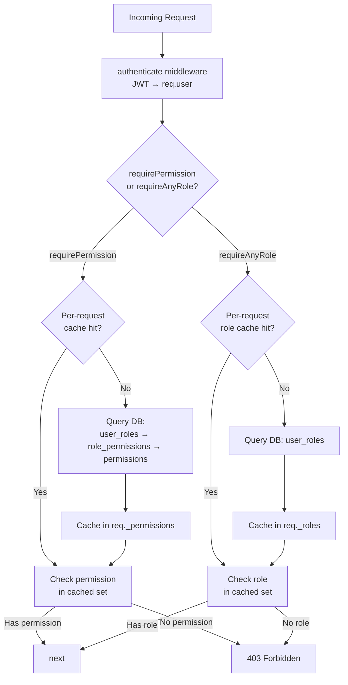
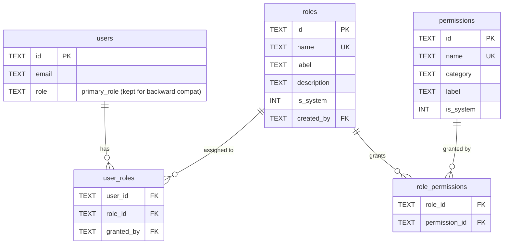
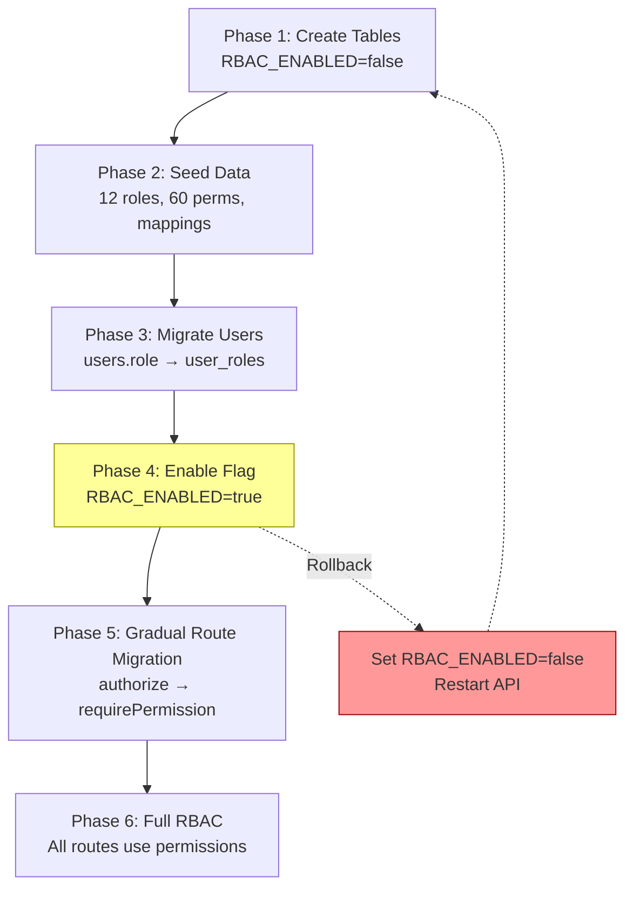

# Capability-Based RBAC System Design

**Sub-Project:** 1 of 4 (Permission Model)
**Date:** 2026-08-05
**Phase:** 12B (before Paystack C1)
**Baseline:** 486/486 backend + 69/69 frontend tests (555 total)

---

## Current State

### Simple Role System

The LMS uses a single `users.role` TEXT column with a CHECK constraint:

```sql
role TEXT NOT NULL DEFAULT 'student' CHECK (role IN ('student', 'lecturer', 'admin'))
```

- **3 roles:** student, lecturer, admin
- **Role in JWT:** `authorize('admin')` checks `req.user.role` without DB hit
- **~80+ hardcoded role checks** across 15+ controller files
- **Lecturer is course-scoped** via `course_lecturers` table + `requireCourseAccess` middleware
- **No custom roles, no multi-role, no capability model**

### Pain Points

1. Adding a new role (e.g., sponsor, parent) requires modifying the CHECK constraint, TypeScript union type, every controller that checks roles, and frontend navigation
2. No granular permissions — admin is all-or-nothing
3. Sponsor Portal is faked as an admin page, not a real role
4. Cannot create custom roles without code changes
5. Single role per user — a person who is both a parent and an employer must pick one

---

## Target Capability Model

### Core Principles

1. **Permissions are capabilities, not roles.** A permission like `course.create` is a discrete action. Roles are bundles of permissions.
2. **Multiple roles per user.** Effective permissions = UNION of all assigned roles.
3. **Hybrid lookup.** JWT carries `primaryRole` (for routing/backward compat). Granular permissions fetched from DB on-demand with per-request caching.
4. **Custom roles.** `admin-2` and `super-admin` can create new roles and assign permissions to them. Custom roles cannot include `system.manage_permissions`.
5. **Backward compatible.** Existing `authorize('admin')` calls continue to work via wrapper.

### Role Definitions (12 Built-in + Custom)

| Role | Description | Can be assigned by |
|------|-------------|-------------------|
| `student` | Base learner. Enroll, submit, view own progress. | Self-registration |
| `supporter-student` | Completed a paid course. Can assist grading (TA-lite). | System (auto on paid course completion) |
| `parent` | Family group manager. View child progress, fund wallets, manage rewards. | Admin, admin-2, super-admin |
| `teacher` | Classroom manager. Multiple classes, wallet funding, rewards. | Admin, admin-2, super-admin |
| `employer` | Team manager. Track team course progress, rewards. | Admin, admin-2, super-admin |
| `sponsor` | Cohort payment manager. Bulk apply, bulk pay. | Admin, admin-2, super-admin |
| `instructor` | Course creator. Full course management, student management, TA management. | Admin, admin-2, super-admin |
| `teaching-assistant` | Graded permissions. Grading requires instructor approval. | Instructor (for their courses), admin+ |
| `admin` | Platform administrator. User management, course approval, billing. | super-admin |
| `admin-2` | Extended admin. Can create custom users and custom roles. | super-admin |
| `super-admin` | Root. Full system control. Only `mukhtar.meer@smwebsystems.com`. | Hardcoded (cannot be assigned via API) |
| `custom-user` | Admin-2/super-admin created role with custom permissions. Cannot include `system.manage_permissions`. | admin-2, super-admin |

### Permission Categories

Permissions use dot-namespace: `{category}.{action}`.

#### course (9 permissions)
| Permission | Description |
|---|---|
| `course.view` | View course content and structure |
| `course.create` | Create new courses |
| `course.manage` | Edit course content, sections, items |
| `course.delete` | Delete courses |
| `course.enroll` | Enroll self in a course |
| `course.enroll_others` | Enroll other users in a course |
| `course.submit` | Submit assignments/work |
| `course.grade` | Grade submissions (final) |
| `course.grade_pending` | Grade submissions (requires approval) |

#### billing (7 permissions)
| Permission | Description |
|---|---|
| `billing.view_own` | View own payment history |
| `billing.view_assigned` | View payments of assigned users (parent/teacher/employer scope) |
| `billing.view_all` | View all platform payments |
| `billing.create` | Initiate payments |
| `billing.confirm` | Confirm manual payments |
| `billing.waive` | Waive payment requirements |
| `billing.refund` | Process refunds |

#### wallet (4 permissions)
| Permission | Description |
|---|---|
| `wallet.view_own` | View own wallet status |
| `wallet.manage_own` | Manage own wallet (link/unlink) |
| `wallet.fund` | Fund other users' wallets |
| `wallet.view_assigned` | View wallets of assigned users |

#### user (6 permissions)
| Permission | Description |
|---|---|
| `user.view_self` | View own profile |
| `user.view_all` | View all users |
| `user.create` | Create user accounts |
| `user.manage` | Edit user profiles, status |
| `user.delete` | Delete user accounts |
| `user.assign_role` | Assign/remove roles to/from users |

#### cohort (6 permissions)
| Permission | Description |
|---|---|
| `cohort.view_own` | View cohorts where user is sponsor |
| `cohort.view_all` | View all cohorts |
| `cohort.create` | Create new cohorts |
| `cohort.manage` | Edit cohort members, settings |
| `cohort.bulk_apply` | Trigger bulk certificate applications |
| `cohort.bulk_pay` | Trigger bulk payments for cohort |

#### certificate (6 permissions)
| Permission | Description |
|---|---|
| `certificate.view_own` | View own certificates and badges |
| `certificate.apply` | Apply for course completion certificate |
| `certificate.approve` | Approve certificate applications |
| `certificate.reject` | Reject certificate applications |
| `certificate.mint` | Mint NFT certificates |
| `certificate.badge_view` | View/download SVG badges |

#### quiz (5 permissions)
| Permission | Description |
|---|---|
| `quiz.view` | View quizzes |
| `quiz.create` | Create quizzes |
| `quiz.manage` | Edit/delete quizzes |
| `quiz.submit` | Submit quiz answers |
| `quiz.view_analytics` | View quiz analytics dashboard |

#### announcement (4 permissions)
| Permission | Description |
|---|---|
| `announcement.view` | View announcements |
| `announcement.create` | Create announcements |
| `announcement.manage` | Edit announcements |
| `announcement.delete` | Delete announcements |

#### document (4 permissions)
| Permission | Description |
|---|---|
| `document.view` | View documents/resources |
| `document.upload` | Upload documents |
| `document.manage` | Edit document metadata |
| `document.delete` | Delete documents |

#### forum (3 permissions)
| Permission | Description |
|---|---|
| `forum.view` | View forum topics/posts |
| `forum.post` | Create topics and replies |
| `forum.moderate` | Edit/delete any post, pin topics |

#### reward (3 permissions)
| Permission | Description |
|---|---|
| `reward.view_own` | View own rewards |
| `reward.give` | Give rewards to assigned users |
| `reward.manage` | Manage reward configuration |

#### system (3 permissions)
| Permission | Description |
|---|---|
| `system.manage_roles` | Create/edit/delete custom roles |
| `system.manage_permissions` | Create new permissions (super-admin only) |
| `system.view_audit_log` | View system audit log |

**Total: 60 permissions across 12 categories.**

### Permission Matrix (Role x Permission)

Full mapping of which permissions each built-in role receives. `*` = all permissions in category.

| Role | course | billing | wallet | user | cohort | certificate | quiz | announce | document | forum | reward | system |
|---|---|---|---|---|---|---|---|---|---|---|---|---|
| student | view, enroll, submit | view_own | view_own | view_self | - | view_own, apply, badge_view | view, submit | view | view | view, post | view_own | - |
| supporter-student | +grade_pending | = | = | = | - | = | = | = | = | = | = | - |
| parent | view | view_assigned | view_assigned, fund | view_self, create | - | view_own | view | view | view | view | view_own, give | - |
| teacher | view, manage | view_assigned | fund | view_self, create | view_own | view_own | view, create | view, create | view, upload | view, post | view_own, give | - |
| employer | view | view_assigned | fund | view_self, create | view_own, create | view_own | view | view | view | view | view_own, give | - |
| sponsor | view | view_all | fund | view_self | view_own, view_all, create, manage, bulk_apply, bulk_pay | view_own | view | view | view | view | view_own, give | - |
| instructor | view, create, manage, grade, enroll_others | view_own | view_own | view_self, view_all | - | approve, reject, view_own | view, create, manage, view_analytics | view, create | view, upload, manage | view, post, moderate | view_own | - |
| teaching-assistant | view, grade_pending | - | - | view_self | - | view_own | view | view | view | view, post | - | - |
| admin | * | view_all, confirm, waive | view_own, manage_own | view_all, create, manage | view_all, create, manage | * | * | * | * | * | * | view_audit_log |
| admin-2 | * | * | manage_own | *, assign_role | * | * | * | * | * | * | * | manage_roles, view_audit_log |
| super-admin | * | * | * | * | * | * | * | * | * | * | * | * |

---

## Database Schema

### New Tables

```sql
-- Roles: built-in + custom
CREATE TABLE IF NOT EXISTS roles (
  id         TEXT PRIMARY KEY,            -- UUID
  name       TEXT UNIQUE NOT NULL,        -- 'student', 'parent', 'custom_xyz'
  label      TEXT NOT NULL,               -- 'Student', 'Parent', 'Custom XYZ'
  description TEXT,
  is_system  INTEGER NOT NULL DEFAULT 0,  -- 1 = built-in (cannot delete)
  created_by TEXT REFERENCES users(id) ON DELETE SET NULL,
  created_at TEXT NOT NULL DEFAULT (datetime('now'))
);

-- Permissions: dot-namespaced capabilities
CREATE TABLE IF NOT EXISTS permissions (
  id         TEXT PRIMARY KEY,            -- UUID
  name       TEXT UNIQUE NOT NULL,        -- 'course.create', 'billing.view_all'
  category   TEXT NOT NULL,               -- 'course', 'billing', 'wallet', etc.
  label      TEXT NOT NULL,               -- 'Create Courses'
  description TEXT,
  is_system  INTEGER NOT NULL DEFAULT 0,  -- 1 = built-in (cannot delete)
  created_at TEXT NOT NULL DEFAULT (datetime('now'))
);

-- Role-Permission mapping
CREATE TABLE IF NOT EXISTS role_permissions (
  role_id       TEXT NOT NULL REFERENCES roles(id) ON DELETE CASCADE,
  permission_id TEXT NOT NULL REFERENCES permissions(id) ON DELETE CASCADE,
  created_at    TEXT NOT NULL DEFAULT (datetime('now')),
  PRIMARY KEY (role_id, permission_id)
);

-- User-Role junction (multi-role)
CREATE TABLE IF NOT EXISTS user_roles (
  user_id    TEXT NOT NULL REFERENCES users(id) ON DELETE CASCADE,
  role_id    TEXT NOT NULL REFERENCES roles(id) ON DELETE CASCADE,
  granted_by TEXT REFERENCES users(id) ON DELETE SET NULL,
  created_at TEXT NOT NULL DEFAULT (datetime('now')),
  PRIMARY KEY (user_id, role_id)
);
```

### Indexes

```sql
CREATE INDEX IF NOT EXISTS idx_user_roles_user ON user_roles(user_id);
CREATE INDEX IF NOT EXISTS idx_user_roles_role ON user_roles(role_id);
CREATE INDEX IF NOT EXISTS idx_role_permissions_role ON role_permissions(role_id);
CREATE INDEX IF NOT EXISTS idx_permissions_category ON permissions(category);
CREATE INDEX IF NOT EXISTS idx_permissions_name ON permissions(name);
```

### Migration from Current Schema

**Phase 1:** Create tables, no data migration.

**Phase 2:** Seed built-in data.
```sql
-- Seed 12 built-in roles
INSERT INTO roles (id, name, label, is_system) VALUES
  ('role_student', 'student', 'Student', 1),
  ('role_supporter_student', 'supporter-student', 'Supporter Student', 1),
  ('role_parent', 'parent', 'Parent', 1),
  ('role_teacher', 'teacher', 'Teacher', 1),
  ('role_employer', 'employer', 'Employer', 1),
  ('role_sponsor', 'sponsor', 'Sponsor', 1),
  ('role_instructor', 'instructor', 'Instructor', 1),
  ('role_ta', 'teaching-assistant', 'Teaching Assistant', 1),
  ('role_admin', 'admin', 'Administrator', 1),
  ('role_admin2', 'admin-2', 'Extended Administrator', 1),
  ('role_super_admin', 'super-admin', 'Super Administrator', 1),
  ('role_custom', 'custom-user', 'Custom User', 1);

-- Seed 60 permissions (example subset)
INSERT INTO permissions (id, name, category, label, is_system) VALUES
  ('perm_course_view', 'course.view', 'course', 'View Courses', 1),
  ('perm_course_create', 'course.create', 'course', 'Create Courses', 1),
  -- ... (all 60 permissions)
  ('perm_system_manage_permissions', 'system.manage_permissions', 'system', 'Manage Permissions', 1);

-- Seed role_permissions (map from permission matrix above)
INSERT INTO role_permissions (role_id, permission_id) VALUES
  ('role_student', 'perm_course_view'),
  ('role_student', 'perm_course_enroll'),
  ('role_student', 'perm_course_submit'),
  -- ... (all mappings from the matrix)
  ;
```

**Phase 3:** Migrate existing users.
```sql
-- Map existing users.role → user_roles
INSERT INTO user_roles (user_id, role_id)
SELECT u.id,
  CASE u.role
    WHEN 'student' THEN 'role_student'
    WHEN 'lecturer' THEN 'role_instructor'
    WHEN 'admin' THEN 'role_admin'
  END
FROM users u
WHERE u.role IS NOT NULL;

-- Super-admin for hardcoded email
INSERT OR IGNORE INTO user_roles (user_id, role_id)
SELECT id, 'role_super_admin' FROM users WHERE email = 'mukhtar.meer@smwebsystems.com';
```

**Phase 4:** Keep `users.role` column as `primary_role` for JWT backward compat. Do NOT drop it. Relax the CHECK constraint to allow new role names:
```sql
-- SQLite requires table rebuild to change CHECK constraint
-- Use PRAGMA foreign_keys=OFF + legacy_alter_table=ON pattern
-- New CHECK: role IN ('student', 'lecturer', 'admin', 'instructor',
--   'sponsor', 'parent', 'teacher', 'employer', 'teaching-assistant',
--   'admin-2', 'super-admin', 'supporter-student', 'custom-user')
-- OR: remove CHECK entirely, rely on roles table as source of truth
```

### Backward Compatibility Layer

The `users.role` column remains. It stores the user's **primary role** — the role used for:
1. JWT `role` claim (backward compat with existing frontend)
2. Dashboard routing (`/admin`, `/student`, `/lecturer` → expanded)
3. Fallback if RBAC feature flag is disabled

Primary role is set to the **highest-privilege role** the user holds (based on the hierarchy). When a new role is assigned via `user_roles`, `users.role` is updated to reflect the highest.

---

## API Design

### New Middleware: `src/middleware/rbac.ts`

```typescript
// Permission check — fetches from DB, caches per-request
export function requirePermission(...permissions: string[]): RequestHandler;

// Role check — checks user_roles table
export function requireAnyRole(...roles: string[]): RequestHandler;

// Helper functions (non-middleware)
export async function hasPermission(userId: string, permission: string): Promise<boolean>;
export async function getUserPermissions(userId: string): Promise<string[]>;
export async function getUserRoles(userId: string): Promise<string[]>;
export function hasAnyRole(userRoles: string[], requiredRoles: string[]): boolean;
```

### Permission Lookup Flow



### Permission Query (single query, cached per-request)

```sql
SELECT DISTINCT p.name
FROM permissions p
JOIN role_permissions rp ON p.id = rp.permission_id
JOIN user_roles ur ON rp.role_id = ur.role_id
WHERE ur.user_id = ?
```

This returns all permissions for a user across all their roles (UNION). Result is cached on `req._permissions` as a `Set<string>` for the duration of the request.

### Backward Compatibility Wrapper

The existing `authorize()` function in `middleware/auth.ts` is updated to delegate:

```typescript
// BEFORE (current):
export function authorize(...roles: UserRole[]) {
  return (req, res, next) => {
    if (!roles.includes(req.user.role)) return res.status(403)...
  }
}

// AFTER (backward compat wrapper):
export function authorize(...roles: UserRole[]) {
  // If RBAC is enabled, delegate to requireAnyRole
  if (config.RBAC_ENABLED) {
    return requireAnyRole(...roles);
  }
  // Fallback: original behavior
  return (req, res, next) => {
    if (!roles.includes(req.user.role)) return res.status(403)...
  }
}
```

### Route Migration Examples

```typescript
// BEFORE:
router.post('/courses', authenticate, authorize('admin'), createCourse);

// AFTER (Phase 1 — backward compat, no change needed):
router.post('/courses', authenticate, authorize('admin'), createCourse);
// authorize('admin') now internally checks user_roles for 'admin' role

// AFTER (Phase 2 — granular permissions):
router.post('/courses', authenticate, requirePermission('course.create'), createCourse);
// Now instructor, admin, admin-2, super-admin can all create courses
```

### New RBAC Admin Endpoints

| Method | Path | Permission Required | Description |
|---|---|---|---|
| GET | `/api/v1/admin/roles` | `system.manage_roles` | List all roles |
| POST | `/api/v1/admin/roles` | `system.manage_roles` | Create custom role |
| PUT | `/api/v1/admin/roles/:id` | `system.manage_roles` | Update custom role |
| DELETE | `/api/v1/admin/roles/:id` | `system.manage_roles` | Delete custom role (non-system only) |
| GET | `/api/v1/admin/permissions` | `system.manage_roles` | List all permissions |
| GET | `/api/v1/admin/roles/:id/permissions` | `system.manage_roles` | List role's permissions |
| PUT | `/api/v1/admin/roles/:id/permissions` | `system.manage_roles` | Set role's permissions |
| GET | `/api/v1/admin/users/:id/roles` | `user.assign_role` | List user's roles |
| POST | `/api/v1/admin/users/:id/roles` | `user.assign_role` | Assign role to user |
| DELETE | `/api/v1/admin/users/:id/roles/:roleId` | `user.assign_role` | Remove role from user |

### Privilege Escalation Guards

1. **`system.manage_permissions`** can only be assigned to `super-admin` role. Cannot be added to any custom role.
2. **`custom-user` role** cannot receive `system.manage_permissions` or `system.manage_roles`.
3. **Cannot assign a role with higher privilege than your own.** Privilege level: `super-admin > admin-2 > admin > instructor > sponsor > employer/teacher/parent > student`. The API checks that the assigner's highest role outranks the role being assigned.
4. **`super-admin` cannot be assigned via API.** Only set via migration/script for the hardcoded email.

---

## Migration Plan

### Rollout Strategy: Feature Flag

```
RBAC_ENABLED=false  # .env — toggle new permission system
```

| Phase | RBAC_ENABLED | Behavior |
|---|---|---|
| 1: Schema only | `false` | Tables created, seeded. `authorize()` uses old path. |
| 2: Dual-write | `false` | User role changes write to both `users.role` AND `user_roles`. |
| 3: Read from RBAC | `true` | `authorize()` delegates to `requireAnyRole()`. New routes use `requirePermission()`. |
| 4: Full migration | `true` | All `authorize()` calls replaced with `requirePermission()`. |

### Data Migration Steps

1. `ensureRbacTables()` in `database.ts` — creates 4 tables (idempotent, `CREATE IF NOT EXISTS`)
2. `seedRbacData()` — inserts 12 roles, 60 permissions, role_permission mappings (idempotent, `INSERT OR IGNORE`)
3. `migrateUsersToRbac()` — reads `users.role`, inserts into `user_roles` (idempotent)
4. Steps 1-3 run on every server start (like existing `ensure*()` functions)

### Rollback Strategy

1. Set `RBAC_ENABLED=false` in `.env`
2. Restart API container: `docker compose up -d --no-deps api`
3. All routes revert to `users.role` column checks
4. New RBAC tables remain but are not read
5. No data loss — `users.role` column is never dropped

---

## UI/UX Notes (Frontend Impact)

### JWT Changes

Current JWT payload:
```json
{ "userId": "...", "email": "...", "role": "admin", "studentId": "...", "iat": 123 }
```

New JWT payload (backward compat):
```json
{ "userId": "...", "email": "...", "role": "admin", "roles": ["admin", "instructor"], "studentId": "...", "iat": 123 }
```

- `role` remains (primary role, for backward compat)
- `roles` added (all assigned roles, for frontend navigation)

### Frontend Changes (Deferred to Sub-Project 2)

This spec does NOT include frontend changes. The backend RBAC system is designed to be invisible to the frontend in Phase 1-3 (backward compat). Frontend changes (multi-role navigation, role badges, permission-based UI rendering) belong in Sub-Project 2.

The only frontend-visible change is the `roles` array in the JWT, which the frontend can ignore until Sub-Project 2.

---

## Test Strategy

### Permission Unit Tests (new file: `__tests__/rbac.test.ts`)

| ID | Test | Description |
|---|---|---|
| RBAC-1 | `hasPermission` returns true for direct role permission | Student has `course.view` |
| RBAC-2 | `hasPermission` returns false for missing permission | Student does not have `course.create` |
| RBAC-3 | Multi-role UNION | User with student + instructor gets both permission sets |
| RBAC-4 | `requirePermission` middleware returns 403 for denied | Non-admin hits admin route |
| RBAC-5 | `requirePermission` middleware passes for granted | Admin hits admin route |
| RBAC-6 | `requireAnyRole` returns true if user has one of the roles | User with admin role passes `requireAnyRole('admin', 'super-admin')` |
| RBAC-7 | `requireAnyRole` returns false if user has none | Student fails `requireAnyRole('admin')` |
| RBAC-8 | Per-request caching | Second `hasPermission` call in same request doesn't query DB |
| RBAC-9 | `authorize()` backward compat | `authorize('admin')` still works when RBAC_ENABLED=true |
| RBAC-10 | `authorize()` fallback | `authorize('admin')` uses old path when RBAC_ENABLED=false |

### Migration Tests

| ID | Test | Description |
|---|---|---|
| MIG-1 | All existing users have user_roles entries | `SELECT count(*) FROM users LEFT JOIN user_roles` has no orphans |
| MIG-2 | Existing admin users retain admin permissions | Admin can still access admin routes |
| MIG-3 | Existing student users retain student permissions | Student can still view courses |
| MIG-4 | Existing lecturer users map to instructor role | Lecturer → instructor mapping correct |
| MIG-5 | Super-admin email gets super-admin role | `mukhtar.meer@smwebsystems.com` has super-admin |

### Privilege Escalation Tests

| ID | Test | Description |
|---|---|---|
| ESC-1 | Admin cannot assign super-admin role | Returns 403 |
| ESC-2 | Admin-2 cannot assign super-admin role | Returns 403 |
| ESC-3 | Custom role cannot include system.manage_permissions | Returns 400 |
| ESC-4 | Student cannot access role management | Returns 403 |
| ESC-5 | Cannot self-escalate | User cannot assign roles to themselves |

### Regression Tests

All 555 existing tests must continue to pass. The RBAC system adds tests on top — does not modify existing test expectations.

**Estimated new tests:** ~20 backend (RBAC-1 to RBAC-10 + MIG-1 to MIG-5 + ESC-1 to ESC-5)

**Target test count after Phase 12B:** ~506/506 backend + 69/69 frontend = ~575 total

---

## Risks

### Breaking Changes
- **Mitigation:** Feature flag (`RBAC_ENABLED`). All changes are additive. `users.role` column is never dropped.
- **Risk level:** LOW if feature flag is tested.

### Performance
- **Risk:** Permission DB query on every sensitive route.
- **Mitigation:** Per-request caching. Single JOIN query returns all permissions at once (~1ms on SQLite for <100 permissions). Cached in `req._permissions` — subsequent checks in the same request are O(1) Set lookup.
- **Risk level:** LOW.

### Data Migration
- **Risk:** Existing users not correctly mapped to new roles.
- **Mitigation:** Migration is idempotent (`INSERT OR IGNORE`). Rollback is instant (feature flag off). Migration tests (MIG-1 to MIG-5) verify correctness.
- **Risk level:** LOW.

### Privilege Escalation
- **Risk:** Custom role creation could grant excessive permissions.
- **Mitigation:** `system.manage_permissions` is hardcoded to super-admin only. API validates that assigner outranks assignee. Tests ESC-1 to ESC-5.
- **Risk level:** MEDIUM — requires careful validation in the API.

### Schema Complexity (SQLite)
- **Risk:** 4 new tables with FKs. SQLite ALTER TABLE gotchas.
- **Mitigation:** All tables use `CREATE IF NOT EXISTS`. No ALTER TABLE needed — all new tables. Existing `users` table stays unchanged (column kept, CHECK constraint relaxed only in Phase 4).
- **Risk level:** LOW.

---

## Mermaid Diagrams

### Schema Relationships



### Migration Flow



---

## To-Do Lists

### Schema Changes
- [ ] Create `roles` table in `database.ts` (`ensureRbacTables()`)
- [ ] Create `permissions` table
- [ ] Create `role_permissions` table
- [ ] Create `user_roles` table
- [ ] Add indexes (5 indexes)
- [ ] Seed 12 built-in roles (`seedRbacData()`)
- [ ] Seed 60 permissions
- [ ] Seed role_permission mappings (full matrix)
- [ ] Migrate existing users (`migrateUsersToRbac()`)

### API Middleware
- [ ] Create `src/middleware/rbac.ts`
- [ ] Implement `hasPermission()`
- [ ] Implement `getUserPermissions()` with per-request cache
- [ ] Implement `getUserRoles()`
- [ ] Implement `requirePermission()` middleware
- [ ] Implement `requireAnyRole()` middleware
- [ ] Update `authorize()` in `auth.ts` to delegate when RBAC_ENABLED

### RBAC Admin Endpoints
- [ ] Create `src/routes/rbac.ts`
- [ ] GET/POST/PUT/DELETE `/admin/roles`
- [ ] GET/PUT `/admin/roles/:id/permissions`
- [ ] GET/POST/DELETE `/admin/users/:id/roles`
- [ ] Privilege escalation guards

### Config
- [ ] Add `RBAC_ENABLED` to `.env` and `config.ts`
- [ ] Add `roles` array to JWT payload
- [ ] Update `JWTPayload` type

### Tests
- [ ] RBAC-1 to RBAC-10 (permission unit tests)
- [ ] MIG-1 to MIG-5 (migration tests)
- [ ] ESC-1 to ESC-5 (privilege escalation tests)
- [ ] Run full regression (555 existing tests)

### Documentation
- [ ] Update MEMORY.md with RBAC phase info
- [ ] Write closeout doc after implementation

---

## /loop Workflow

### /loop assess
```
Phase 12B readiness:
1. Phase 11 pushed to remote? CHECK
2. RBAC_ENABLED config added? CHECK
3. database.ts has ensureRbacTables()? CHECK
4. All 555 existing tests passing? RUN
5. New RBAC tests defined? CHECK
```

### /loop design
```
RBAC design review:
1. Permission matrix complete? CHECK (60 permissions, 12 roles)
2. Privilege escalation guards defined? CHECK
3. Migration rollback tested? CHECK
4. Backward compat verified? CHECK
```

### /loop review
```
Phase 12B review checklist:
1. All new RBAC tests green? CHECK
2. All 555 existing tests still green? CHECK
3. TypeScript compilation clean? CHECK
4. authorize() backward compat verified? CHECK
5. Feature flag toggle tested (on/off)? CHECK
6. Privilege escalation guards tested? CHECK
```

### /loop plan
```
Next steps after Phase 12B:
1. Sub-Project 2: Multi-role frontend (navigation, role badges, context switching)
2. Sub-Project 3: Multi-tenant architecture (tenant_id, course scoping)
3. Sub-Project 4: Payment/wallet integration (role-based billing, wallet funding)
4. Phase 12 C1: Paystack automation (uses requirePermission('billing.create'))
```

### /loop defer
```
Deferred from Phase 12B:
- Frontend multi-role UI (Sub-Project 2)
- Multi-tenant architecture (Sub-Project 3)
- Role-based wallet funding (Sub-Project 4)
- Gradual route migration from authorize() to requirePermission() (can be done incrementally)
```

---

## Recommendation

**Implement as Phase 12B** — before Paystack C1 (Phase 12 C1). The RBAC system provides the foundation for all future role-based features. Paystack C1 can then use `requirePermission('billing.create')` instead of `authorize('admin')`, making payment routes accessible to sponsors and employers from day one.

**Phased rollout:**
1. Phase 12B C1: Schema + seed data + middleware + tests (RBAC_ENABLED=false)
2. Phase 12B C2: Enable flag, backward compat verification, admin endpoints
3. Phase 12 C1: Paystack automation (uses RBAC if enabled)

**Estimated effort:** ~20 new tests, 4 new files, 2 modified files. No frontend changes in this sub-project.

---

## Non-Goals (Explicit)

- No frontend UI changes (Sub-Project 2)
- No multi-tenant/tenant_id (Sub-Project 3)
- No payment/wallet integration changes (Sub-Project 4)
- No new dashboard layouts per role
- No role-based email notifications
- No LDAP/SAML/external identity provider integration
