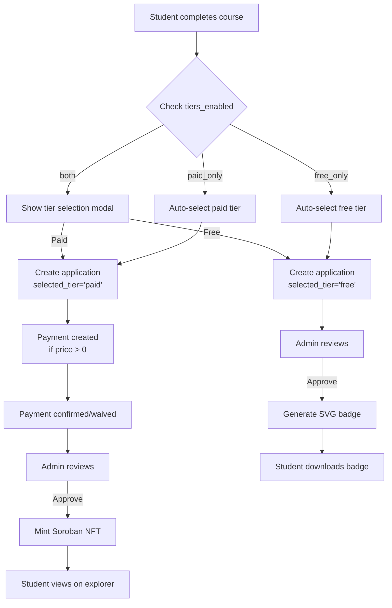
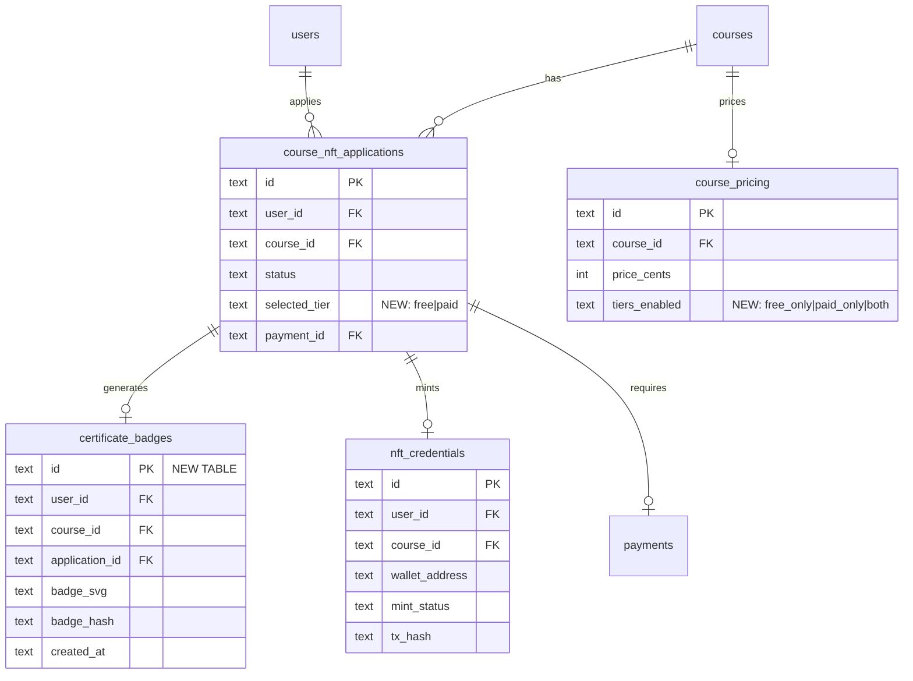
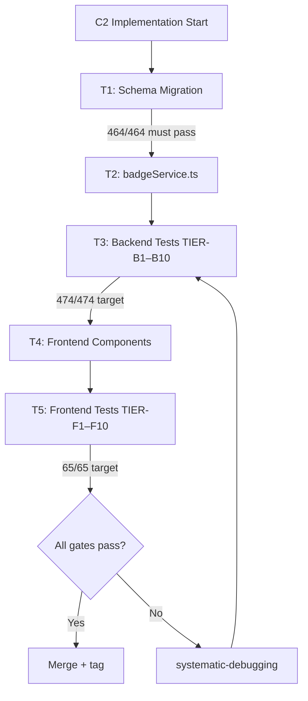

# Phase 11 C2 — Freemium Certificate Tiers

**Date:** 2026-08-05
**Status:** SPEC READY
**Depends on:** Phase 11 C1a (manual payment foundation) — RELEASED
**Branch:** `feat/phase11-c2-freemium-tiers` (to be created at implementation time)
**Prerequisites:** None (zero external dependencies)

---

## Problem Statement

The LMS currently offers a single certificate path: admin-approved, on-chain NFT credential via Soroban on Stellar mainnet. This creates two issues:

1. **All-or-nothing:** Students who complete courses but cannot or do not wish to pay receive nothing — no recognition of completion.
2. **Payment blocker:** C1 (Paystack/Stellar automation) is blocked on external API keys. Students completing courses today have no certificate option.

Phase 11 C2 introduces a two-tier certificate model:
- **Free tier:** Server-generated SVG badge (digital credential, no blockchain)
- **Paid tier:** On-chain Soroban NFT (existing C1a flow, payment-gated)

This gives every completing student immediate recognition while preserving the premium NFT path for paid certificates.

---

## What C1a Already Provides (DO NOT REBUILD)

### Tables (exist, will be extended)
- `course_pricing` — id, course_id (UNIQUE), price_cents, currency, is_active, timestamps
- `payments` — id, user_id, course_id, application_id, amount_cents, currency, payment_method, status, confirmed_by, confirmed_at, notes, timestamps
- `course_nft_applications.payment_id` — FK to payments

### Service Functions (exist, unchanged)
- `getCoursePricing(courseId)` → CoursePricing | null
- `setCoursePricing(courseId, priceCents)` → CoursePricing
- `createPayment(userId, courseId, applicationId, amountCents)` → Payment
- `confirmPayment(paymentId, confirmedBy, notes?)` → Payment | null
- `waivePayment(paymentId, confirmedBy, notes)` → Payment | null
- `isPaymentSatisfied(applicationId)` → boolean

### Endpoints (exist, unchanged)
- `GET /courses/:courseId/pricing` — any authenticated user
- `PUT /admin/courses/:courseId/pricing` — admin only
- `POST /admin/payments/:paymentId/confirm` — admin manual confirm
- `POST /admin/payments/:paymentId/waive` — admin waive
- `GET /admin/payments` — admin list

### Payment Gate (exists, unchanged for paid tier)
- `nftApplications.ts` mint endpoint returns 402 if `isPaymentSatisfied()` returns false
- Free courses (no pricing row or price_cents=0) bypass gate

### Tests (exist, must remain green)
- Backend: PAY-B1–B10 (464 total)
- Frontend: PAY-F1–F7 (55 total)

---

## Goals

1. Add `certificate_badges` table for free-tier SVG badge storage
2. Add `selected_tier` column to `course_nft_applications` (free/paid)
3. Add `tiers_enabled` column to `course_pricing` (free_only/paid_only/both)
4. Add `badgeService.ts` — SVG template rendering with student name, course, date, badge ID
5. Add badge generation endpoint — auto-generates badge after admin approval of free-tier application
6. Add tier selection to student application flow — student picks free or paid at application time
7. Add badge display on student dashboard — download SVG
8. Add admin tier configuration to PricingManagement — set which tiers are available per course
9. Free tier skips payment gate and NFT minting entirely
10. Paid tier uses existing C1a flow unchanged

## Non-Goals

- No PDF certificate generation (deferred)
- No on-chain record for free tier
- No changes to payment service logic
- No changes to payment gate (402 behavior unchanged)
- No subscription/recurring billing
- No badge customization by admin (template is fixed)
- No badge revocation (admin can reject application, which prevents badge)
- No sponsor cohorts (C3)
- No Paystack/Stripe integration (C1)

---

## Tier Model

| Feature | Free Tier | Paid Tier |
|---------|-----------|-----------|
| **Credential** | SVG badge (server-generated) | On-chain Soroban NFT |
| **Storage** | `certificate_badges.badge_svg` (TEXT) | `nft_credentials` table |
| **Payment** | None required | Payment gate enforced (C1a) |
| **Verification** | Database lookup by badge ID | Blockchain explorer (tx_hash) |
| **Admin approval** | Required | Required |
| **Wallet required** | No | Yes (Stellar address) |
| **Student action** | Download SVG file | View on Stellar explorer |
| **Availability** | Always (unless admin sets paid_only) | Requires course pricing |

---

## Data Model Extensions

### NEW TABLE: `certificate_badges`

```sql
CREATE TABLE IF NOT EXISTS certificate_badges (
  id             TEXT PRIMARY KEY,
  user_id        TEXT NOT NULL REFERENCES users(id) ON DELETE CASCADE,
  course_id      TEXT NOT NULL REFERENCES courses(id) ON DELETE CASCADE,
  application_id TEXT NOT NULL REFERENCES course_nft_applications(id) ON DELETE CASCADE,
  badge_svg      TEXT NOT NULL,
  badge_hash     TEXT NOT NULL,
  created_at     TEXT NOT NULL DEFAULT (datetime('now')),
  UNIQUE(user_id, course_id)
);
CREATE INDEX IF NOT EXISTS idx_certificate_badges_application_id
  ON certificate_badges(application_id);
```

**Design notes:**
- `badge_svg`: Complete SVG markup as TEXT (~2-4 KB per badge)
- `badge_hash`: SHA-256 of SVG content for integrity verification
- `UNIQUE(user_id, course_id)`: One badge per student per course (same as NFT constraint)
- No `updated_at`: Badges are immutable once generated

### ALTER: `course_nft_applications` — add tier selection

```sql
ALTER TABLE course_nft_applications
  ADD COLUMN selected_tier TEXT NOT NULL DEFAULT 'free'
  CHECK (selected_tier IN ('free', 'paid'));
```

**Design notes:**
- Default `'free'` — backward compatible with existing applications (treated as free tier)
- Student selects at application time; cannot change after submission
- Existing applications (pre-C2) default to `'free'`, but since they already went through the old single-path flow, they're treated as paid-tier equivalent (they have NFT credentials)

### ALTER: `course_pricing` — add tier configuration

```sql
ALTER TABLE course_pricing
  ADD COLUMN tiers_enabled TEXT NOT NULL DEFAULT 'both'
  CHECK (tiers_enabled IN ('free_only', 'paid_only', 'both'));
```

**Design notes:**
- `'both'` (default): Student sees tier selection UI
- `'free_only'`: Only free badge available (auto-selected, no choice shown)
- `'paid_only'`: Only paid NFT available (auto-selected, no choice shown)
- Courses without a `course_pricing` row default to `'both'` (free badge always available)

---

## Backend API Design

### NEW SERVICE: `badgeService.ts`

```typescript
// services/badgeService.ts

export function generateBadgeSvg(params: {
  badgeId: string;
  studentName: string;
  courseName: string;
  completionDate: string;
  courseCode: string;
}): string
// Returns: SVG markup string (~2-4 KB)
// Template: Fixed design with interpolated fields
// No external dependencies (pure string template)

export function createBadge(
  userId: string,
  courseId: string,
  applicationId: string,
): CertificateBadge
// 1. Fetches user name, course title
// 2. Generates SVG via generateBadgeSvg()
// 3. Computes SHA-256 hash
// 4. INSERTs into certificate_badges
// 5. Returns the badge row

export function getBadgeForApplication(applicationId: string): CertificateBadge | null
// Fetches badge by application_id

export function getBadgeForUser(userId: string, courseId: string): CertificateBadge | null
// Fetches badge by user_id + course_id

export function getTiersEnabled(courseId: string): 'free_only' | 'paid_only' | 'both'
// Reads course_pricing.tiers_enabled (default 'both' if no row)
```

### NEW ENDPOINT: `GET /badges/:badgeId`

```
GET /api/v1/badges/:badgeId
Auth: authenticated user (badge owner or admin)
Response: 200 { badgeId, userId, courseId, applicationId, badgeSvg, badgeHash, createdAt }
Error: 404 if not found, 403 if not owner/admin
```

### NEW ENDPOINT: `GET /badges/:badgeId/download`

```
GET /api/v1/badges/:badgeId/download
Auth: authenticated user (badge owner or admin)
Response: 200 with Content-Type: image/svg+xml, Content-Disposition: attachment
Error: 404 / 403
```

### NEW ENDPOINT: `GET /courses/:courseId/tiers`

```
GET /api/v1/courses/:courseId/tiers
Auth: any authenticated user
Response: 200 { tiersEnabled: 'both'|'free_only'|'paid_only', priceCents: number, isFree: boolean }
```

### MODIFIED ENDPOINT: `PUT /admin/courses/:courseId/pricing`

```
PUT /api/v1/admin/courses/:courseId/pricing
Body: { priceCents: number, tiersEnabled?: 'free_only'|'paid_only'|'both' }
Auth: admin only
Response: 200 { ...existingFields, tiersEnabled }
```

Extends existing endpoint to accept optional `tiersEnabled` field. If omitted, defaults to `'both'`.

### MODIFIED: Application creation (`POST /courses/:courseId/completions/apply`)

**Changes:**
- Accept `selectedTier` in request body (default `'free'`)
- Validate tier is available for this course (`getTiersEnabled`)
- If `selectedTier === 'free'`: skip payment creation, no wallet requirement
- If `selectedTier === 'paid'`: existing flow (create payment if priced, require wallet)
- Store `selected_tier` on the application row

### MODIFIED: Application approval flow

**Changes:**
- After admin approves a free-tier application: auto-generate badge via `createBadge()`
- After admin approves a paid-tier application: existing flow (wait for payment + mint)
- Application status flow unchanged: pending → approved → minted (paid) OR pending → approved (free, badge auto-generated)

### MODIFIED: Mint endpoint

**Changes:**
- If `application.selected_tier === 'free'`: return 400 "Free-tier applications cannot be minted as NFT"
- If `application.selected_tier === 'paid'`: existing flow (payment gate + Soroban mint)

---

## SVG Badge Template

```svg
<svg xmlns="http://www.w3.org/2000/svg" viewBox="0 0 400 300" width="400" height="300">
  <defs>
    <linearGradient id="bg" x1="0%" y1="0%" x2="100%" y2="100%">
      <stop offset="0%" style="stop-color:#1e3a5f"/>
      <stop offset="100%" style="stop-color:#2d5a8e"/>
    </linearGradient>
  </defs>
  <rect width="400" height="300" rx="16" fill="url(#bg)"/>
  <rect x="8" y="8" width="384" height="284" rx="12" fill="none" stroke="#c9a96e" stroke-width="2"/>
  <text x="200" y="50" text-anchor="middle" fill="#c9a96e" font-size="14" font-family="serif">
    CERTIFICATE OF COMPLETION
  </text>
  <text x="200" y="90" text-anchor="middle" fill="#ffffff" font-size="11" font-family="sans-serif">
    This certifies that
  </text>
  <text x="200" y="120" text-anchor="middle" fill="#c9a96e" font-size="20" font-weight="bold" font-family="serif">
    {{studentName}}
  </text>
  <text x="200" y="155" text-anchor="middle" fill="#ffffff" font-size="11" font-family="sans-serif">
    has successfully completed
  </text>
  <text x="200" y="185" text-anchor="middle" fill="#ffffff" font-size="16" font-weight="bold" font-family="sans-serif">
    {{courseName}}
  </text>
  <line x1="100" y1="210" x2="300" y2="210" stroke="#c9a96e" stroke-width="1"/>
  <text x="200" y="240" text-anchor="middle" fill="#a0b4cc" font-size="10" font-family="sans-serif">
    {{completionDate}}
  </text>
  <text x="200" y="260" text-anchor="middle" fill="#a0b4cc" font-size="8" font-family="sans-serif">
    Badge ID: {{badgeId}}
  </text>
  <text x="200" y="280" text-anchor="middle" fill="#5a7a9a" font-size="7" font-family="sans-serif">
    SM Web Systems Blockchain Academy
  </text>
</svg>
```

**Template variables:**
- `{{studentName}}`: `users.name` (HTML-escaped)
- `{{courseName}}`: `courses.title` (HTML-escaped)
- `{{completionDate}}`: ISO date formatted as "August 5, 2026"
- `{{badgeId}}`: First 8 chars of the badge UUID (for display)

**Security:** All interpolated values are HTML-escaped to prevent SVG injection.

---

## Frontend UX Design

### Tier Selection UI (Student)

**Location:** Application flow in StudentQuizzes.tsx (or wherever "Apply for Certificate" is triggered)

**Behavior:**
1. Student completes course requirements → "Apply for Certificate" button appears
2. On click, if `tiersEnabled === 'both'`:
   - Show tier selection modal with two cards:
     - **Free Badge:** "Digital certificate of completion. Download as SVG." — [Select]
     - **Paid NFT Certificate:** "Verified on-chain credential. Price: $X.XX" — [Select]
   - Student picks one → application created with `selectedTier`
3. If `tiersEnabled === 'free_only'`:
   - Auto-select free tier, no modal. Application created directly.
4. If `tiersEnabled === 'paid_only'`:
   - Auto-select paid tier, no modal. Existing flow.

### Badge Display (Student Dashboard)

**Location:** StudentQuizzes.tsx or new section

**Behavior:**
- If student has a badge for a course: show "View Badge" button
- On click: render SVG inline + "Download" button
- Badge displayed alongside course completion info

### Admin Tier Configuration

**Location:** PricingManagement.tsx

**Changes:**
- Add "Tier Mode" dropdown to pricing edit modal: Both | Free Only | Paid Only
- Display current tier mode in the pricing table
- Default: "Both"

### Admin Certificates — Badge Column

**Location:** AdminCertificates.tsx

**Changes:**
- Add "Tier" column to applications table: shows "Free" or "Paid" badge
- Free-tier approved applications show "Badge Generated" status
- Free-tier applications: hide mint button, hide payment badge
- Paid-tier applications: existing behavior unchanged

---

## Testing Strategy

### Backend Tests (~10 new cases)

| ID | Test Case | Type |
|----|-----------|------|
| TIER-B1 | `getTiersEnabled()` returns 'both' for course with no pricing row | Unit |
| TIER-B2 | `getTiersEnabled()` returns configured value for course with pricing | Unit |
| TIER-B3 | `generateBadgeSvg()` produces valid SVG with escaped fields | Unit |
| TIER-B4 | `createBadge()` stores badge and returns it | Unit |
| TIER-B5 | `getBadgeForApplication()` retrieves stored badge | Unit |
| TIER-B6 | Free-tier application skips payment creation | Integration |
| TIER-B7 | Free-tier application skips wallet requirement | Integration |
| TIER-B8 | Free-tier approval auto-generates badge | Integration |
| TIER-B9 | Paid-tier application enforces payment gate (existing PAY-B8 behavior) | Regression |
| TIER-B10 | Mint endpoint rejects free-tier application with 400 | Integration |

**Target:** 474/474 backend tests (464 existing + 10 new)

### Frontend Tests (~10 new cases)

| ID | Test Case | Type |
|----|-----------|------|
| TIER-F1 | Tier selection modal renders when tiersEnabled='both' | Component |
| TIER-F2 | Free tier auto-selected when tiersEnabled='free_only' | Component |
| TIER-F3 | Paid tier auto-selected when tiersEnabled='paid_only' | Component |
| TIER-F4 | Tier selection calls API with correct selectedTier | Component |
| TIER-F5 | Badge display renders SVG inline | Component |
| TIER-F6 | Badge download button triggers file download | Component |
| TIER-F7 | Admin PricingManagement shows tier mode dropdown | Component |
| TIER-F8 | Admin PricingManagement saves tier mode | Component |
| TIER-F9 | AdminCertificates shows tier column | Component |
| TIER-F10 | AdminCertificates hides mint button for free-tier apps | Component |

**Target:** 65/65 frontend tests (55 existing + 10 new)

### Regression Coverage

- All 464 existing backend tests must pass
- All 55 existing frontend tests must pass
- PAY-B8–B10 (payment gate) must remain green
- Free course flow (no pricing row) must remain unchanged
- Manual confirm/waive must continue to work for paid tier
- Existing NFT minting flow unchanged for paid tier

### Manual QA Checklist

- [ ] Student sees tier selection when both tiers enabled
- [ ] Free tier application creates no payment record
- [ ] Free tier approval generates badge (check certificate_badges table)
- [ ] Badge SVG renders correctly in browser
- [ ] Badge download produces valid .svg file
- [ ] Paid tier flow unchanged (payment → confirm → approve → mint)
- [ ] Admin can configure tier mode in PricingManagement
- [ ] Admin sees tier column in AdminCertificates
- [ ] Mint button hidden for free-tier applications
- [ ] Course with no pricing row defaults to both tiers

---

## Edge Cases

| Edge Case | Expected Behavior |
|-----------|-------------------|
| Student applies free tier, admin later changes to paid_only | Application stays free (selected at apply time, immutable) |
| Student applies paid tier, admin later changes to free_only | Application stays paid (selected at apply time, immutable) |
| Course has no pricing row | `getTiersEnabled()` returns 'both', free tier has no payment |
| Badge generation fails (unlikely — template string) | Return 500, log error, admin can retry approval |
| Student has existing pre-C2 application (no selected_tier) | Default 'free' in migration; existing NFT creds unaffected |
| Admin tries to mint free-tier application | 400 error: "Free-tier applications cannot be minted as NFT" |
| Student tries to download another student's badge | 403 Forbidden |
| Duplicate badge attempt (re-approval) | UNIQUE constraint prevents duplicate; return existing badge |
| SVG injection via student name | All template variables HTML-escaped |

---

## Error / Fallback Behavior

| Scenario | Response |
|----------|----------|
| Badge generation error | 500 Internal Server Error + log; admin retries approval |
| Invalid tier selection | 400 "Invalid tier. Must be 'free' or 'paid'" |
| Tier not available for course | 400 "This tier is not available for this course" |
| Badge not found | 404 |
| Not badge owner | 403 |
| Free-tier mint attempt | 400 "Free-tier applications cannot be minted as NFT" |

---

## Touched Files

### New Files (4)
| File | Purpose |
|------|---------|
| `LMS-Server/src/services/badgeService.ts` | Badge generation + CRUD |
| `LMS-Server/src/__tests__/badges.test.ts` | Backend badge/tier tests (TIER-B1–B10) |
| `LMS-Frontend/src/components/TierSelector.tsx` | Tier selection modal component |
| `LMS-Frontend/src/components/__tests__/TierSelector.test.tsx` | Frontend tier tests (TIER-F1–F10) |

### Modified Files (~8)
| File | Changes |
|------|---------|
| `LMS-Server/src/config/database.ts` | Add `ensureBadgesTables()`, ALTER columns |
| `LMS-Server/src/types/index.ts` | Add `CertificateBadge`, `CertificateTier` types |
| `LMS-Server/src/routes/nftApplications.ts` | Tier selection in apply, block mint for free tier |
| `LMS-Server/src/routes/payments.ts` | Add badge/tier endpoints |
| `LMS-Server/src/controllers/adminController.ts` | Badge data in certificate listings |
| `LMS-Frontend/src/components/PricingManagement.tsx` | Tier mode dropdown |
| `LMS-Frontend/src/pages/AdminCertificates.tsx` | Tier column, hide mint for free |
| `LMS-Frontend/src/pages/StudentQuizzes.tsx` | Tier selection + badge display |
| `LMS-Frontend/src/types/api.ts` | Add badge/tier types |
| `LMS-Frontend/src/services/courseCompletionService.ts` | Add tier/badge API calls |

---

## Rollout / Compatibility Notes

### Backward Compatibility
- **Default tier `'free'`:** Existing applications (pre-C2) get `selected_tier='free'` via ALTER TABLE DEFAULT. Since they already have NFT credentials from the old single-path flow, their existing NFT creds are unaffected.
- **Default `tiers_enabled='both'`:** All existing courses offer both tiers by default. Admin can change per course.
- **No pricing row = both tiers available:** Free tier always works. Paid tier requires pricing to be set.
- **Payment gate unchanged:** `isPaymentSatisfied()` still works exactly the same for paid tier.

### Migration Safety
- `ALTER TABLE ADD COLUMN` with DEFAULT is safe (no table rewrite in SQLite ≥3.26.0)
- `CREATE TABLE IF NOT EXISTS` for new tables is safe
- No existing data is modified by migration

### Rollback
- `git revert <commit>` — removes badge table, new columns, service, UI
- Existing applications/credentials unaffected
- `selected_tier` column becomes orphaned but harmless (SQLite doesn't support DROP COLUMN easily)
- Badge data in `certificate_badges` is lost (acceptable — badges can be regenerated)

---

## Mermaid Diagrams

### Tier Selection Flow



### Data Model



### Verification Gate Flow



---

## /loop Workflow

### /loop assess
```
Read C1a closeout + C2 spec. Verify:
- C1a tests still green (464 + 55)
- No external blockers (C2 has zero deps)
- Spec alignment with C1a release state
Output: READY / BLOCKED
```

### /loop spec
```
Write C2 spec to docs/superpowers/specs/
Include: data model, API, UI, tests, edge cases
Commit spec to git
Output: SPEC READY
```

### /loop review
```
Review C2 implementation against:
- Spec compliance
- Backward compatibility
- Test coverage
- No scope expansion
Output: APPROVED / CHANGES REQUESTED
```

### /loop plan
```
Convert spec into task list (T0–T7)
Define subagent ownership
Create implementation plan
Output: Plan file at docs/superpowers/plans/
```

---

## Review Checklist

- [ ] Data model: `certificate_badges` schema correct
- [ ] Data model: `selected_tier` column on applications correct
- [ ] Data model: `tiers_enabled` column on pricing correct
- [ ] API: Badge endpoints (GET, download) correctly scoped
- [ ] API: Tier selection in apply endpoint validated
- [ ] API: Mint endpoint blocks free-tier applications
- [ ] Service: SVG template renders correctly with escaped values
- [ ] Service: Badge hash computed from SVG content
- [ ] UI: Tier selection modal shows correct options per tier config
- [ ] UI: Badge display renders SVG inline
- [ ] UI: Admin PricingManagement has tier mode dropdown
- [ ] UI: AdminCertificates shows tier column, hides mint for free
- [ ] Tests: 10 backend tests cover all tier/badge paths
- [ ] Tests: 10 frontend tests cover all UI states
- [ ] Regression: All 464 backend + 55 frontend tests pass
- [ ] Rollback: Revert is safe and documented
- [ ] No scope expansion beyond this spec

---

## Final Recommendation

### PHASE 11 C2 SPEC: READY

Zero external dependencies. Builds entirely on C1a foundation. Additive only — no schema rewrites, no existing behavior changes.

### Exact Next Actions

1. Write implementation plan → `docs/superpowers/plans/2026-08-05-phase11-c2-implementation-plan.md`
2. Create branch → `feat/phase11-c2-freemium-tiers`
3. Execute T0–T7
4. Verify all gates
5. Merge to main + tag `phase11-c2-complete-2026-08-05`
