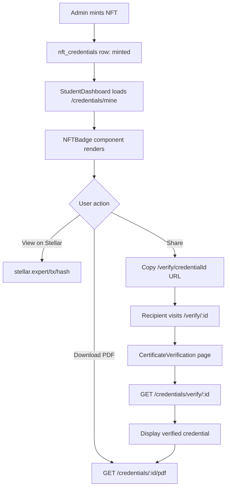
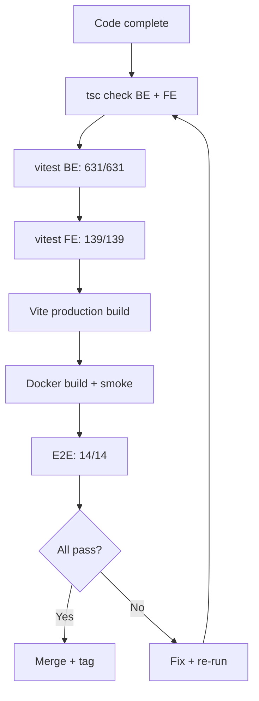

# Phase 23 C4: NFT Certificate Badge Improvements — Design Spec

**Date:** 2026-08-07
**Status:** Draft
**Phase:** 23 C4
**Baseline:** 760 tests (625 BE + 135 FE), 14 E2E

---

## 1. Problem Statement

NFT certificates are issued on-chain via Soroban but displayed as plain text badges in the StudentDashboard. Students cannot share or verify certificates publicly, and there is no way to download a certificate PDF with NFT metadata. The current experience does not reflect the value of an on-chain credential.

## 2. Goals

1. Enhanced badge display showing NFT metadata (course, date, issuer, blockchain link, token ID)
2. Public certificate verification page (no auth required)
3. Shareable credential links (UUID-based, no short URL service needed)
4. Certificate PDF download with NFT badge embedded
5. Optional visual celebration on mint (CSS confetti animation)

## 3. Non-Goals

- QR code generation (deferred to Phase 24)
- Social media sharing buttons (deferred)
- Badge gallery page (separate from dashboard)
- Schema migrations (all required data exists)
- External short URL service

## 4. Architecture

### 4.1 New Files

| File | Type | Purpose |
|------|------|---------|
| `LMS-Frontend/src/components/NFTBadge.tsx` | Component | Rich NFT badge card with metadata + animation |
| `LMS-Frontend/src/pages/CertificateVerification.tsx` | Page | Public verification page (no auth) |
| `LMS-Server/src/services/certificatePdfService.ts` | Service | PDF generation for NFT certificates |

### 4.2 Modified Files

| File | Change |
|------|--------|
| `LMS-Frontend/src/components/dashboard/LmsCertificatesSection.tsx` | Use `NFTBadge` component instead of inline card |
| `LMS-Frontend/src/App.tsx` | Add `/verify/:credentialId` public route |
| `LMS-Server/src/routes/publicCredentials.ts` | Add `GET /credentials/verify/:id` + `GET /credentials/:id/pdf` |
| `LMS-Server/src/app.ts` | Register new routes (if not already on publicCredentials router) |

### 4.3 New Test Files

| File | Tests |
|------|-------|
| `LMS-Server/src/__tests__/nft-badges.test.ts` | 6 BE tests |
| `LMS-Frontend/src/__tests__/NFTBadge.test.tsx` | 4 FE tests |

## 5. Detailed Design

### 5.1 NFTBadge Component

**Path:** `LMS-Frontend/src/components/NFTBadge.tsx`

```typescript
interface NFTBadgeProps {
  credentialId: string;
  courseTitle: string;
  courseCode?: string;
  walletAddress: string;
  txHash: string | null;
  sorobanTokenId?: number | null;
  issuedAt: string;
  network?: string;
  isNewlyMinted?: boolean; // triggers confetti animation
}
```

**Behavior:**
- Displays a gradient card (violet/indigo theme, matching existing LMS styling)
- Shows: course title, course code, issued date, wallet address (truncated), token ID
- "View on Stellar" link → `https://stellar.expert/explorer/{network}/tx/{txHash}`
- "Share" button → copies `https://lms.smwebsystems.com/verify/{credentialId}` to clipboard
- "Download PDF" link → `GET /api/v1/credentials/{credentialId}/pdf`
- When `isNewlyMinted=true`, plays a CSS keyframe confetti animation (3s duration, auto-removes)

**Confetti animation:** Pure CSS — 12 small colored squares animated with `@keyframes` (translateY + rotate + opacity). No external library. Animation class removed after 3s via `useEffect` timeout.

### 5.2 Certificate Verification Page

**Path:** `LMS-Frontend/src/pages/CertificateVerification.tsx`

**Route:** `/verify/:credentialId` — public, no auth, outside `<Layout>`

**Flow:**
1. Extract `credentialId` from URL params
2. Fetch `GET /api/v1/credentials/verify/{credentialId}`
3. Display states:
   - **Loading:** Spinner
   - **Not found:** "Certificate not found" message
   - **Found:** Full credential details with verification badge

**Display (verified state):**
- Green checkmark "Verified Certificate" header
- Course title + code
- Student name (from API response)
- Issued date
- Wallet address (full, copyable)
- Transaction hash (full, with Stellar explorer link)
- Soroban token ID (if available)
- Contract ID
- Network (mainnet/testnet)
- "SM Web Systems Blockchain Academy" issuer branding
- "Download PDF" button

### 5.3 Backend: Verification Endpoint

**Route:** `GET /api/v1/credentials/verify/:credentialId`

**Auth:** None (public)

**Query:**
```sql
SELECT nc.id, nc.wallet_address, nc.tx_hash, nc.contract_id,
       nc.network, nc.created_at, nc.soroban_token_id,
       nc.course_id, c.title AS course_title, c.course_code,
       u.name AS student_name
FROM nft_credentials nc
LEFT JOIN courses c ON c.id = nc.course_id
LEFT JOIN users u ON u.id = nc.user_id
WHERE nc.id = ? AND nc.mint_status = 'minted' AND nc.is_superseded = 0
```

**Response (200):**
```json
{
  "success": true,
  "data": {
    "credential": {
      "credentialId": "...",
      "studentName": "...",
      "courseTitle": "...",
      "courseCode": "...",
      "walletAddress": "...",
      "txHash": "...",
      "contractId": "...",
      "network": "public",
      "sorobanTokenId": 42,
      "issuedAt": "2026-08-07T12:00:00Z",
      "issuer": "SM Web Systems Blockchain Academy"
    }
  }
}
```

**Response (404):**
```json
{
  "success": false,
  "error": { "code": "NOT_FOUND", "message": "Certificate not found or not yet issued" }
}
```

### 5.4 Backend: Certificate PDF Endpoint

**Route:** `GET /api/v1/credentials/:credentialId/pdf`

**Auth:** None (public — credential ID is unguessable UUID)

**Implementation:** `certificatePdfService.ts` using pdfkit (same pattern as `invoiceService.ts`)

**PDF Layout:**
1. Header: "Certificate of Completion" (serif, centered)
2. Issuer: "SM Web Systems Blockchain Academy"
3. Body: "This certifies that **{studentName}** has successfully completed **{courseTitle}** ({courseCode})"
4. Completion date
5. SVG badge embedded (reuse `generateBadgeSvg` from `badgeService.ts` if free-tier, or generic NFT badge)
6. Blockchain verification section:
   - Transaction hash
   - Stellar explorer link (text, not clickable — it's a PDF)
   - Contract ID
   - Token ID
   - Network
7. Footer: "Verify at https://lms.smwebsystems.com/verify/{credentialId}"
8. Generated timestamp

**Content-Disposition:** `inline; filename="certificate-{credentialId-short}.pdf"`
**Content-Type:** `application/pdf`

### 5.5 Shareable Links

No dedicated service needed. The shareable URL is:
```
https://lms.smwebsystems.com/verify/{credentialId}
```

The "Share" button on `NFTBadge` copies this URL to clipboard using `navigator.clipboard.writeText()` with try/catch fallback (already established pattern in the codebase from Phase 17 C3).

### 5.6 Mint Animation

CSS-only confetti effect on `NFTBadge` when `isNewlyMinted=true`:

- 12 small squares (6×6px) with different colors, positioned absolutely
- `@keyframes confetti`: translateY(-200px → 400px), rotate(0 → 720deg), opacity(1 → 0)
- Staggered animation-delay (0–2s range)
- Duration: 3s
- `useEffect` sets `isNewlyMinted=false` after 3s via state update or CSS animation-fill-mode

### 5.7 StudentDashboard Integration

`LmsCertificatesSection.tsx` changes:
- Import `NFTBadge` component
- Replace inline credential card with `<NFTBadge>` for each credential
- Pass `isNewlyMinted={false}` (animation only on CertEligibilitySection mint transition)

`CertEligibilitySection.tsx` — no changes needed. It already links to Stellar explorer when minted. The NFTBadge shows in the separate "LMS Certificates" section.

## 6. API Summary

| Method | Path | Auth | Purpose |
|--------|------|------|---------|
| GET | `/credentials/verify/:credentialId` | None | Public certificate verification |
| GET | `/credentials/:credentialId/pdf` | None | Download certificate PDF |

Existing endpoints unchanged:
- `GET /credentials/public?wallet=<addr>` — public wallet lookup
- `GET /credentials/mine` — authenticated user's credentials

## 7. Security Considerations

- **No PII exposure:** Student name is already public on certificates (by design)
- **Credential ID as access token:** UUIDs are unguessable (122 bits of entropy). No additional auth needed for public verification — same pattern as `/credentials/public?wallet=` which already exposes the same data
- **Rate limiting:** Apply standard per-IP rate limit to verification + PDF endpoints (reuse existing middleware)
- **PDF generation DoS:** Limit PDF size (single page), no user-controlled content that could cause rendering loops

## 8. Test Plan

### Backend (6 tests in `nft-badges.test.ts`)

| ID | Test | Expected |
|----|------|----------|
| BADGE-1 | GET /credentials/verify/:id returns credential for minted, non-superseded | 200 + full metadata |
| BADGE-2 | GET /credentials/verify/:id returns 404 for non-existent ID | 404 |
| BADGE-3 | GET /credentials/verify/:id returns 404 for superseded credential | 404 |
| BADGE-4 | GET /credentials/verify/:id returns 404 for pending/failed credential | 404 |
| BADGE-5 | GET /credentials/:id/pdf returns PDF for minted credential | 200 + application/pdf |
| BADGE-6 | GET /credentials/:id/pdf returns 404 for non-existent credential | 404 |

### Frontend (4 tests in `NFTBadge.test.tsx`)

| ID | Test | Expected |
|----|------|----------|
| BADGE-FE-1 | NFTBadge renders course title, date, wallet | Elements visible |
| BADGE-FE-2 | NFTBadge shows Stellar explorer link when txHash present | Link with correct href |
| BADGE-FE-3 | NFTBadge share button copies verification URL | Clipboard API called |
| BADGE-FE-4 | CertificateVerification page renders verified state | Verification badge + metadata |

### Target counts:
- Backend: 625 → 631
- Frontend: 135 → 139
- E2E: 14 (unchanged)

## 9. Rollback

- Frontend-only changes can be reverted by reverting the dist/ rsync
- Backend routes are additive (no existing endpoints modified)
- No schema migrations — rollback is clean git revert

## 10. Mermaid: NFT Badge Workflow



## 11. Mermaid: Verification Gate Flow


