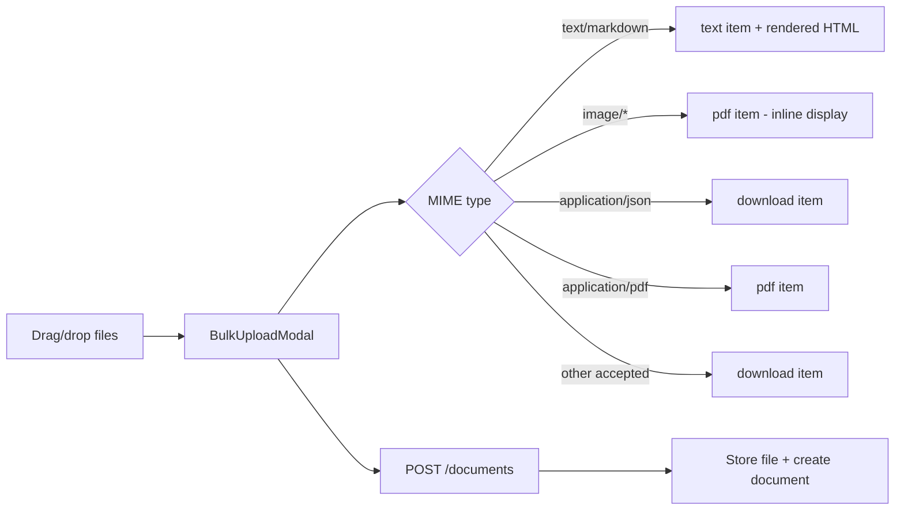
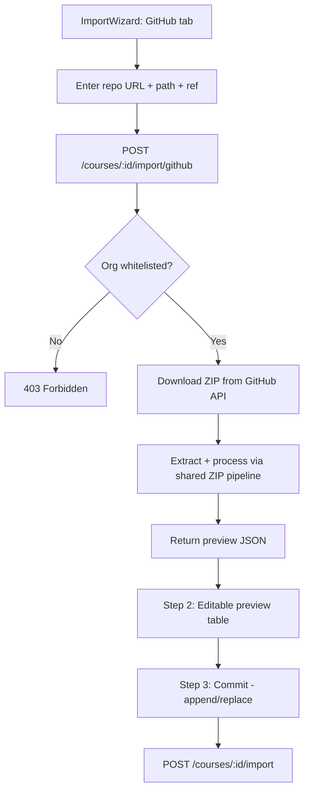

# Upload Extensions Design Spec

**Date:** 2026-08-11
**Phase:** 27 C1 — Upload Extensions (File Types + GitHub Import)
**Status:** Draft

## Problem

1. `.md` and `.json` files are rejected by the upload pipeline (not in MIME whitelists).
2. `.png` files upload but render as download links instead of inline images.
3. No way to import courseware from a GitHub repository.

## Scope

- Extend MIME whitelists to accept `.md` (text/markdown) and `.json` (application/json).
- Fix `.png` item type mapping for inline display.
- Add GitHub repo import to ImportWizard (server-side ZIP download via GitHub API).
- Applies to both Admin and Lecturer roles (requires `course.manage` permission).

## Out of Scope

- Private GitHub repo support (requires PAT management).
- Markdown editor/WYSIWYG in the course builder.
- New item types beyond the existing 8 (`video`, `link`, `pdf`, `text`, `audio`, `quiz`, `assignment`, `download`).

---

## Section 1: File Type Extensions

### Current MIME Whitelists

4 parallel lists must stay in sync:

| File | Location |
|------|----------|
| `DOCUMENT_MIME_TYPES` | `LMS-Server/src/utils/fileUpload.ts` |
| `MIME_FROM_EXT` + `ALLOWED_DOC_MIMES` | `LMS-Server/src/controllers/coursesController.ts` |
| `ACCEPTED_MIME_TYPES` | `LMS-Frontend/src/components/BulkUploadModal.tsx` |
| `DOC_MIME_TYPES` | `LMS-Frontend/src/components/ImportWizard.tsx` |

### New Types to Add

| Extension | MIME Type | Item Type | Behavior | Max Size |
|-----------|----------|-----------|----------|----------|
| `.md` | `text/markdown` | `text` | Rendered as sanitized HTML in `information` field | 2 MB |
| `.json` | `application/json` | `download` | Stored as downloadable file | 1 MB |

### PNG Fix

`.png` (image/png) is already accepted but mapped to item type `download`. Change mapping to `pdf` so the existing `EmbeddedMaterialViewer` renders it inline via the document download URL.

### Item Type Mapping Changes

Update both `mimeToItemType()` (BulkUploadModal) and `itemTypeFromMime()` (coursesController):

```
image/png  → 'pdf'   (inline display via EmbeddedMaterialViewer)
image/jpeg → 'pdf'   (same — already accepted, fix mapping)
image/gif  → 'pdf'   (same)
text/markdown → 'text' (rendered HTML in information field)
application/json → 'download' (generic download)
```

### Markdown Processing

When a `.md` file is uploaded via BulkUploadModal or imported via ZIP/folder:

1. File stored on disk as raw `.md` (document record created)
2. Backend reads file content, converts to HTML using `marked` library
3. HTML sanitized by stripping `<script>`, `<iframe>`, `on*` attributes
4. Sanitized HTML stored in item's `information` field
5. Item type set to `text`, `url` left empty, `documentId` points to raw `.md`
6. Student viewer already renders `information` as HTML — no changes needed

Sanitization function (simple tag/attribute whitelist):
- Allowed tags: `p`, `h1`-`h6`, `ul`, `ol`, `li`, `a`, `strong`, `em`, `code`, `pre`, `blockquote`, `table`, `thead`, `tbody`, `tr`, `th`, `td`, `img`, `br`, `hr`
- Allowed attributes: `href` (on `a`), `src`/`alt` (on `img`), `class`
- Strip everything else

### MIME_TO_EXTENSION Additions

```typescript
'text/markdown': '.md',
'application/json': '.json',
```

---

## Section 2: Folder Upload

**No new work needed.** ImportWizard already supports folder upload via `webkitdirectory` API with folder-to-week/section mapping. Once the MIME whitelists are extended (Section 1), `.md`, `.json` files will automatically be accepted during folder processing.

The only change: add `text/markdown` and `application/json` to ImportWizard's `DOC_MIME_TYPES` set.

---

## Section 3: GitHub Repo Import

### UX Flow

ImportWizard Step 1 gains a 4th source option: **"GitHub Repository"**

1. User selects "GitHub Repository" source
2. Form fields:
   - **Repository URL** (required): `https://github.com/SM-Web-Systems/repo-name`
   - **Subdirectory path** (optional): e.g., `/courseware` — only import files under this path
   - **Branch/tag** (optional, default: `main`)
3. User clicks "Fetch" → loading spinner
4. Backend downloads ZIP, processes it, returns preview JSON
5. Step 2 shows editable preview (reuses existing preview table)
6. Step 3 confirms with append/replace mode (reuses existing commit flow)

### New Backend Endpoint

```
POST /api/v1/courses/:id/import/github
Content-Type: application/json
Authorization: Bearer <JWT>
Permission: course.manage

Request Body:
{
  "repoUrl": "https://github.com/SM-Web-Systems/blockchain-course",
  "subPath": "/courseware",     // optional
  "ref": "main"                 // optional, defaults to "main"
}

Response (success):
{
  "success": true,
  "data": {
    "preview": {
      "sections": [...],        // same format as ZIP import preview
      "warnings": [...],
      "filesStored": 12,
      "filesSkipped": 3
    }
  }
}

Response (error - non-whitelisted org):
{
  "success": false,
  "error": {
    "code": "FORBIDDEN",
    "message": "Repository owner 'evil-org' is not in the allowed list"
  }
}
```

### Backend Architecture

New file: `LMS-Server/src/services/githubImportService.ts`

```typescript
export async function fetchGitHubZip(
  owner: string,
  repo: string,
  ref: string,
): Promise<string>  // Returns path to downloaded temp ZIP file

export function parseGitHubUrl(
  url: string,
): { owner: string; repo: string }

export function isAllowedOrg(owner: string): boolean
```

**Implementation:**
1. `parseGitHubUrl()` — extracts owner/repo from URL, validates format
2. `isAllowedOrg()` — checks against `GITHUB_IMPORT_ALLOWED_ORGS` env var (default: `SM-Web-Systems`)
3. `fetchGitHubZip()` — downloads `https://api.github.com/repos/{owner}/{repo}/zipball/{ref}` to a temp file in the imports directory
4. Controller calls `fetchGitHubZip()`, then reuses the existing ZIP extraction logic from `importZipContent()`

**Reuse strategy:** Extract the ZIP processing core from `importZipContent()` into a shared function `processZipPreview(zipPath: string, courseId: string, subPath?: string): ZipPreviewResult` in `coursesController.ts` that both the ZIP upload endpoint and GitHub import endpoint call. The existing `importZipContent` handler becomes a thin wrapper: accept upload → call `processZipPreview` → return result.

### Security

- **Org whitelist:** Only `SM-Web-Systems` by default. Configurable via `GITHUB_IMPORT_ALLOWED_ORGS` env var (comma-separated).
- **ZIP size cap:** Reuse existing 50 MB limit. GitHub's zipball API returns repos as ZIP — enforce the same limit.
- **File count cap:** Reuse existing 200 entries limit.
- **Public repos only:** No GitHub auth tokens. If the repo is private, the GitHub API returns 404.
- **Rate limiting:** Uses existing write limiter (300 req/15min per IP).
- **Temp file cleanup:** Downloaded ZIP deleted in `finally` block.
- **Path traversal:** Reuse existing protection from `importZipContent`.

### Frontend Changes

`ImportWizard.tsx` — Step 1 additions:
- New "GitHub" source button (with GitHub icon from lucide-react)
- Form with 3 fields (repo URL, subdirectory, branch)
- "Fetch" button that calls `POST /courses/:id/import/github`
- On success, transitions to Step 2 with the preview data (same as ZIP flow)
- Loading state and error display during fetch

---

## Section 4: Tests

### Backend (+4 tests)

| ID | Test | Description |
|----|------|-------------|
| UPLOAD-EXT-1 | New MIME types accepted | Upload `.md` and `.json` via document endpoint — expect 200 |
| UPLOAD-EXT-2 | Item type mapping | Verify `itemTypeFromMime('text/markdown')` returns `'text'` and `image/png` returns `'pdf'` |
| GH-IMP-1 | GitHub URL parsing | `parseGitHubUrl('https://github.com/SM-Web-Systems/repo')` returns `{ owner: 'SM-Web-Systems', repo: 'repo' }` |
| GH-IMP-2 | Non-whitelisted org rejected | Import from `github.com/evil-org/repo` returns 403 |

### Frontend (+3 tests)

| ID | Test | Description |
|----|------|-------------|
| BULK-EXT-1 | Extended MIME acceptance | BulkUploadModal accepts `.md` file without filtering it out |
| WIZ-GH-1 | GitHub source option renders | ImportWizard shows "GitHub Repository" button in Step 1 |
| WIZ-GH-2 | GitHub form validation | Submitting empty repo URL shows validation error |

---

## Section 5: Diagrams

### File Upload Workflow



### GitHub Import Flow



---

## Rollback

Tag `pre-phase27-c1-2026-08-11` created before implementation.
Revert: `git reset --hard pre-phase27-c1-2026-08-11` + rebuild containers.

## Dependencies

- `marked` npm package (markdown → HTML conversion). Not currently installed — must `npm install marked` in LMS-Server.
- No new frontend dependencies (lucide-react already has `Github` icon).
