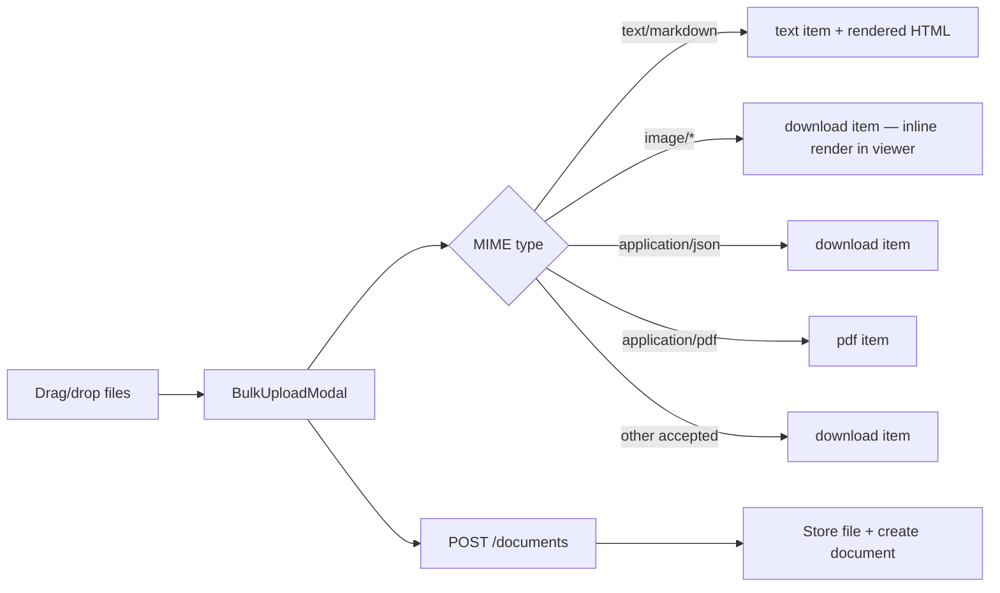
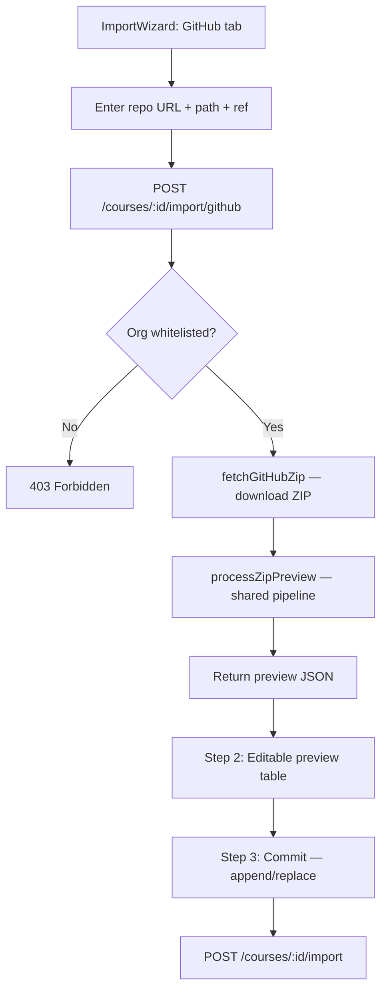

# Upload Extensions Design Spec

**Date:** 2026-08-11
**Phase:** 27 C1 — Upload Extensions (File Types + GitHub Import)
**Status:** Approved

## Problem

1. `.md` and `.json` files are rejected by the upload pipeline (not in MIME whitelists).
2. `.png` files upload but render as download links instead of inline images.
3. No way to import courseware from a GitHub repository.

## Scope

- Extend MIME whitelists to accept `.md` (text/markdown) and `.json` (application/json).
- Render image items inline in the student viewer without changing their item type.
- Add GitHub repo import to ImportWizard (server-side ZIP download via GitHub API).
- Applies to both Admin and Lecturer roles (requires `course.manage` permission).

## Out of Scope

- Private GitHub repo support (requires PAT management).
- Markdown editor/WYSIWYG in the course builder.
- New item types beyond the existing 8 (`video`, `link`, `pdf`, `text`, `audio`, `quiz`, `assignment`, `download`).

---

## Section 1: File Type Extensions

### Current MIME Whitelists

4 parallel lists must stay in sync:

| Constant | File |
|----------|------|
| `DOCUMENT_MIME_TYPES` + `MIME_TO_EXTENSION` | `LMS-Server/src/utils/fileUpload.ts` |
| `MIME_FROM_EXT` + `ALLOWED_DOC_MIMES` | `LMS-Server/src/controllers/coursesController.ts` |
| `ACCEPTED_MIME_TYPES` | `LMS-Frontend/src/components/BulkUploadModal.tsx` |
| `DOC_MIME_TYPES` | `LMS-Frontend/src/components/ImportWizard.tsx` |

### New Types to Add (all 4 lists)

| Extension | MIME Type | Item Type | Behavior | Max Size |
|-----------|----------|-----------|----------|----------|
| `.md` | `text/markdown` | `text` | Rendered as sanitized HTML in `information` field | 2 MB |
| `.json` | `application/json` | `download` | Stored as downloadable file | 1 MB |

### MIME_TO_EXTENSION / MIME_FROM_EXT Additions

```typescript
'text/markdown': '.md',
'application/json': '.json',
```

### Item Type Mapping Changes

Update `mimeToItemType()` in `BulkUploadModal.tsx` and `itemTypeFromMime()` in `coursesController.ts`:

```
text/markdown    → 'text'     (rendered HTML in information field)
application/json → 'download' (generic download)
```

All other mappings remain unchanged. In particular, `image/*` types remain mapped to `download` — see "Student Viewer: Inline Image Rendering" below.

### Student Viewer: Inline Image Rendering

Images (`image/png`, `image/jpeg`, `image/gif`) keep their `download` item type in the data model. This avoids semantic confusion with `pdf` items and prevents breakage in logic that assumes `pdf` means actual PDFs.

Instead, the student course viewer (`EmbeddedMaterialViewer.tsx`) detects image documents at render time. In the existing `item.type === 'download'` branch (line ~414), add a check: if the item has a `documentId`, fetch the document's MIME type (or infer from `fileName` extension). If the MIME is `image/*`, render an inline `` tag pointing to `/api/v1/documents/{documentId}/download` instead of showing the download card.

Implementation:
- Add a `fileName` check in the `download` branch of `EmbeddedMaterialViewer`
- If `fileName` ends in `.png`, `.jpg`, `.jpeg`, `.gif`, render `` with the download URL
- Otherwise, render the existing download card
- No backend changes needed — the download endpoint already serves the file with correct `Content-Type`

### Markdown Processing

When a `.md` file is uploaded via BulkUploadModal or imported via ZIP/folder:

1. File stored on disk as raw `.md` (document record created in `course_documents`)
2. Backend reads the stored file content, converts to HTML using `marked` library
3. HTML sanitized using **DOMPurify** (via `isomorphic-dompurify` for Node.js)
4. Sanitized HTML stored in the item's `information` field
5. Item type set to `text`, `url` left empty
6. `documentId` always set — points to the raw `.md` file for optional download
7. Student viewer already renders `information` as HTML — no frontend changes needed

**Storage model clarification:**
- The `text` item's `information` field is the **primary content** for students (rendered HTML)
- The raw `.md` document (via `documentId`) is **always attached** — it serves as the source of truth and allows re-rendering or raw download
- If a user uploads `.md` through BulkUploadModal, both the document record and the item's `information` are created in a single flow
- In the ZIP/folder import path, `processZipPreview()` stores the document and the markdown rendering happens when the user commits the import (in `importCourseContent()`)

### Markdown Sanitization

Use **DOMPurify** with a safe default config rather than a custom tag/attribute whitelist:

```typescript
import DOMPurify from 'isomorphic-dompurify';

function sanitizeMarkdownHtml(html: string): string {
  return DOMPurify.sanitize(html, {
    ALLOWED_TAGS: [
      'p', 'h1', 'h2', 'h3', 'h4', 'h5', 'h6',
      'ul', 'ol', 'li', 'a', 'strong', 'em', 'b', 'i',
      'code', 'pre', 'blockquote',
      'table', 'thead', 'tbody', 'tr', 'th', 'td',
      'img', 'br', 'hr', 'span', 'div', 'dl', 'dt', 'dd',
      'sup', 'sub', 'del', 's',
    ],
    ALLOWED_ATTR: [
      'href', 'target', 'rel',    // <a>
      'src', 'alt', 'title',      // 
      'class',                      // generic
    ],
    // Force safe link attributes
    ADD_ATTR: ['target'],
    FORBID_TAGS: ['script', 'iframe', 'object', 'embed', 'form', 'input', 'textarea', 'select', 'button'],
    FORBID_ATTR: ['onerror', 'onload', 'onclick', 'onmouseover', 'onfocus', 'onblur', 'style'],
  });
}
```

Key security properties:
- `<script>`, `<iframe>`, `<object>`, `<embed>` are explicitly forbidden
- All `on*` event handler attributes are forbidden
- `style` attributes are forbidden (prevents CSS-based attacks)
- `<a>` tags get `target="_blank"` and `rel="noopener noreferrer"` added post-sanitization
- DOMPurify handles edge cases (nested tags, encoding tricks, mutation XSS) that a simple regex/whitelist would miss

---

## Section 2: Folder Upload

**No new work needed.** ImportWizard already supports folder upload via `webkitdirectory` API with folder-to-week/section mapping. Once the MIME whitelists are extended (Section 1), `.md` and `.json` files will automatically be accepted during folder processing.

The only change: add `text/markdown` and `application/json` to ImportWizard's `DOC_MIME_TYPES` set.

---

## Section 3: GitHub Repo Import

### UX Flow

ImportWizard Step 1 gains a 4th source option: **"GitHub Repository"**

1. User selects "GitHub Repository" source
2. Form fields:
   - **Repository URL** (required): `https://github.com/SM-Web-Systems/repo-name`
   - **Subdirectory path** (optional): e.g., `/courseware` — only import files under that path
   - **Branch/tag** (optional, default: `main`)
3. User clicks "Fetch" → loading spinner
4. Backend downloads ZIP, processes it, returns preview JSON
5. Step 2 shows editable preview (reuses existing preview table)
6. Step 3 confirms with append/replace mode (reuses existing commit flow)

### New Backend Endpoint

```
POST /api/v1/courses/:id/import/github
Content-Type: application/json
Authorization: Bearer <JWT>
Permission: course.manage

Request Body:
{
  "repoUrl": "https://github.com/SM-Web-Systems/blockchain-course",
  "subPath": "/courseware",     // optional
  "ref": "main"                 // optional, defaults to "main"
}

Response (success):
{
  "success": true,
  "data": {
    "preview": {
      "sections": [...],        // same format as ZIP import preview
      "warnings": [...],
      "filesStored": 12,
      "filesSkipped": 3
    }
  }
}

Response (error — non-whitelisted org):
{
  "success": false,
  "error": {
    "code": "FORBIDDEN",
    "message": "Repository owner 'evil-org' is not in the allowed list"
  }
}
```

### Backend Architecture

#### Shared ZIP Processing: `processZipPreview()`

Extract the ZIP processing core (lines 552–715 of `coursesController.ts`) from `importZipContent()` into a shared function:

```typescript
interface ZipPreviewResult {
  sections: Array<{
    title: string;
    week: string;
    items: Array<{
      title: string;
      type: 'pdf' | 'download' | 'text';
      fileName: string;
      documentId: string;
      warnings: string[];
    }>;
  }>;
  warnings: string[];
  filesStored: number;
  filesSkipped: number;
}

function processZipPreview(
  zipPath: string,
  courseId: string,
  uploadedById: string,
  subPath?: string,
): ZipPreviewResult
```

**Behavior:**
1. Opens ZIP with `adm-zip`
2. Filters entries (no directories, no `__MACOSX`, no dotfiles, no path traversal)
3. If `subPath` is provided, further filters to only entries whose path starts with `subPath` (after stripping the GitHub zipball root directory prefix)
4. Enforces `ZIP_MAX_ENTRIES` (200) and `ZIP_MAX_EXTRACTED_BYTES` (200 MB)
5. For each valid entry: infer MIME, check against `ALLOWED_DOC_MIMES`, store file on disk, insert `course_documents` record
6. For `.md` files: additionally read content, render to HTML via `marked`, sanitize via DOMPurify, store sanitized HTML in the preview item (so the commit step can use it for the `information` field)
7. Maps folder structure to week/section preview
8. Detects duplicate file names per section
9. Returns `ZipPreviewResult`

**Error handling:** Throws `AppError` for invalid ZIP, empty ZIP, too many entries, or size overflow. The calling handler catches and responds.

The existing `importZipContent` handler becomes a thin wrapper:
```typescript
export function importZipContent(req, res, next) {
  // Auth + course existence checks (unchanged)
  // ...
  const result = processZipPreview(req.file.path, id, req.user.userId);
  deleteFile(req.file.path);
  res.json({ success: true, data: { preview: result } });
}
```

#### New Service: `githubImportService.ts`

New file: `LMS-Server/src/services/githubImportService.ts`

```typescript
export function parseGitHubUrl(url: string): { owner: string; repo: string }
// Extracts owner/repo from URLs like:
//   https://github.com/SM-Web-Systems/blockchain-course
//   https://github.com/SM-Web-Systems/blockchain-course.git
// Throws AppError if URL format is invalid.

export function isAllowedOrg(owner: string): boolean
// Checks owner against GITHUB_IMPORT_ALLOWED_ORGS env var
// Default: 'SM-Web-Systems' (case-insensitive comparison)

export async function fetchGitHubZip(
  owner: string,
  repo: string,
  ref: string,
): Promise<string>
// Downloads https://api.github.com/repos/{owner}/{repo}/zipball/{ref}
// Follows redirects (GitHub returns 302 → S3 URL)
// Writes to temp file in uploads/imports/YYYY/MM/{uuid}.zip
// Enforces 50 MB download size limit (abort if exceeded)
// Returns absolute path to downloaded ZIP
// Throws on network error, 404, or size exceeded
```

#### New Route in `courses.ts`

```typescript
router.post('/:id/import/github', requirePermission('course.manage'), importGitHubContent);
```

#### New Controller: `importGitHubContent()`

In `coursesController.ts`:

```typescript
export async function importGitHubContent(req, res, next) {
  const { id } = req.params;
  const { repoUrl, subPath, ref = 'main' } = req.body;

  // Validate course exists + lecturer assignment guard (same as importZipContent)
  // Parse and validate GitHub URL
  const { owner, repo } = parseGitHubUrl(repoUrl);
  if (!isAllowedOrg(owner)) throw AppError(403, 'FORBIDDEN', '...');

  let zipPath: string | undefined;
  try {
    zipPath = await fetchGitHubZip(owner, repo, ref);
    const result = processZipPreview(zipPath, id, req.user.userId, subPath);
    res.json({ success: true, data: { preview: result } });
  } finally {
    if (zipPath) deleteFile(zipPath);
  }
}
```

### Security

- **Org whitelist:** Only `SM-Web-Systems` by default (case-insensitive). Configurable via `GITHUB_IMPORT_ALLOWED_ORGS` env var (comma-separated).
- **ZIP size cap:** 50 MB download limit enforced during streaming download. If the response body exceeds 50 MB, abort and delete partial file.
- **File count cap:** 200 entries limit enforced in `processZipPreview`.
- **Extracted size cap:** 200 MB enforced in `processZipPreview`.
- **Public repos only:** No GitHub auth tokens stored. If the repo is private, GitHub returns 404 → user sees "Repository not found or not public".
- **Rate limiting:** Uses existing write limiter (300 req/15min per IP).
- **Temp file cleanup:** Downloaded ZIP deleted in `finally` block.
- **Path traversal:** Enforced in `processZipPreview` (no `..` in paths).
- **GitHub API abuse:** The zipball endpoint is rate-limited by GitHub (60 req/hr unauthenticated). If GitHub returns 403, surface the error to the user.

### Frontend Changes

`ImportWizard.tsx` — Step 1 additions:
- New "GitHub" source button (with `Github` icon from `lucide-react`)
- Form with 3 fields (repo URL, subdirectory, branch)
- "Fetch" button that calls `POST /courses/:id/import/github`
- On success, transitions to Step 2 with the preview data (same as ZIP flow)
- Loading state during fetch, error display on failure (404, 403, network error)

---

## Section 4: Tests

### Backend (+5 tests)

| ID | Test | Description |
|----|------|-------------|
| UPLOAD-EXT-1 | New MIME types accepted | Upload `.md` and `.json` via document endpoint — expect 200 |
| UPLOAD-EXT-2 | Item type mapping | Verify `itemTypeFromMime('text/markdown')` returns `'text'` and `itemTypeFromMime('image/png')` returns `'download'` |
| UPLOAD-EXT-3 | Markdown sanitization | Upload a `.md` file containing `<script>alert(1)</script>` and ``. Assert that the rendered `information` field contains neither `<script>` tags nor `onerror` attributes |
| GH-IMP-1 | GitHub URL parsing | `parseGitHubUrl('https://github.com/SM-Web-Systems/repo')` returns `{ owner: 'SM-Web-Systems', repo: 'repo' }` |
| GH-IMP-2 | Non-whitelisted org rejected | Import from `github.com/evil-org/repo` returns 403 |

### Frontend (+4 tests)

| ID | Test | Description |
|----|------|-------------|
| BULK-EXT-1 | Extended MIME acceptance | BulkUploadModal accepts `.md` file (type `text/markdown`) without filtering it out |
| WIZ-GH-1 | GitHub source option renders | ImportWizard shows "GitHub Repository" button in Step 1 |
| WIZ-GH-2 | GitHub form validation | Submitting empty repo URL shows validation error |
| WIZ-GH-3 | GitHub import error handling | Simulate a 404 response from the GitHub import endpoint. Assert the UI shows "Repository not found or not public" error message |

---

## Section 5: Diagrams

### File Upload Workflow



### GitHub Import Flow



---

## Rollback

Tag `pre-phase27-c1-2026-08-11` created before implementation.
Revert: `git reset --hard pre-phase27-c1-2026-08-11` + rebuild containers.

## Dependencies

- `marked` — markdown → HTML conversion. Not currently installed. `npm install marked` in LMS-Server.
- `isomorphic-dompurify` — HTML sanitization (wraps DOMPurify for Node.js, uses jsdom internally). `npm install isomorphic-dompurify` in LMS-Server.
- No new frontend dependencies (`lucide-react` already has `Github` icon).

## MIME List Sync Checklist

All 4 files must be updated with the same additions:

- [ ] `LMS-Server/src/utils/fileUpload.ts` — add to `DOCUMENT_MIME_TYPES`, `MIME_TO_EXTENSION`
- [ ] `LMS-Server/src/controllers/coursesController.ts` — add to `MIME_FROM_EXT`, `ALLOWED_DOC_MIMES`
- [ ] `LMS-Frontend/src/components/BulkUploadModal.tsx` — add to `ACCEPTED_MIME_TYPES`
- [ ] `LMS-Frontend/src/components/ImportWizard.tsx` — add to `DOC_MIME_TYPES`
