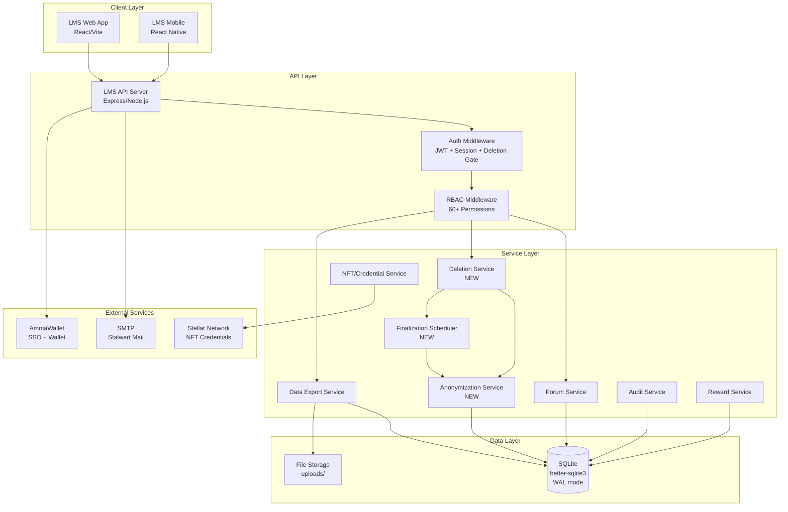
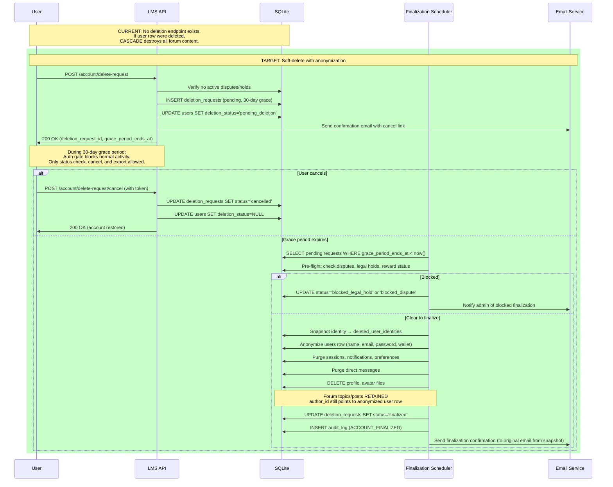
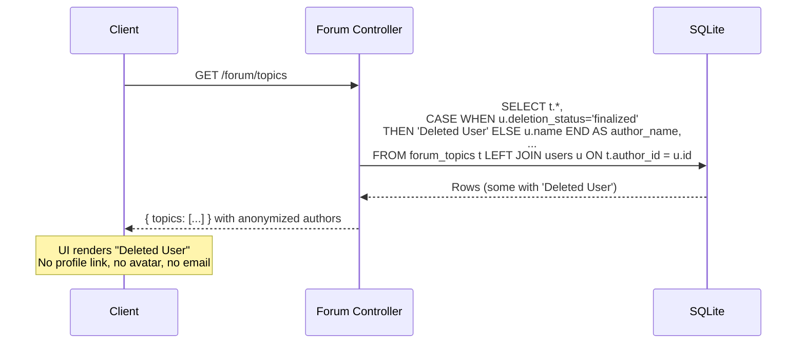
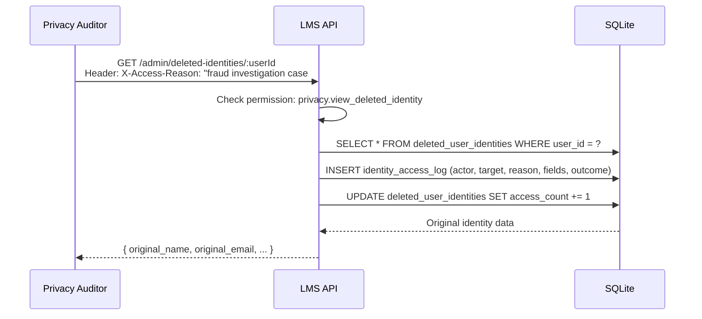

# Forum Anonymization & Account Deletion — Design Specification

**Date:** 2026-09-04
**Status:** Draft — Pending Implementation
**Author:** Claude Code (AI-assisted design)
**Approach:** Soft-delete on users table (Approach A)

---

## Table of Contents

1. [Problem Statement](#1-problem-statement)
2. [Industry Benchmark Summary](#2-industry-benchmark-summary)
3. [Design Principles](#3-design-principles)
4. [Retention Schedule](#4-retention-schedule)
5. [Technical Design](#5-technical-design)
6. [Architecture Diagrams](#6-architecture-diagrams)
7. [API Design](#7-api-design)
8. [Frontend Changes](#8-frontend-changes)
9. [User-Facing Policy Text](#9-user-facing-policy-text)
10. [Internal Engineering Policy](#10-internal-engineering-policy)
11. [Testing Strategy](#11-testing-strategy)
12. [Implementation To-Do List](#12-implementation-to-do-list)
13. [Deployment & Verification](#13-deployment--verification)

---

## 1. Problem Statement

When a user deletes their account on the SM Web Systems LMS, their forum topics and comments must NOT be deleted. Instead, they must become anonymous (author shown as "Deleted User") without breaking existing data, moderation, or audit workflows.

**Current state:**
- Forum tables (`forum_topics`, `forum_posts`) use `ON DELETE CASCADE` on `author_id → users(id)`
- No user deletion endpoint exists (permission `user.delete` defined but unused)
- No soft-delete or anonymization patterns exist anywhere in the codebase
- 8 RESTRICT FKs from reward tables prevent hard-deletion of users with reward activity
- 40+ CASCADE FKs from `users(id)` would destroy data if the user row were deleted

**Target state:**
- Users can request account deletion with a 30-day grace period
- After finalization, the user row persists with anonymized public fields
- Forum content is preserved with "Deleted User" attribution
- Original identity is stored in a restricted table for compliance access
- All public-facing surfaces show only anonymized information

---

## 2. Industry Benchmark Summary

| Platform | Deletion Model | Forum Content | Author Label | Grace Period |
|----------|---------------|---------------|-------------|-------------|
| Codecademy | Hard delete, immediate | Perpetual license | N/A | None |
| Canvas LMS | Soft delete (admin) | Institution decides | "Deleted By [name]" | Institution-defined |
| Moodle | Soft delete + GDPR flow | Shell preserved | Real name persists (bug) | Configurable |
| Discourse | Anonymize (recommended) | Preserved intact | `anon12345678` | None |
| Reddit | Hard delete (account only) | Preserved, orphaned | `[deleted]` | None |
| Stack Overflow | Soft delete (restricted) | Preserved | `user<numericId>` | None |

**Consensus:** Anonymize user identity, preserve community content (GDPR Art. 17(3) freedom-of-expression exemption), scrub PII, retain learning records for audit.

---

## 3. Design Principles

### P1: Soft-Delete with 30-Day Grace Period
- User requests deletion → account enters restricted "pending_deletion" state
- Normal auth, posting, messaging, profile editing, and new transactions disabled
- User can cancel via secure verified recovery flow during 30-day window
- After 30 days, finalization runs only after eligibility, legal-hold, payment/dispute, credential, and retention checks pass

### P2: Forum Content Preservation + Public Pseudonymization
- Forum topics, posts, replies are never deleted on account deletion
- Public UI shows "Deleted User" — no profile links, avatars, bios, emails, or wallet IDs
- Internal `author_id` FK retained for moderation, legal compliance, abuse investigation
- This is pseudonymization (internal link exists), not irreversible anonymization
- Deleted-user content excluded from search suggestions, user directories, leaderboards
- Separate moderation rule for content containing personal data, harassment, or illegal material

### P3: Category-Based Retention Schedule
See [Section 4](#4-retention-schedule) for the full schedule with lawful basis per category.

### P4: Personal Data Minimization on Finalization
After grace period, purge/de-identify data not required for an approved retention purpose:
- Sessions, tokens, password hashes, auth provider IDs
- Names, emails, avatars, bios, profile fields, wallet addresses
- Direct messages (per retention schedule)
- Notification preferences, marketing consent
- Login history, IP/device data (per security retention)
- Uploaded documents, profile images, caches
- Use irreversible placeholder: `deleted_<random-uuid>@deleted.local`

### P5: Data Export Throughout Deletion Window
- Offer GDPR/POPIA-style export before and during 30-day pending period
- Export not a precondition for deletion
- Extend existing export to include forum posts/replies
- Time-limited, access-controlled, encrypted in transit
- Audit all export events

### P6: Restricted Internal Audit & Re-identification
- New permission: `privacy.view_deleted_identity`
- Access requires documented reason; every access event audited
- Public, learner, teacher, and ordinary-admin screens show only "Deleted User"
- Never use retained identity for marketing, analytics, or outreach

### P7: Legal Hold & Dispute Exception
- Active disputes/investigations block finalization
- Hold reason and review date documented
- Unrelated personal data still minimized
- Finalization resumes when hold ends
- Legal hold cannot be indefinite without review

### P8: Backups & Third-Party Processors
- Documented backup retention/rotation period
- Backups not restored without rerunning deletion/anonymization
- Processor register maintained with propagation rules

### P9: User-Facing Transparency
- Clear explanation of all deletion stages, retention, and exceptions
- See [Section 9](#9-user-facing-policy-text)

### P10: Technical Implementation Requirements
- Map every action to actual tables, FKs, processors, files, jobs
- Idempotent, transactional, dry-run-first, audited, rollback-aware
- Distinguish: pending_deletion, finalized, pseudonymized_retained, legal_hold, fully_purged

---

## 4. Retention Schedule

| Category | Records | Retention Period | Lawful Basis | Review Date |
|----------|---------|-----------------|-------------|-------------|
| **A. Learning Records** | course_enrollments, lesson_completions, submissions, nft_credentials, course_completion_requirements | 7 years from finalization | Certification audit, accreditation, limitation periods | Annual |
| **B. Assessment Records** | quiz_completions, quizzes (user answers) | 7 years from finalization | Grading audit, academic integrity | Annual |
| **C. Financial Records** | payments, disputes, course_pricing (user txns) | 7 years from finalization | Tax law (SA Income Tax Act), POPIA financial retention | Annual |
| **D. Reward Records** | reward_accounts, reward_allocations, reward_transactions, reward_eligibility_events, reward_refund_* | 7 years from finalization | Financial accountability, RESTRICT FKs | Annual |
| **E. NFT/Credential Records** | nft_credentials, course_nft_applications, certificate_badges, credential metadata | Indefinite (blockchain immutable) | Credential verification, blockchain record | Biennial |
| **F. Forum Content** | forum_topics, forum_posts, moderation records | Indefinite (pseudonymized) | Community value, freedom of expression (GDPR Art. 17(3)) | Biennial |
| **G. Security Logs** | login_history, active_sessions, audit_log | 2 years from finalization | Security incident response, fraud prevention | Annual |
| **H. Compliance Records** | deletion_requests, data_exports, consent records, legal holds | 7 years from finalization | Regulatory compliance, proof of GDPR/POPIA compliance | Annual |

**At expiry:** Securely delete or de-identify unless another documented legal basis applies.

---

## 5. Technical Design

### 5.1 Schema Changes

#### New columns on `users` table:

```sql
ALTER TABLE users ADD COLUMN deletion_status TEXT DEFAULT NULL
  CHECK (deletion_status IN ('pending_deletion', 'finalized', 'legal_hold'));
ALTER TABLE users ADD COLUMN deletion_requested_at TEXT DEFAULT NULL;
ALTER TABLE users ADD COLUMN deletion_finalized_at TEXT DEFAULT NULL;
ALTER TABLE users ADD COLUMN deletion_requested_by TEXT DEFAULT NULL;  -- 'self' or admin user_id
ALTER TABLE users ADD COLUMN legal_hold_reason TEXT DEFAULT NULL;
ALTER TABLE users ADD COLUMN legal_hold_placed_at TEXT DEFAULT NULL;
ALTER TABLE users ADD COLUMN legal_hold_review_date TEXT DEFAULT NULL;
```

#### New table: `deleted_user_identities`

Stores original PII for restricted compliance access. Encrypted at rest.

```sql
CREATE TABLE IF NOT EXISTS deleted_user_identities (
  user_id TEXT PRIMARY KEY REFERENCES users(id),
  original_name TEXT NOT NULL,
  original_email TEXT NOT NULL,
  original_wallet_address TEXT,
  original_auth_provider TEXT,
  original_ammawallet_user_id TEXT,
  snapshot_at TEXT NOT NULL DEFAULT (datetime('now')),
  retention_expires_at TEXT NOT NULL,  -- based on retention schedule
  access_count INTEGER DEFAULT 0,
  last_accessed_at TEXT,
  last_accessed_by TEXT,
  last_access_reason TEXT
);
```

#### New table: `deletion_requests`

Tracks the lifecycle of deletion requests.

```sql
CREATE TABLE IF NOT EXISTS deletion_requests (
  id TEXT PRIMARY KEY,
  user_id TEXT NOT NULL REFERENCES users(id),
  status TEXT NOT NULL DEFAULT 'pending'
    CHECK (status IN ('pending', 'cancelled', 'finalizing', 'finalized', 'blocked_legal_hold', 'blocked_dispute')),
  requested_at TEXT NOT NULL DEFAULT (datetime('now')),
  cancel_token_hash TEXT,  -- for secure cancellation
  grace_period_ends_at TEXT NOT NULL,
  finalized_at TEXT,
  cancelled_at TEXT,
  blocked_reason TEXT,
  dry_run_result TEXT,  -- JSON: pre-finalization audit
  finalization_log TEXT,  -- JSON: what was purged/anonymized
  created_at TEXT NOT NULL DEFAULT (datetime('now')),
  updated_at TEXT NOT NULL DEFAULT (datetime('now'))
);
CREATE INDEX idx_deletion_requests_user ON deletion_requests(user_id);
CREATE INDEX idx_deletion_requests_status ON deletion_requests(status);
CREATE INDEX idx_deletion_requests_grace ON deletion_requests(grace_period_ends_at);
```

#### New table: `identity_access_log`

Audit trail for every access to deleted user identities.

```sql
CREATE TABLE IF NOT EXISTS identity_access_log (
  id INTEGER PRIMARY KEY AUTOINCREMENT,
  target_user_id TEXT NOT NULL REFERENCES users(id),
  actor_id TEXT NOT NULL,
  reason TEXT NOT NULL,
  fields_accessed TEXT NOT NULL,  -- JSON array of field names
  outcome TEXT NOT NULL DEFAULT 'viewed',  -- viewed, exported, denied
  created_at TEXT NOT NULL DEFAULT (datetime('now'))
);
CREATE INDEX idx_identity_access_log_target ON identity_access_log(target_user_id);
CREATE INDEX idx_identity_access_log_actor ON identity_access_log(actor_id);
```

#### New RBAC permission:

```
privacy.view_deleted_identity — View original identity of deleted users (compliance only)
```

### 5.2 User Lifecycle States

```
                  ┌──────────┐
                  │  active   │ ← normal user
                  └────┬─────┘
                       │ request deletion
                       ▼
              ┌──────────────────┐
              │ pending_deletion │ ← restricted, 30-day window
              └───┬──────┬──────┘
        cancel │  │      │ legal hold placed
               │  │      ▼
               │  │  ┌────────────┐
               │  │  │ legal_hold │ ← blocked, review date set
               │  │  └──────┬─────┘
               │  │         │ hold released
               ▼  │         │
          ┌────────┘         │
          │ active           │
          │ (restored)       ▼
          │          ┌─────────────┐
          │          │  finalized  │ ← PII anonymized, identity snapshot stored
          │          └─────────────┘
          │
          └──────────────────────────────────────┘
```

### 5.3 Finalization Process (Idempotent)

The finalization service runs as a scheduled job (daily) or on-demand. Steps:

1. **Pre-flight checks (dry-run):**
   - Verify grace period expired
   - Check no active payment disputes (`SELECT FROM disputes WHERE ... status IN ('open', 'under_review')`)
   - Check no active legal holds (`deletion_status != 'legal_hold'`)
   - Check no pending reward refunds
   - Log dry-run result to `deletion_requests.dry_run_result`

2. **Snapshot original identity:**
   - `INSERT INTO deleted_user_identities` with current name, email, wallet, auth provider
   - Set `retention_expires_at` based on retention schedule (max of all applicable categories)

3. **Anonymize user row:**
   ```sql
   UPDATE users SET
     name = 'Deleted User',
     email = 'deleted_' || lower(hex(randomblob(16))) || '@deleted.local',
     password_hash = NULL,
     walletAddress = NULL,
     wallet_linking_status = 'none',
     auth_provider = 'deleted',
     ammawallet_user_id = NULL,
     password_reset_token = NULL,
     password_reset_expires_at = NULL,
     password_changed_at = NULL,
     description = NULL,
     deletion_status = 'finalized',
     deletion_finalized_at = datetime('now'),
     updated_at = datetime('now')
   WHERE id = ? AND deletion_status = 'pending_deletion'
   ```

4. **Purge profile data:**
   ```sql
   DELETE FROM user_profiles WHERE user_id = ?;
   ```

5. **Purge sessions and tokens:**
   ```sql
   DELETE FROM active_sessions WHERE user_id = ?;
   ```

6. **Purge login history** (after security retention period — 2 years post-finalization, handled by retention scheduler):
   - Initially retained; marked for future purge

7. **Purge direct messages** (per retention schedule):
   ```sql
   DELETE FROM conversation_messages WHERE conversation_id IN (
     SELECT id FROM conversations WHERE user1_id = ? OR user2_id = ?
   );
   DELETE FROM conversation_reads WHERE user_id = ?;
   DELETE FROM conversations WHERE user1_id = ? OR user2_id = ?;
   ```

8. **Purge notification preferences:**
   ```sql
   DELETE FROM notification_preferences WHERE user_id = ?;
   DELETE FROM notifications WHERE user_id = ?;
   ```

9. **Purge uploaded files:**
   - Delete avatar file from disk
   - Delete user-specific uploaded documents (not course materials)

10. **Retain (do NOT purge):**
    - `forum_topics` and `forum_posts` (author_id still points to anonymized user)
    - `course_enrollments`, `lesson_completions`, `submissions`
    - `quiz_completions`
    - `payments`, `disputes`
    - `reward_*` tables (RESTRICT FKs enforce this)
    - `nft_credentials`, `course_nft_applications`, `certificate_badges`
    - `audit_log` entries
    - `data_exports` records
    - `deletion_requests` record

11. **Log finalization:**
    - Update `deletion_requests` with finalization_log (JSON: what was purged, counts)
    - Insert `audit_log` entry: action='ACCOUNT_FINALIZED', actor_id='system'

12. **Trigger processor cleanup** (future work):
    - Email service records
    - Analytics identifiers
    - File storage cleanup

### 5.4 Forum Query Changes

**Current pattern (INNER JOIN — breaks if user deleted):**
```sql
SELECT t.*, u.name AS author_name, u.email AS author_email, u.role AS author_role
FROM forum_topics t
JOIN users u ON t.author_id = u.id
```

**New pattern (LEFT JOIN + conditional display):**
```sql
SELECT t.*,
  CASE WHEN u.deletion_status = 'finalized' THEN 'Deleted User' ELSE u.name END AS author_name,
  CASE WHEN u.deletion_status = 'finalized' THEN NULL ELSE u.email END AS author_email,
  CASE WHEN u.deletion_status = 'finalized' THEN 'deleted' ELSE u.role END AS author_role,
  (u.deletion_status = 'finalized') AS is_deleted_user
FROM forum_topics t
LEFT JOIN users u ON t.author_id = u.id
```

This pattern applies to:
- `forumController.ts`: `getTopics()`, `getTopic()`, `getPosts()`
- Any search results that include forum content
- User directory / profile views

**Pending-deletion users:** Still show real name (account not yet finalized), but cannot post new content.

### 5.5 Authentication Gate

In `middleware/auth.ts`, after JWT validation:

```typescript
// Block pending-deletion and finalized users
if (user.deletion_status === 'pending_deletion') {
  // Allow only: GET /deletion-request (status check), POST /deletion-request/cancel, GET /data-export
  const allowedPaths = ['/deletion-request', '/data-export'];
  if (!allowedPaths.some(p => req.path.startsWith(p))) {
    throw new AppError('Account pending deletion. Cancel deletion to restore access.', 403);
  }
}
if (user.deletion_status === 'finalized') {
  throw new AppError('Account has been deleted', 401);
}
```

### 5.6 Deletion Request Cancellation

Secure recovery flow:
1. User visits a cancellation URL with a token (emailed at request time)
2. Token verified (SHA256 hash stored in `deletion_requests.cancel_token_hash`)
3. `deletion_requests.status` → 'cancelled', `cancelled_at` set
4. `users.deletion_status` → NULL (restored to active)
5. User must re-authenticate (all sessions were not yet purged during pending state)

---

## 6. Architecture Diagrams

### 6.1 High-Level Architecture



### 6.2 Forum + User + Audit Data Model

```mermaid
erDiagram
    USERS {
        text id PK
        text name "anonymized on finalization"
        text email "UK: replaced with deleted_uuid"
        text password_hash "NULLed on finalization"
        text role "student|lecturer|admin"
        text walletAddress "UK: NULLed on finalization"
        text deletion_status "NULL|pending_deletion|finalized|legal_hold"
        text deletion_requested_at
        text deletion_finalized_at
        text legal_hold_reason
        text legal_hold_review_date
    }

    FORUM_TOPICS {
        text id PK
        text title
        text body
        text author_id FK "NOT NULL, retained"
        text course_id FK "nullable, SET NULL"
        text created_at
        text updated_at
    }

    FORUM_POSTS {
        text id PK
        text topic_id FK "CASCADE"
        text body
        text author_id FK "NOT NULL, retained"
        text created_at
        text updated_at
    }

    DELETED_USER_IDENTITIES {
        text user_id PK_FK
        text original_name
        text original_email
        text original_wallet_address
        text snapshot_at
        text retention_expires_at
        int access_count
        text last_accessed_by
    }

    DELETION_REQUESTS {
        text id PK
        text user_id FK
        text status "pending|cancelled|finalizing|finalized|blocked_*"
        text requested_at
        text grace_period_ends_at
        text finalized_at
        text dry_run_result "JSON"
        text finalization_log "JSON"
    }

    IDENTITY_ACCESS_LOG {
        int id PK
        text target_user_id FK
        text actor_id
        text reason
        text fields_accessed "JSON"
        text outcome
        text created_at
    }

    AUDIT_LOG {
        int id PK
        text action
        text actor_id
        text target_id
        text details
        text created_at
    }

    USERS ||--o{ FORUM_TOPICS : "author_id"
    USERS ||--o{ FORUM_POSTS : "author_id"
    USERS ||--o| DELETED_USER_IDENTITIES : "user_id"
    USERS ||--o{ DELETION_REQUESTS : "user_id"
    USERS ||--o{ IDENTITY_ACCESS_LOG : "target_user_id"
    FORUM_TOPICS ||--o{ FORUM_POSTS : "topic_id"
    COURSES ||--o{ FORUM_TOPICS : "course_id"
```

### 6.3 Account Deletion Flow — Current vs Target



### 6.4 Forum Read Path — Handling Deleted Users



### 6.5 Compliance Access — Viewing Deleted Identity



---

## 7. API Design

### 7.1 Account Deletion Endpoints

#### `POST /account/delete-request`
**Auth:** Authenticated user (self-service)
**Body:** `{ reason?: string }`
**Response:** `{ success, data: { requestId, gracePeriodEndsAt, cancelUrl } }`
**Logic:**
- Verify user has no active `pending` deletion request
- Verify no active disputes or legal holds
- Generate cancel token, hash it, store in deletion_requests
- Set `users.deletion_status = 'pending_deletion'`
- Send confirmation email with cancel link
- Log to audit_log

#### `GET /account/delete-request`
**Auth:** Authenticated user (allowed during pending_deletion)
**Response:** `{ success, data: { status, requestedAt, gracePeriodEndsAt } }`

#### `POST /account/delete-request/cancel`
**Auth:** Authenticated user OR token-based (allowed during pending_deletion)
**Body:** `{ cancelToken: string }`
**Response:** `{ success, message: "Account restored" }`
**Logic:**
- Verify token hash matches
- Set `deletion_requests.status = 'cancelled'`
- Set `users.deletion_status = NULL`
- Log to audit_log

#### `POST /admin/users/:id/legal-hold`
**Auth:** `privacy.view_deleted_identity` permission
**Body:** `{ reason: string, reviewDate: string }`
**Response:** `{ success }`
**Logic:**
- Set `users.deletion_status = 'legal_hold'`
- Block finalization
- Log to audit_log

#### `DELETE /admin/users/:id/legal-hold`
**Auth:** `privacy.view_deleted_identity` permission
**Response:** `{ success }`
**Logic:**
- If user had pending deletion, restore to `pending_deletion`
- Log to audit_log

#### `GET /admin/deleted-identities/:userId`
**Auth:** `privacy.view_deleted_identity` permission
**Headers:** `X-Access-Reason: <string>` (required)
**Response:** `{ success, data: { originalName, originalEmail, ... } }`
**Logic:**
- Fetch from `deleted_user_identities`
- Log access to `identity_access_log`

#### `GET /admin/deletion-requests`
**Auth:** `privacy.view_deleted_identity` permission
**Query:** `?status=pending&limit=50&offset=0`
**Response:** `{ success, data: { requests: [...] } }`

### 7.2 Modified Forum Endpoints

No new endpoints. Existing endpoints modified to handle deleted users:
- `GET /forum/topics` — LEFT JOIN, conditional author display
- `GET /forum/topics/:id` — LEFT JOIN, conditional author display
- `GET /forum/topics/:topicId/posts` — LEFT JOIN, conditional author display
- `POST /forum/topics` — Block if `deletion_status IS NOT NULL`
- `POST /forum/topics/:topicId/posts` — Block if `deletion_status IS NOT NULL`

### 7.3 Modified Data Export

Add forum content to existing export:
- `forum-topics.json` — user's authored topics (title, body, course, dates)
- `forum-posts.json` — user's authored replies (body, topic reference, dates)
- Exclude other users' personal data from thread context

---

## 8. Frontend Changes

### 8.1 Forum UI

**ForumAuthor component changes:**
- Check `is_deleted_user` flag in API response
- If true: render "Deleted User" with a generic avatar icon, no profile link
- If false: render normally with name, avatar, profile link

**Forum.tsx page:**
- No structural changes needed — just display logic in author rendering

### 8.2 Account Settings Page (New Section)

**Delete Account section** (bottom of settings/profile page):
- "Delete My Account" button (danger style)
- Confirmation modal explaining:
  - 30-day grace period
  - What will be deleted/anonymized/retained
  - Forum content preservation
  - Data export recommendation
- Password confirmation required
- Shows deletion request status if pending

### 8.3 Restricted State UI

When `deletion_status = 'pending_deletion'`:
- Show a banner: "Your account is scheduled for deletion on [date]. [Cancel Deletion] [Download My Data]"
- Disable all normal navigation except: account status, data export, cancel deletion
- Block new posts, messages, enrollments

### 8.4 Admin UI

**Admin Dashboard — Deletion Management panel:**
- List of pending/blocked deletion requests
- Legal hold controls
- Compliance identity viewer (with reason field)

---

## 9. User-Facing Policy Text

### Account Deletion

You may request deletion of your account at any time from your account settings. When you submit a deletion request:

**30-Day Recovery Period.** Your account immediately enters a restricted state. You will not be able to log in, post, or access course materials during this period. You may cancel the deletion request and restore full access at any time during the 30-day window by using the cancellation link sent to your registered email address. This recovery period is provided as a courtesy to prevent accidental loss of your learning records.

**What Happens After 30 Days.** Once the recovery period ends, your account is permanently finalized. Your personal information — including your name, email address, profile details, and wallet identifiers — is removed from all public-facing pages and replaced with "Deleted User." Your password and authentication credentials are securely destroyed. Direct messages are deleted. Session data is purged.

**What Is Retained.** Your forum posts and discussion contributions remain visible with the author shown as "Deleted User." This preserves the integrity of community discussions and the context of other users' replies. Your course enrolment records, grades, quiz submissions, payment history, certificates, and NFT credentials are retained in anonymized form for a limited period as required for certification verification, financial compliance, and audit purposes. These records are not publicly visible and are accessible only to authorized compliance personnel under documented procedures.

**Data Export.** Before and during the 30-day recovery period, you may download a copy of your personal data, including your profile, learning records, forum posts, messages, and payment history. We encourage you to export your data before your account is finalized.

**Exceptions.** If your account is involved in an active payment dispute, fraud investigation, or legal proceeding, finalization may be delayed until the matter is resolved. You will be notified of any such delay and the reason for it.

**Backup Copies.** Anonymized production data may persist in encrypted backup copies until those backups expire in the normal rotation cycle. We do not restore backup copies in a way that would reactivate deleted accounts.

For questions or assistance with account deletion, contact support@smwebsystems.com.

---

## 10. Internal Engineering Policy

### Soft-Delete Implementation
- User row is NEVER hard-deleted. `deletion_status` column governs lifecycle state.
- `pending_deletion`: auth gate blocks normal access; only status, cancel, export endpoints allowed.
- `finalized`: all PII anonymized on user row; original identity in `deleted_user_identities`.
- `legal_hold`: finalization blocked; reviewed on `legal_hold_review_date`.

### Anonymization Implementation
- `name` → `'Deleted User'`
- `email` → `'deleted_' || lower(hex(randomblob(16))) || '@deleted.local'` (non-routable, non-predictable)
- `password_hash` → `NULL`
- `walletAddress` → `NULL`
- `auth_provider` → `'deleted'`
- `description` → `NULL`
- Profile row (`user_profiles`) → hard-deleted
- Avatar file → hard-deleted from disk

### Forum Queries
- ALL forum queries MUST use `LEFT JOIN users` (not `JOIN`)
- ALL forum queries MUST check `u.deletion_status` to substitute "Deleted User"
- This pattern is enforced by test assertions

### Audit Requirements
- `audit_log` entry for: deletion request, cancellation, legal hold placed/released, finalization
- `identity_access_log` entry for every compliance access to `deleted_user_identities`
- `deletion_requests.finalization_log` captures JSON of all purge actions

### Retention Enforcement
- Finalization scheduler runs daily at 04:00 UTC
- Checks `deletion_requests WHERE status='pending' AND grace_period_ends_at < datetime('now')`
- Pre-flight validation before any destructive action
- Idempotent: can be safely re-run

### Security
- Cancel tokens: crypto.randomBytes(32), SHA256-hashed for storage
- Cancel links valid for 30 days (matches grace period)
- No leaked PII in API responses for finalized users
- Rate limit on deletion requests: 1 per 24 hours per user

---

## 11. Testing Strategy

### Unit Tests (Backend)
| ID | Test | Description |
|----|------|-------------|
| DEL-01 | Request creation | POST /account/delete-request creates request and sets deletion_status |
| DEL-02 | Duplicate request | Second request while pending returns 409 |
| DEL-03 | Cancellation | Cancel with valid token restores account |
| DEL-04 | Invalid cancel token | Returns 400 |
| DEL-05 | Auth gate - pending | Blocks normal endpoints, allows status/cancel/export |
| DEL-06 | Auth gate - finalized | Returns 401 |
| DEL-07 | Forum post blocked | Pending-deletion user cannot create topic/post |
| DEL-08 | Legal hold placement | Sets status to legal_hold |
| DEL-09 | Legal hold blocks finalization | Scheduler skips held accounts |
| DEL-10 | Dispute blocks finalization | Scheduler skips accounts with open disputes |
| ANON-01 | User row anonymized | name, email, password, wallet NULLed/replaced |
| ANON-02 | Profile deleted | user_profiles row removed |
| ANON-03 | Sessions purged | active_sessions rows deleted |
| ANON-04 | Messages purged | conversations + messages deleted |
| ANON-05 | Notifications purged | notifications + preferences deleted |
| ANON-06 | Identity snapshot created | deleted_user_identities row with original data |
| ANON-07 | Forum content preserved | forum_topics and forum_posts rows still exist |
| ANON-08 | Forum author display | GET /forum/topics returns "Deleted User" for finalized user |
| ANON-09 | Learning records preserved | enrollments, completions, submissions untouched |
| ANON-10 | Payment records preserved | payments, disputes untouched |
| ANON-11 | Reward records preserved | reward_accounts, transactions untouched |
| ANON-12 | NFT credentials preserved | nft_credentials untouched |
| ANON-13 | Idempotent finalization | Running finalization twice produces same result |
| ANON-14 | Email placeholder non-predictable | Verify email doesn't contain original user ID |
| AUDIT-01 | Deletion request logged | audit_log entry created |
| AUDIT-02 | Finalization logged | audit_log entry + finalization_log JSON |
| AUDIT-03 | Identity access logged | identity_access_log entry on compliance view |
| AUDIT-04 | Access reason required | 400 if X-Access-Reason header missing |
| AUDIT-05 | Permission check | Non-privacy-auditor gets 403 |
| EXPORT-01 | Forum included in export | data export ZIP contains forum-topics.json and forum-posts.json |

### Integration Tests
| ID | Test | Description |
|----|------|-------------|
| INT-01 | Full lifecycle | Create user → post → request deletion → cancel → re-post → request again → finalize → verify anonymization |
| INT-02 | Legal hold lifecycle | Request deletion → place hold → verify blocked → release hold → finalize |
| INT-03 | Dispute blocking | Create payment dispute → request deletion → verify blocked → resolve dispute → finalize |
| INT-04 | Multi-user forum | User A and B post → A deletes → verify B's posts intact, A's posts show "Deleted User" |

### E2E Tests (Playwright)
| ID | Test | Description |
|----|------|-------------|
| E2E-01 | Deletion request UI | Navigate to settings → request deletion → verify confirmation modal → verify pending banner |
| E2E-02 | Cancellation UI | While pending → click cancel → verify account restored |
| E2E-03 | Forum anonymization | After finalization → navigate to forum → verify "Deleted User" displayed |

---

## 12. Implementation To-Do List

### Phase 1: Schema & Infrastructure
- [ ] 1.1 Create git worktree for feature branch
- [ ] 1.2 Add `deletion_status`, `deletion_requested_at`, `deletion_finalized_at`, `legal_hold_*` columns to `users`
- [ ] 1.3 Create `deleted_user_identities` table
- [ ] 1.4 Create `deletion_requests` table
- [ ] 1.5 Create `identity_access_log` table
- [ ] 1.6 Add `privacy.view_deleted_identity` RBAC permission
- [ ] 1.7 Write migration in `database.ts` (ensure* pattern)
- [ ] 1.8 Write schema tests for new tables

### Phase 2: Deletion Request Service
- [ ] 2.1 Write tests first (DEL-01 through DEL-10)
- [ ] 2.2 Create `deletionService.ts` (requestDeletion, cancelDeletion, getDeletionStatus)
- [ ] 2.3 Create deletion request routes
- [ ] 2.4 Implement auth gate in middleware/auth.ts for pending_deletion
- [ ] 2.5 Send confirmation email with cancel link
- [ ] 2.6 Verify all tests pass

### Phase 3: Finalization Service
- [ ] 3.1 Write tests first (ANON-01 through ANON-14)
- [ ] 3.2 Create `anonymizationService.ts` (anonymizeUser, snapshotIdentity, purgePersonalData)
- [ ] 3.3 Create `finalizationScheduler.ts` (daily job, pre-flight checks, idempotent execution)
- [ ] 3.4 Wire scheduler into server.ts (start/stop)
- [ ] 3.5 Implement legal hold endpoints
- [ ] 3.6 Verify all tests pass

### Phase 4: Forum Query Updates
- [ ] 4.1 Write test (ANON-08) for forum author anonymization
- [ ] 4.2 Update `forumController.ts`: INNER JOIN → LEFT JOIN + CASE expressions
- [ ] 4.3 Update `toAuthor()` helper to handle deleted users
- [ ] 4.4 Update search endpoint to exclude deleted-user content from suggestions
- [ ] 4.5 Verify existing forum tests still pass
- [ ] 4.6 Verify new anonymization test passes

### Phase 5: Data Export Enhancement
- [ ] 5.1 Write test (EXPORT-01) for forum content in export
- [ ] 5.2 Add forum topics/posts to `dataExportService.ts`
- [ ] 5.3 Verify export test passes

### Phase 6: Compliance Access API
- [ ] 6.1 Write tests (AUDIT-01 through AUDIT-05)
- [ ] 6.2 Create compliance routes (GET /admin/deleted-identities/:userId, GET /admin/deletion-requests)
- [ ] 6.3 Implement identity_access_log recording
- [ ] 6.4 Verify all audit tests pass

### Phase 7: Frontend Changes
- [ ] 7.1 Update Forum.tsx to handle `is_deleted_user` flag
- [ ] 7.2 Update forumService.ts types for deleted user fields
- [ ] 7.3 Create DeleteAccountSection component for account settings
- [ ] 7.4 Create PendingDeletionBanner component
- [ ] 7.5 Create Admin DeletionManagementPanel component
- [ ] 7.6 Write frontend tests

### Phase 8: Integration & E2E Tests
- [ ] 8.1 Write integration tests (INT-01 through INT-04)
- [ ] 8.2 Write E2E tests (E2E-01 through E2E-03)
- [ ] 8.3 Verify all tests pass end-to-end

### Phase 9: Documentation & Policy
- [ ] 9.1 Write user-facing policy text and add to app
- [ ] 9.2 Write internal engineering policy note
- [ ] 9.3 Update API docs (OpenAPI annotations)
- [ ] 9.4 Create retention schedule document

### Phase 10: Deployment & Verification
- [ ] 10.1 Run full test suite locally
- [ ] 10.2 Scan diffs for secrets and PII exposure
- [ ] 10.3 Create PR with clear description
- [ ] 10.4 Deploy to staging/production
- [ ] 10.5 Verify forum behavior with real data
- [ ] 10.6 Record build SHA and feature commit SHA

---

## 13. Deployment & Verification

### Migration Order
1. Deploy schema changes (new tables + columns) — backward compatible
2. Deploy auth gate + deletion request endpoints
3. Deploy finalization service (scheduler initially disabled)
4. Deploy forum query updates
5. Deploy frontend changes
6. Enable finalization scheduler
7. Monitor audit logs and forum rendering

### Verification Checklist
- [ ] All 1270+ backend tests pass
- [ ] All 227+ frontend tests pass
- [ ] All 14+ E2E tests pass
- [ ] New deletion tests pass (DEL-01 through DEL-10)
- [ ] New anonymization tests pass (ANON-01 through ANON-14)
- [ ] New audit tests pass (AUDIT-01 through AUDIT-05)
- [ ] Forum renders "Deleted User" for finalized accounts
- [ ] Pending-deletion users cannot post
- [ ] Cancellation restores account
- [ ] Data export includes forum content
- [ ] No PII leaked in API responses for finalized users
- [ ] Compliance access requires reason and logs access
- [ ] Legal hold blocks finalization
- [ ] Diffs contain no secrets or user data
