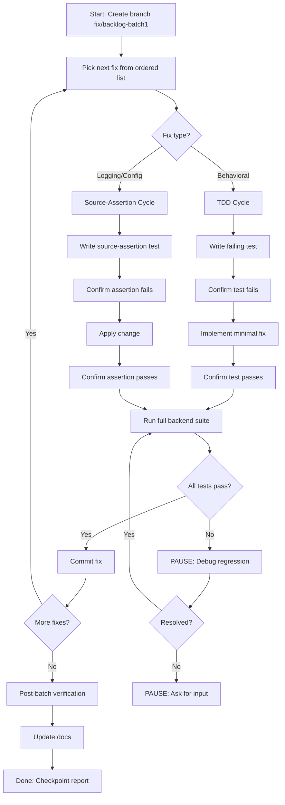
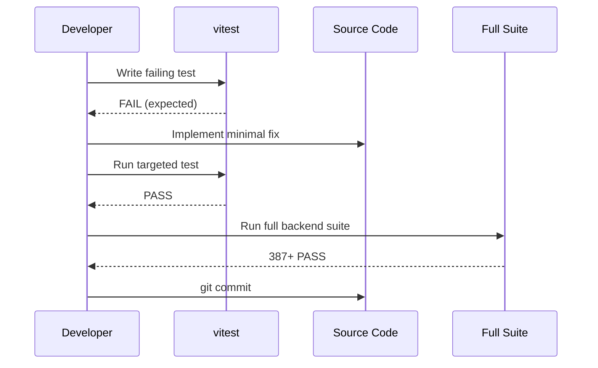
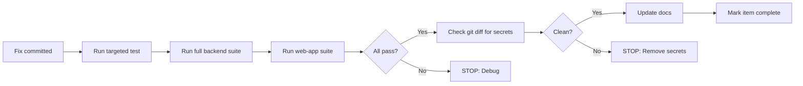
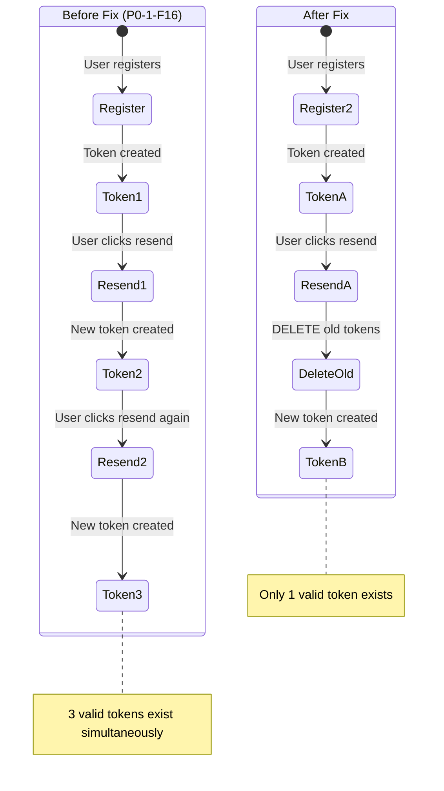
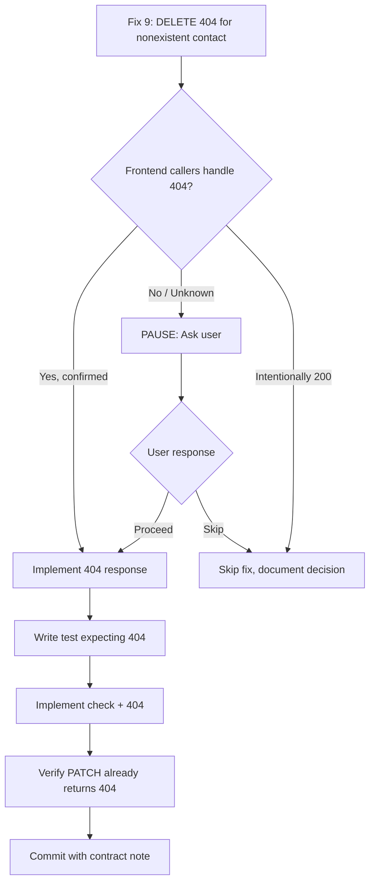

# Backlog Batch 1 — Developer Specification

> Date: 2026-07-28
> Scope: 10 backend quick wins — defensive guards, validation, observability
> Branch: `fix/backlog-batch1` from `main` (`bd21cc3`)
> Tests baseline: 387/387 passing

---

## Mermaid Diagrams

### Batch 1 Execution Loop



### TDD Cycle for a Single Fix



### Verification-Before-Completion Flow



### Fix 5: Verification Token Lifecycle (Before/After)



### Fix 9: API Contract Decision Gate



---

## Fix 1: P2-3-F2 — Division by zero in calcPriceImpact

**Finding ID:** P2-3-F2
**Severity:** LOW
**Why it matters:** `parseFloat(amount)` or `spotPrice` being 0 produces `NaN`/`Infinity`, which propagates to the UI as broken price impact display.

**Current behavior:**
```
calcPriceImpact([{price:"0",amount:"100"}], "50") → Infinity
calcPriceImpact([{price:"1.5",amount:"100"}], "0") → NaN
```

**Desired behavior:**
```
calcPriceImpact([{price:"0",amount:"100"}], "50") → "0"
calcPriceImpact([{price:"1.5",amount:"100"}], "0") → "0"
```

**Affected files:**
- `packages/backend/src/modules/swap/swap.service.ts:260-275`

**Exact guard to add:**
```typescript
const parsedAmount = parseFloat(amount);
if (parsedAmount <= 0 || isNaN(parsedAmount)) return "0";
const spotPrice = parseFloat(asks[0].price);
if (spotPrice <= 0 || isNaN(spotPrice)) return "0";
```

**Failure modes prevented:** NaN/Infinity in price impact, broken UI display
**Tests to write first:** Unit tests with amount="0", amount="-1", price="0"
**Expected passing criteria:** All return "0" string, valid inputs unchanged
**Regression risks:** None — only affects edge cases that currently produce broken output
**Reviewer focus:** Ensure existing valid-input behavior unchanged; check `toFixed(2)` precision

---

## Fix 2: P2-3-F4 — Quote amount not validated

**Finding ID:** P2-3-F4
**Severity:** LOW
**Why it matters:** Invalid amounts (zero, negative, non-numeric) are passed directly to Stellar Horizon API, causing unpredictable responses or errors.

**Current behavior:** `getBestQuote(..., "0")` calls Horizon with `amount=0`
**Desired behavior:** `getBestQuote(..., "0")` throws `"amount must be a positive number"`

**Affected files:**
- `packages/backend/src/modules/swap/swap.service.ts:18-23`

**Exact guard:**
```typescript
const parsed = parseFloat(amount);
if (isNaN(parsed) || parsed <= 0) {
  throw new Error("amount must be a positive number");
}
```

**Failure modes prevented:** Invalid Horizon requests, confusing Horizon errors
**Tests:** Unit tests with "0", "-5", "abc" — all should throw
**Regression risks:** None — these inputs already fail downstream
**Reviewer focus:** Error message clarity, ensure route handler catches and returns 400

---

## Fix 3: P1-2-F4 — writeBillingCredit positive-amount validation

**Finding ID:** P1-2-F4
**Severity:** LOW
**Why it matters:** A zero or negative `amountXlm` would decrement the tenant balance via `prepaid_xlm_balance + negative::numeric`, corrupting billing state.

**Current behavior:** `writeBillingCredit(tx, {amountXlm: "-100"})` subtracts 100 XLM
**Desired behavior:** `writeBillingCredit(tx, {amountXlm: "-100"})` throws error

**Affected files:**
- `packages/backend/src/services/billing.service.ts:406-412`

**Exact guard:** After destructuring `opts`, use existing `toStroops()`:
```typescript
const amountStroops = toStroops(amountXlm);
if (amountStroops <= 0n) {
  throw new Error("amountXlm must be a positive value");
}
```

**Failure modes prevented:** Billing balance corruption, negative credits
**Tests:** Unit tests with "0.0000000", "-100.0000000", "abc"
**Regression risks:** None — negative credits are always bugs
**Reviewer focus:** Uses `toStroops()` not `parseFloat()` for precision

---

## Fix 4: P4-7-F2 — Unbounded rateLimitWindows map

**Finding ID:** P4-7-F2
**Severity:** MEDIUM
**Why it matters:** `rateLimitWindows` Map grows by one entry per unique API key ID, never shrinks. In a long-running process, this is an unbounded memory leak.

**Current behavior:** Map grows forever
**Desired behavior:** Expired entries evicted when map size exceeds 100

**Affected files:**
- `packages/backend/src/middleware/tenant-api-key.ts:71-90`

**Exact guard:**
```typescript
if (rateLimitWindows.size > 100) {
  for (const [id, w] of rateLimitWindows) {
    if (now - w.windowStart >= 60_000) {
      rateLimitWindows.delete(id);
    }
  }
}
```

**Why threshold 100:** Production has ~10 tenant API keys. 100 is 10x headroom. Eviction is O(n) sweep, negligible at this scale.

**Failure modes prevented:** Unbounded memory growth in long-running server
**Tests:** Unit test with fake timers: create entries, advance time, verify eviction
**Regression risks:** Very low — only removes already-expired entries
**Reviewer focus:** Threshold appropriateness, eviction only removes expired entries

---

## Fix 5: P0-1-F16 — Stale verification tokens on re-send

**Finding ID:** P0-1-F16
**Severity:** LOW
**Why it matters:** Multiple valid verification tokens accumulate. Old email links remain valid indefinitely (until 24h expiry). Reduces security of email verification.

**Current behavior:** resend-verification INSERTs without DELETEing old tokens
**Desired behavior:** DELETE old tokens for user, then INSERT new one

**Affected files:**
- `packages/backend/src/routes/auth.ts:1175-1180`

**Exact change:** Before the INSERT, add:
```typescript
await db.execute(
  sql`DELETE FROM email_verification_tokens WHERE user_id = ${userId}`,
);
```

**Failure modes prevented:** Multiple valid tokens, stale email links
**Tests:** Source-assertion: verify DELETE appears before INSERT in resend-verification handler
**Regression risks:** Low — old verification links stop working (intended)
**Reviewer focus:** DELETE uses `user_id`, not `token`; parameterized query prevents injection

---

## Fix 6: P2-2-F5 — ILIKE wildcard injection

**Finding ID:** P2-2-F5
**Severity:** LOW
**Why it matters:** User-supplied `query` string is interpolated directly into ILIKE patterns. `%` and `_` are SQL wildcards — a query like `%%%%%` matches everything and can degrade PG performance.

**Current behavior:** `ilike(tokens.assetCode, \`%${query}%\`)`
**Desired behavior:** `ilike(tokens.assetCode, \`%${escapeIlike(query.slice(0,100))}%\`)`

**Affected files:**
- `packages/backend/src/modules/tokens/token.service.ts:197-206`

**Exact helper to add:**
```typescript
function escapeIlike(raw: string): string {
  return raw.replace(/\\/g, "\\\\").replace(/%/g, "\\%").replace(/_/g, "\\_");
}
```

**Failure modes prevented:** Wildcard injection, performance degradation, unexpected matches
**Tests:** Source-assertion: verify escape function exists and query is capped
**Regression risks:** Very low — literal `%` in search now matches literal `%` instead of wildcard
**Reviewer focus:** Escape order (backslash first), slice before escape

---

## Fix 7: P0-3-F14 — PII in production logs

**Finding ID:** P0-3-F14
**Severity:** LOW
**Why it matters:** `console.log("[sign-and-submit] userId:", userId)` correlates user IDs with wallet public keys in production logs. This is unnecessary PII exposure.

**Current behavior:** userId and publicKey logged on every sign-and-submit
**Desired behavior:** These log lines removed entirely

**Affected files:**
- `packages/backend/src/server.ts:1234, 1372, 1409-1414`

**Exact change:** Delete the 3 console.log statements. Line 2299 (admin liquifier) is out of scope.

**Failure modes prevented:** PII correlation in production logs
**Tests:** Source-assertion: grep for unguarded console.log with userId in server.ts
**Regression risks:** None — removes debug noise only
**Reviewer focus:** Ensure only the PII logs are removed, not operational ones

---

## Fix 8: P2-4-F4 — TURNSTILE_SECRET_KEY startup warning

**Finding ID:** P2-4-F4
**Severity:** LOW
**Why it matters:** Empty TURNSTILE_SECRET_KEY silently disables Turnstile verification in production. Misconfiguration is invisible.

**Current behavior:** No warning
**Desired behavior:** `console.warn` if empty in production

**Affected files:**
- `packages/backend/src/config/index.ts`

**Exact change:** After line 59, add:
```typescript
if (!process.env.TURNSTILE_SECRET_KEY && process.env.NODE_ENV === "production") {
  console.warn("WARNING: TURNSTILE_SECRET_KEY is empty — Turnstile verification will be non-functional.");
}
```

**Failure modes prevented:** Silent Turnstile bypass from misconfiguration
**Tests:** Source-assertion: verify warning references TURNSTILE_SECRET_KEY and production
**Regression risks:** None — warning only
**Reviewer focus:** Warn, not crash — Turnstile is optional for some deployments

---

## Fix 9: P3-6-F5 — DELETE 404 for nonexistent contact

**Finding ID:** P3-6-F5
**Severity:** LOW
**Why it matters:** DELETE always returns 200, even for nonexistent contacts. This is inconsistent with PATCH (which returns 404) and misleading to callers.

**⚠️ REQUIRES API CONTRACT CONFIRMATION before implementation.**

**Current behavior:** `DELETE /api/v1/contacts/:id` → `200 { ok: true }` always
**Desired behavior:** `DELETE /api/v1/contacts/:id` → `404 { error: "Contact not found" }` when no row deleted

**Affected files:**
- `packages/backend/src/routes/contacts.ts:117-137`

**Exact change:** Check `rowCount` from delete result, same pattern as PATCH handler:
```typescript
const result = await db.delete(addressBook)
  .where(and(eq(addressBook.id, id), eq(addressBook.userId, userId)));
const count = (result as any).rowCount || 0;
if (count === 0) {
  return reply.status(404).send({ error: "Contact not found" });
}
return { ok: true };
```

**Failure modes prevented:** Misleading success on nonexistent resource
**Tests:** Integration test: DELETE nonexistent ID → 404
**Regression risks:** Low — callers may not expect 404 on DELETE
**Reviewer focus:** Confirm PATCH already uses same pattern; confirm frontend handles 404

---

## Fix 10: P1-1-F4 — Silent catch on lastUsedAt update

**Finding ID:** P1-1-F4
**Severity:** LOW
**Why it matters:** `.catch(() => {})` swallows all errors from the lastUsedAt update. Real DB errors become invisible.

**Current behavior:** `.catch(() => {})` — silent
**Desired behavior:** `.catch((err) => console.warn(...))` — logged

**Affected files:**
- `packages/backend/src/middleware/tenant-api-key.ts:168`

**Exact change:**
```typescript
.catch((err: any) => console.warn("[tenant-api-key] lastUsedAt update failed:", err.message));
```

**Failure modes prevented:** Invisible DB errors
**Tests:** Source-assertion: verify catch block contains console.warn
**Regression risks:** None — fire-and-forget behavior unchanged
**Reviewer focus:** Still fire-and-forget; warn only, no throw
