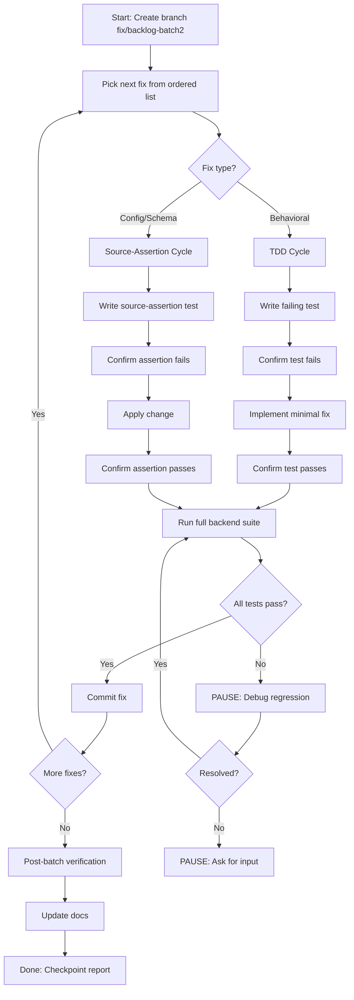
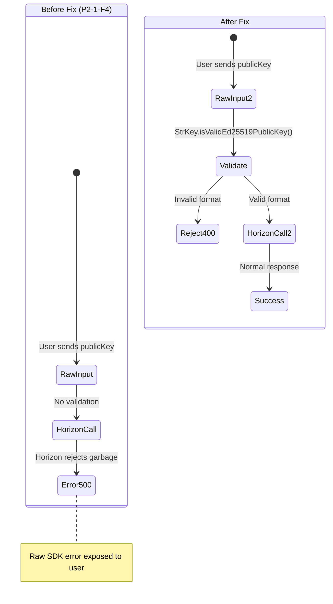
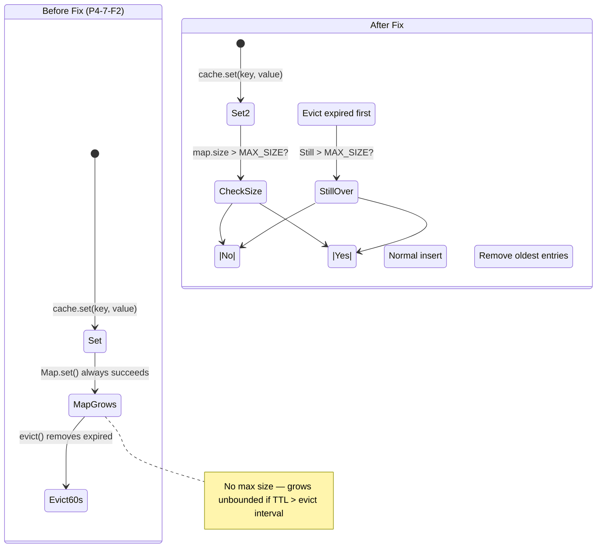
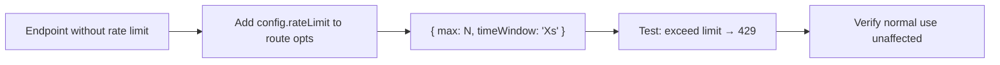

# Backlog Batch 2 — Developer Specification

> Date: 2026-07-28
> Scope: 10 backend fixes — input validation, rate limiting, observability, memory bounds
> Branch: `fix/backlog-batch2` from `main` (`461bada`)
> Tests baseline: 410/410 passing

---

## Mermaid Diagrams

### Batch 2 Execution Loop



### Trustline Validation Flow (Fix 1 — Before/After)



### MemoryCache Bounds (Fix 9 — Before/After)



### Rate Limit Addition Pattern (Fixes 6-8)



---

## Execution Order (risk-ascending)

1. Fix 10 (P2-7-F4) — userAgent audit capture — zero risk, additive
2. Fix 9 (P4-7-F2) — MemoryCache max size — zero risk, internal
3. Fix 5 (P1-3-F2) — unsuspend() defensive guard — very low risk
4. Fix 3 (P2-2-F2) — TOML image URL validation — very low risk
5. Fix 4 (P2-2-F3) — Icon download max file size — very low risk
6. Fix 6 (P3-6-F4) — Contacts rate limit — low risk
7. Fix 7 (P3-8-F3) — Push test rate limit — low risk
8. Fix 8 (P3-9-F2) — Curated seed rate limit + auth gate — low risk
9. Fix 1 (P2-1-F4) — Trustline input validation — low risk
10. Fix 2 (P2-1-F5) — Error message sanitization — low risk

---

## Fix 1: P2-1-F4 — Trustline input format validation

**Finding ID:** P2-1-F4
**Severity:** LOW
**Why it matters:** publicKey, assetCode, and assetIssuer are passed raw to Horizon SDK. Invalid values cause SDK errors whose raw messages are exposed to users (compounding P2-1-F5).

**Current behavior:** `POST /trustlines/add` with `publicKey: "garbage"` → SDK throws, 500 with raw error
**Desired behavior:** `POST /trustlines/add` with `publicKey: "garbage"` → 400 with "Invalid Stellar public key"

**Affected files:**
- `packages/backend/src/routes/trustlines.ts` — 5 endpoints (lines 15-482)

**Exact changes:**

Add import at top:
```typescript
import { StrKey } from "@stellar/stellar-sdk";
```

Add validation helper:
```typescript
function validateStellarPublicKey(key: string): boolean {
  return StrKey.isValidEd25519PublicKey(key);
}

function validateAssetCode(code: string): boolean {
  return /^[a-zA-Z0-9]{1,12}$/.test(code);
}
```

Add to each endpoint's handler, before Horizon calls:
```typescript
if (!validateStellarPublicKey(publicKey)) {
  return reply.status(400).send({ error: "Invalid Stellar public key format" });
}
// For endpoints with assetCode/assetIssuer:
if (!validateAssetCode(assetCode)) {
  return reply.status(400).send({ error: "Invalid asset code format" });
}
if (!validateStellarPublicKey(assetIssuer)) {
  return reply.status(400).send({ error: "Invalid asset issuer format" });
}
```

**Tests:** Unit tests: invalid publicKey → 400, valid publicKey → proceeds
**Regression risks:** None — invalid inputs already fail downstream
**Reviewer focus:** StrKey import, all 5 endpoints covered, no false rejections of valid keys

---

## Fix 2: P2-1-F5 — Error message sanitization in trustlines

**Finding ID:** P2-1-F5
**Severity:** LOW
**Why it matters:** Raw `error.message` from Horizon SDK leaks internal details (URLs, XDR blobs, network topology).

**Current behavior:** `catch (error: any) { reply.status(500).send({ error: error.message }); }`
**Desired behavior:** `catch (error: any) { reply.status(500).send({ error: "Internal server error" }); console.warn(...); }`

**Affected files:**
- `packages/backend/src/routes/trustlines.ts` — 5 catch blocks (lines ~99, 201, 306, 399, 480)

**Exact change for each catch block:**
```typescript
} catch (error: any) {
  if (error?.response?.status === 404) {
    return reply.status(404).send({ error: "Account not found or not funded" });
  }
  console.warn("[trustlines] error:", error.message);
  return reply.status(500).send({ error: "Internal server error" });
}
```

**Tests:** Source-assertion: verify no catch block returns `error.message` directly
**Regression risks:** None — clients should not depend on internal error text
**Reviewer focus:** Preserve 404 handling, log the real error for debugging

---

## Fix 3: P2-2-F2 — TOML image URL scheme validation

**Finding ID:** P2-2-F2
**Severity:** LOW
**Why it matters:** External stellar.toml files can contain arbitrary URLs in their `image` field. Stored URLs could be `javascript:`, `data:`, or SSRF targets. While `icon-resolver.ts` validates at fetch time, the raw URL persists in the DB and could be served to frontends.

**Current behavior:** Any string from TOML `image` field stored directly to DB
**Desired behavior:** Only `https://` URLs stored; others rejected

**Affected files:**
- `packages/backend/src/lib/toml-sync.ts:62-87`

**Exact guard (add before DB writes):**
```typescript
function isValidImageUrl(url: string): boolean {
  try {
    const parsed = new URL(url);
    return parsed.protocol === "https:";
  } catch {
    return false;
  }
}
```

Apply to both DB write paths:
```typescript
if (imageUrl && isValidImageUrl(imageUrl)) {
  await db.update(tokens).set({ tomlImage: imageUrl, updatedAt: new Date() })...
}
// And for orgLogo:
if (orgLogoMatch?.[1] && isValidImageUrl(orgLogoMatch[1])) {
  await db.update(tokens).set({ tomlImage: orgLogoMatch[1], updatedAt: new Date() })...
}
```

**Tests:** Source-assertion: verify `isValidImageUrl` exists and is called before DB writes
**Regression risks:** Very low — non-HTTPS image URLs would fail to download anyway
**Reviewer focus:** URL constructor handles edge cases, both paths guarded

---

## Fix 4: P2-2-F3 — Icon download max file size

**Finding ID:** P2-2-F3
**Severity:** LOW
**Why it matters:** `icon-resolver.ts` downloads external images with no size cap. A malicious stellar.toml server could return a multi-GB response, exhausting container memory.

**Current behavior:** `Buffer.from(await response.arrayBuffer())` — reads entire response
**Desired behavior:** Reject responses >512KB before reading body

**Affected files:**
- `packages/backend/src/lib/icon-resolver.ts` — two download paths (lines ~102-117 and ~183-193)

**Exact guard (add after `response.ok` check):**
```typescript
const MAX_ICON_SIZE = 512 * 1024; // 512 KB

const contentLength = parseInt(response.headers.get("content-length") || "0", 10);
if (contentLength > MAX_ICON_SIZE) continue; // or skip

const buffer = Buffer.from(await response.arrayBuffer());
if (buffer.length > MAX_ICON_SIZE) continue; // double-check actual size
```

**Tests:** Source-assertion: verify MAX_ICON_SIZE constant and size check exist
**Regression risks:** Very low — legitimate icons are well under 512KB
**Reviewer focus:** Both download paths protected, both Content-Length and actual size checked

---

## Fix 5: P1-3-F2 — unsuspend() defensive guard

**Finding ID:** P1-3-F2
**Severity:** LOW
**Why it matters:** `unsuspend()` clears suspension for ANY tenant, even manually-suspended ones. A race between the SELECT query and UPDATE could accidentally unsuspend a tenant that an admin manually suspended.

**Current behavior:** `UPDATE tenants SET suspendedAt=null WHERE id=?`
**Desired behavior:** `UPDATE tenants SET suspendedAt=null WHERE id=? AND suspension_reason IN ('debt_limit','maintenance_grace_expired')`

**Affected files:**
- `packages/backend/src/jobs/auto-suspension.ts:44-51`

**Exact change:**
```typescript
async function unsuspend(tenantId: number): Promise<void> {
  const now = new Date();
  await db
    .update(schema.tenants)
    .set({ suspendedAt: null, suspensionReason: null, updatedAt: now })
    .where(
      and(
        eq(schema.tenants.id, tenantId),
        isNotNull(schema.tenants.suspendedAt),
        inArray(schema.tenants.suspensionReason, ["debt_limit", "maintenance_grace_expired"]),
      ),
    );
}
```

**Tests:** Unit test: verify unsuspend WHERE clause includes suspensionReason guard
**Regression risks:** Very low — auto-unsuspend callers already filter by reason in SELECT
**Reviewer focus:** `inArray` import from drizzle-orm, no change to admin manual unsuspend path

---

## Fix 6: P3-6-F4 — Rate limit contacts CRUD

**Finding ID:** P3-6-F4
**Severity:** LOW
**Why it matters:** No per-endpoint rate limit on contacts. Only global 60/1min applies. Bulk scraping or spam-insertion possible.

**Current behavior:** No rate limit config on contact endpoints
**Desired behavior:** 30 requests per minute on each contact endpoint

**Affected files:**
- `packages/backend/src/routes/contacts.ts` — 4 endpoints

**Exact change (add to each endpoint's route options):**
```typescript
config: {
  rateLimit: {
    max: 30,
    timeWindow: "1 minute",
  },
},
```

**Tests:** Source-assertion: verify all 4 contact endpoints include `rateLimit` config
**Regression risks:** None — 30/min is generous for normal use
**Reviewer focus:** All 4 endpoints covered (GET, POST, PATCH, DELETE)

---

## Fix 7: P3-8-F3 — Rate limit /push/test

**Finding ID:** P3-8-F3
**Severity:** LOW
**Why it matters:** `/push/test` fans out to all user subscriptions, making external HTTP requests per call. No rate limit allows abuse.

**Current behavior:** No rate limit on `/push/test`
**Desired behavior:** 5 requests per 15 minutes

**Affected files:**
- `packages/backend/src/routes/push.ts:127-183`

**Exact change:**
```typescript
config: {
  rateLimit: {
    max: 5,
    timeWindow: "15 minutes",
  },
},
```

**Tests:** Source-assertion: verify `/push/test` route includes `rateLimit` config
**Regression risks:** None — test notifications are infrequent by nature
**Reviewer focus:** Rate limit only on /test, not /subscribe or /unsubscribe

---

## Fix 8: P3-9-F2 — Rate limit and auth gate on /curated/seed

**Finding ID:** P3-9-F2
**Severity:** LOW
**Why it matters:** `/tokens/curated/seed` is unauthenticated and performs N DB upserts per call. Can be used for DoS.

**Current behavior:** No auth, no rate limit
**Desired behavior:** Require admin auth + 3 requests per hour rate limit

**Affected files:**
- `packages/backend/src/routes/curated-tokens.ts:72-138`

**Exact changes:**
1. Add `preHandler: [authMiddleware]` to route options
2. Add rate limit config:
```typescript
config: {
  rateLimit: {
    max: 3,
    timeWindow: "1 hour",
  },
},
```

**Tests:** Source-assertion: verify `/tokens/curated/seed` has both authMiddleware and rateLimit
**Regression risks:** Low — any automation calling this endpoint must now provide auth token
**Reviewer focus:** Admin-only vs any-user auth decision (spec says `authMiddleware` — any authenticated user)

---

## Fix 9: P4-7-F2 — MemoryCache max size bound

**Finding ID:** P4-7-F2
**Severity:** MEDIUM
**Why it matters:** `MemoryCache` Map grows without bound if entries are created faster than they expire. Potential OOM in long-running process.

**Current behavior:** Only TTL eviction every 60s, no size cap
**Desired behavior:** Max 500 entries, evict expired first, then oldest if still over

**Affected files:**
- `packages/backend/src/lib/cache.ts`

**Exact change in `set()` method:**
```typescript
private readonly maxSize = 500;

async set(key: string, value: unknown, ttlSeconds: number = 300): Promise<void> {
  if (this.store.size >= this.maxSize) {
    this.evict(); // try removing expired first
    if (this.store.size >= this.maxSize) {
      // Remove oldest entry (first key in Map insertion order)
      const oldest = this.store.keys().next().value;
      if (oldest !== undefined) this.store.delete(oldest);
    }
  }
  this.store.set(key, {
    value,
    expiresAt: Date.now() + ttlSeconds * 1000,
  });
}
```

**Tests:** Unit test: insert maxSize+1 entries, verify size stays at maxSize
**Regression risks:** Very low — current usage has ~10 deterministic keys
**Reviewer focus:** maxSize 500 is 50x current usage, evict-expired-first is correct

---

## Fix 10: P2-7-F4 — Capture userAgent in audit log calls

**Finding ID:** P2-7-F4
**Severity:** LOW
**Why it matters:** `auditLog()` accepts `userAgent` but no call site passes it. Every `audit_logs` row has `user_agent = NULL`, reducing forensic value.

**Current behavior:** `auditLog("login", { userId, ip })` — no userAgent
**Desired behavior:** `auditLog("login", { userId, ip, userAgent: request.headers["user-agent"] })` — at auth-related call sites

**Affected files (auth-related call sites only — highest value):**
- `packages/backend/src/routes/auth.ts` — 10 call sites
- `packages/backend/src/server.ts` — 2 call sites (transaction_submit, transaction_sign)
- `packages/backend/src/routes/admin.ts` — 9 call sites

**Exact pattern at each call site:**
Add `userAgent: request.headers["user-agent"]` to the opts object.

Example (auth.ts login):
```typescript
// Before:
await auditLog("login", { userId: user.id, ip: request.ip });
// After:
await auditLog("login", { userId: user.id, ip: request.ip, userAgent: request.headers["user-agent"] });
```

**Tests:** Source-assertion: grep all `auditLog(` calls, verify auth/admin/server call sites include `userAgent`
**Regression risks:** None — additive field, DB column already exists
**Reviewer focus:** Only add to call sites where `request` object is in scope, skip job/cron call sites
