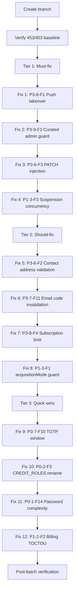

# Backlog Batch 3 — Developer Spec

> **For agentic workers:** REQUIRED SUB-SKILL: Use superpowers:subagent-driven-development (recommended) or superpowers:executing-plans to implement this plan task-by-task.

**Date:** 2026-07-28
**Branch:** `fix/backlog-batch3` from `main` at `ddcd81d`
**Baseline:** 453/453 backend + 23/23 web-app
**Scope:** 12 fixes (2 HIGH, 3 MEDIUM, 7 LOW/quick-win)

---

## Execution Flow



**Note:** P0-1-F14 (password complexity) and P1-2-F2 (billing TOCTOU) are placed last because they are the highest-effort items. If time or risk budget is exhausted, these can be deferred to Batch 4 without blocking the batch.

---

## Global Constraints

- Backend only — no frontend changes
- No stub module changes (Earn/Fiat/MoneyGram)
- TDD: write test → confirm FAIL → implement → confirm PASS → full suite → commit
- Each commit: `fix(module): description (Finding-ID)` + `Co-Authored-By: Claude Opus 4.6 <noreply@anthropic.com>`
- No new `as any` casts in non-test source
- No secrets in source
- No schema migrations (all fixes are code-only)

---

## Fix 1: P3-8-F1 — Push Subscription Takeover (HIGH)

**File:** `packages/backend/src/routes/push.ts:72-84`
**Risk:** Low (removes permissive behavior)

**Problem:** `onConflictDoUpdate` on endpoint unique column overwrites `userId`. User B can submit User A's endpoint URL and hijack push notifications.

**Current code (line 81):**
```typescript
.onConflictDoUpdate({
  target: pushSubscriptions.endpoint,
  set: { p256dh: keys.p256dh, auth: keys.auth, userId: user.id },
});
```

**Fix:** Remove `userId` from the `set` clause and add a WHERE guard:
```typescript
.onConflictDoUpdate({
  target: pushSubscriptions.endpoint,
  set: { p256dh: keys.p256dh, auth: keys.auth },
  where: eq(pushSubscriptions.userId, user.id),
});
```

This ensures only the original owner can update their subscription keys. A different user submitting the same endpoint gets a no-op upsert.

**Test:** Source-assertion test confirming `userId` is NOT in the conflict `set` clause and `where:` guard exists. Optionally: unit test with mocked DB verifying different-user upsert is a no-op.

---

## Fix 2: P3-9-F1 — Curated Seed Admin Guard (HIGH)

**File:** `packages/backend/src/routes/curated-tokens.ts:76`
**Risk:** Low (restricts access further)

**Problem:** Batch 2 added `authMiddleware` to `/curated/seed`, but any authenticated user can trigger the seed. This should be admin-only.

**Current code:**
```typescript
preHandler: [authMiddleware],
```

**Fix:** Add admin role verification. Either:
- Use `requireAdmin` middleware if it exists, OR
- Add an inline check after auth:
```typescript
preHandler: [authMiddleware],
// Then inside handler, before processing:
if (!request.admin) {
  return reply.status(403).send({ error: "Admin access required" });
}
```

Check how other admin-only routes enforce the role (likely in `admin.ts` pattern).

**Test:** Source-assertion test verifying either `requireAdmin` middleware or `request.admin` check exists in the seed handler.

---

## Fix 3: P3-6-F3 — Contacts PATCH Spread Injection (MEDIUM)

**File:** `packages/backend/src/routes/contacts.ts:93-110`
**Risk:** Very low

**Problem:** PATCH body is spread directly into `set()`. Without `additionalProperties: false`, an attacker could inject `userId`, `address`, or other columns.

**Current code (line 107):**
```typescript
const updates = request.body as any;
const result = await db.update(addressBook)
  .set({ ...updates, updatedAt: new Date() })
```

**Fix — Option A (recommended):** Add `additionalProperties: false` to the PATCH body schema:
```typescript
body: {
  type: "object",
  additionalProperties: false,
  properties: {
    name: { type: "string" },
    memo: { type: "string" },
    memoType: { type: "string" },
    notes: { type: "string" },
  },
},
```

**Fix — Option B:** Explicitly destructure allowed fields:
```typescript
const { name, memo, memoType, notes } = request.body as any;
const updates: Record<string, unknown> = {};
if (name !== undefined) updates.name = name;
if (memo !== undefined) updates.memo = memo;
if (memoType !== undefined) updates.memoType = memoType;
if (notes !== undefined) updates.notes = notes;
```

**Test:** Source-assertion test verifying either `additionalProperties: false` or explicit field destructuring.

---

## Fix 4: P1-3-F3 — Auto-Suspension Concurrency Guard (MEDIUM)

**File:** `packages/backend/src/jobs/auto-suspension.ts:321-333`
**Risk:** Very low

**Problem:** No guard against overlapping cron runs. Concurrent execution could double-suspend or double-unsuspend tenants.

**Fix:** Add module-level `isRunning` flag:
```typescript
let isRunning = false;

export async function checkAndRunAutoSuspension(): Promise<void> {
  if (isRunning) {
    console.log("[auto-suspension] Skipping — previous run still in progress");
    return;
  }
  isRunning = true;
  try {
    // ... existing logic ...
  } finally {
    isRunning = false;
  }
}
```

**Test:** Source-assertion test verifying `isRunning` flag and `finally` block exist.

---

## Fix 5: P3-6-F2 — Contacts Address Validation (MEDIUM)

**File:** `packages/backend/src/routes/contacts.ts:52`
**Risk:** Very low

**Problem:** Only 56-char length check on address. Any 56-char string accepted.

**Fix:** Add `StrKey.isValidEd25519PublicKey()` validation in the POST handler body:
```typescript
import { StrKey } from "@stellar/stellar-sdk";
// ... in POST handler:
if (!StrKey.isValidEd25519PublicKey(address)) {
  return reply.status(400).send({ error: "Invalid Stellar address" });
}
```

**Test:** Source-assertion test verifying `StrKey` or `isValidEd25519PublicKey` appears in contacts.ts.

---

## Fix 6: P3-7-F11 — Old Email Codes Not Invalidated (LOW)

**File:** `packages/backend/src/routes/two-fa.ts:340-345, 387-392, ~143`
**Risk:** Very low

**Problem:** When a new email code is sent, old unused codes remain valid.

**Fix:** Before each INSERT of a new code, mark previous codes as used:
```typescript
await db.update(schema.emailCodes)
  .set({ used: true })
  .where(and(
    eq(schema.emailCodes.userId, user.id),
    eq(schema.emailCodes.type, codeType),
    eq(schema.emailCodes.used, false),
  ));
```

Apply at 3 sites: send-email-code, send-code, and 2FA setup flow.

**Test:** Source-assertion test verifying the invalidation UPDATE appears before each INSERT of email codes.

---

## Fix 7: P3-8-F4 — Push Subscription Limit Per User (LOW)

**File:** `packages/backend/src/routes/push.ts:40-88`
**Risk:** Very low

**Problem:** No limit on subscriptions per user. Attacker could fabricate thousands of endpoints.

**Fix:** Before INSERT, count existing subscriptions:
```typescript
const [{ count }] = await db.select({ count: sql<number>`COUNT(*)::int` })
  .from(pushSubscriptions)
  .where(eq(pushSubscriptions.userId, user.id));
if (count >= 10) {
  return reply.status(429).send({ error: "Maximum push subscriptions reached" });
}
```

**Test:** Source-assertion test verifying subscription count check exists.

---

## Fix 8: P1-3-F1 — acquisitionModeEnabled Guard (LOW)

**File:** `packages/backend/src/jobs/auto-suspension.ts:157-189`
**Risk:** Very low

**Problem:** `enforceDebtLimit` suspends tenants without checking if acquisition mode is enabled. If disabled, debt limit doesn't apply.

**Fix:** Add `eq(schema.tenantBillingPolicy.acquisitionModeEnabled, true)` to the WHERE clause of the candidates query.

**Test:** Source-assertion test verifying `acquisitionModeEnabled` appears in the enforceDebtLimit query.

---

## Fix 9: P3-7-F10 — TOTP Window Reduction (LOW)

**File:** `packages/backend/src/routes/two-fa.ts:244, 459`
**Risk:** Low (may increase "invalid code" rate for users with clock drift >30s)

**Problem:** `window: 2` accepts codes from 150-second range. Standard is `window: 1` (90 seconds).

**Fix:** Change `window: 2` to `window: 1` at both verification sites.

**Test:** Source-assertion test verifying `window: 1` (not `window: 2`) at TOTP verification sites.

---

## Fix 10: P0-2-F3 — CREDIT_ROLES Rename (LOW)

**File:** `packages/backend/src/routes/admin.ts:28`
**Risk:** Very low (cosmetic rename)

**Problem:** `CREDIT_ROLES` is used for all privileged operations, not just credit writes.

**Fix:** Rename to `PRIVILEGED_ROLES` at definition and all usage sites (8+ references).

**Test:** Source-assertion test verifying `PRIVILEGED_ROLES` exists and `CREDIT_ROLES` does not.

---

## Fix 11: P0-1-F14 — Password Complexity (MEDIUM)

**File:** `packages/backend/src/routes/auth.ts:51, 829, ~1422`
**Risk:** Low

**Problem:** Password validation is length-only (minLength: 8). No complexity requirements.

**Fix:** Create a shared `validatePasswordStrength()` function requiring at least:
- 8+ characters (existing)
- 1 uppercase letter
- 1 lowercase letter
- 1 digit

Apply at: register, change-password, and SMS password-reset endpoints.

**Note:** zxcvbn adds a ~800KB dependency. A regex-based approach is simpler and sufficient for Batch 3. zxcvbn can be considered in a future enhancement.

**Test:** Unit test for the validator function + source-assertion test verifying it's called at all 3 password-setting endpoints.

---

## Fix 12: P1-2-F2 — Billing TOCTOU Race (MEDIUM)

**File:** `packages/backend/src/services/billing.service.ts:222-313` + `packages/backend/src/routes/wallets.ts:157-170`
**Risk:** Medium (touching billing critical path)

**Problem:** `checkWalletBilling` runs outside the transaction. Two concurrent wallet creations can both pass the balance check, then both write debits exceeding the debt limit.

**Fix:** Add a `checkWalletBillingTx(tx, opts)` variant that:
1. Accepts a transaction handle
2. Uses `FOR UPDATE` on the tenant billing row
3. Performs the balance/policy check inside the transaction

Update `wallets.ts` to call `checkWalletBillingTx(tx, ...)` inside the transaction block. Keep the outer `checkWalletBilling` as a fast pre-flight (avoids entering a transaction for obviously-failed checks).

**Test:** Unit test mocking concurrent wallet creation: two calls with same tenant, balance = 3 XLM, cost = 3 XLM → only one should succeed.

---

## Execution Order Summary

| Order | Fix | Finding | Severity | Effort | Tier |
|-------|-----|---------|----------|--------|------|
| 1 | Fix 1 | P3-8-F1 | HIGH | Small | Must-fix |
| 2 | Fix 2 | P3-9-F1 | HIGH | Small | Must-fix |
| 3 | Fix 3 | P3-6-F3 | MEDIUM | Small | Must-fix |
| 4 | Fix 4 | P1-3-F3 | MEDIUM | Small | Must-fix |
| 5 | Fix 5 | P3-6-F2 | MEDIUM | Small | Should-fix |
| 6 | Fix 6 | P3-7-F11 | LOW | Small | Should-fix |
| 7 | Fix 7 | P3-8-F4 | LOW | Small | Should-fix |
| 8 | Fix 8 | P1-3-F1 | LOW | Small | Should-fix |
| 9 | Fix 9 | P3-7-F10 | LOW | Small | Quick win |
| 10 | Fix 10 | P0-2-F3 | LOW | Small | Quick win |
| 11 | Fix 11 | P0-1-F14 | MEDIUM | Medium | Deferrable |
| 12 | Fix 12 | P1-2-F2 | MEDIUM | Medium | Deferrable |

**Deferral gate:** After Fix 10, assess time/risk budget. Fixes 11-12 are higher effort and can be deferred to Batch 4 if the session runs long.
