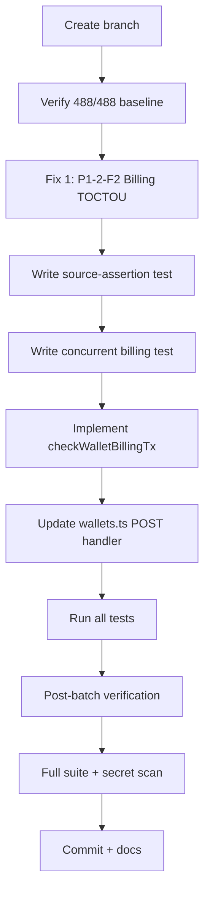
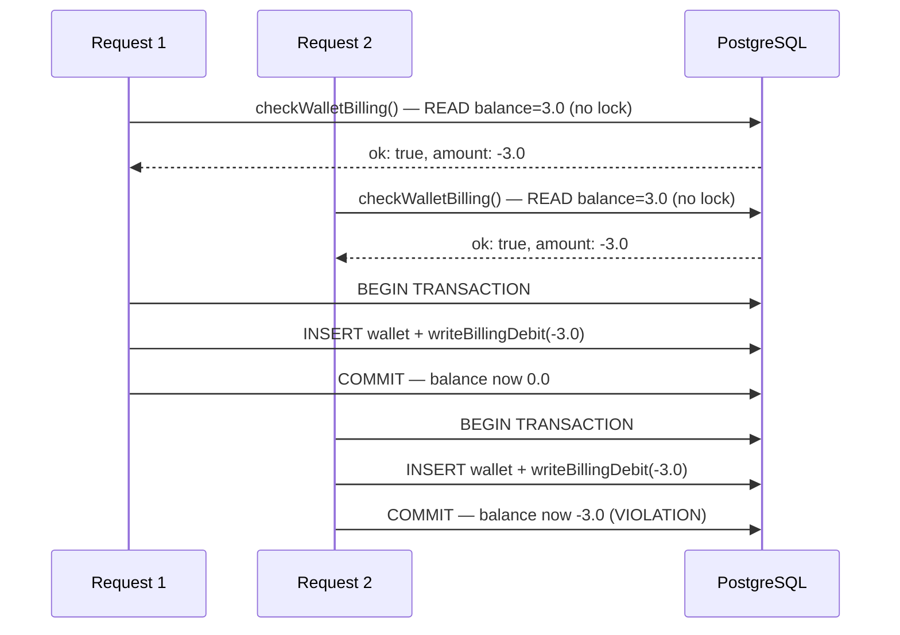
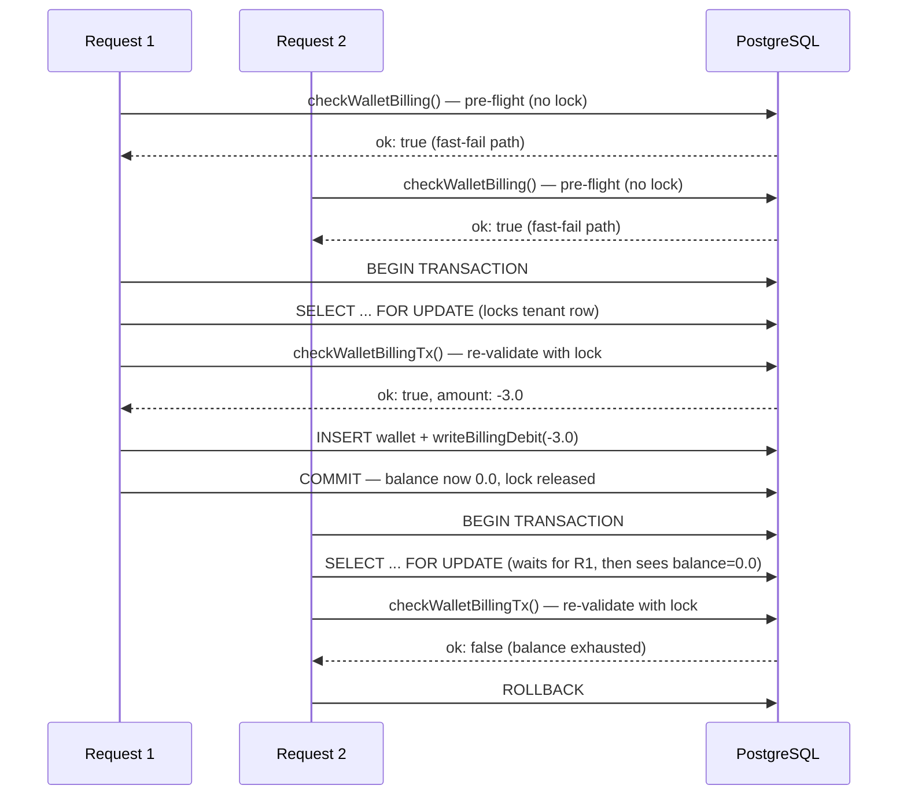

# Backlog Batch 4 — Developer Spec

> **For agentic workers:** REQUIRED SUB-SKILL: Use superpowers:subagent-driven-development (recommended) or superpowers:executing-plans to implement this plan task-by-task.

**Date:** 2026-07-28
**Branch:** `fix/backlog-batch4` from `main` at `bf64194`
**Baseline:** 488/488 backend + 23/23 web-app
**Scope:** 1 fix (P1-2-F2 Billing TOCTOU — MEDIUM severity, MEDIUM effort)

---

## Execution Flow



---

## Global Constraints

- Backend only — no frontend changes
- No stub module changes (Earn/Fiat/MoneyGram)
- TDD: write test → confirm FAIL → implement → confirm PASS → full suite → commit
- Each commit: `fix(module): description (Finding-ID)` + `Co-Authored-By: Claude Opus 4.6 <noreply@anthropic.com>`
- No new `as any` casts in non-test source (except `tx: any` pattern already used)
- No secrets in source
- No schema migrations (code-only fix)
- Existing `checkWalletBilling()` MUST be preserved (keep pre-flight fast-fail path)
- `writeBillingDebit()` MUST NOT be modified (already works correctly within transactions)

---

## Fix 1: P1-2-F2 — Billing TOCTOU Race Condition (MEDIUM)

### Problem

The wallet creation endpoint has a Time-of-Check-Time-of-Use (TOCTOU) race condition in its billing flow:

1. `checkWalletBilling()` reads the tenant's `prepaidXlmBalance` **outside** the transaction (line 160 of wallets.ts)
2. The wallet + billing debit happens **inside** a transaction (lines 170-234)
3. Between steps 1 and 2, another concurrent request can also pass the check
4. Both requests then debit the balance, potentially exceeding limits

### Current Vulnerable Flow



### Fixed Flow



### Files

- **Modify:** `packages/backend/src/services/billing.service.ts` — add `checkWalletBillingTx()` function
- **Modify:** `packages/backend/src/routes/wallets.ts:155-234` — move billing check inside transaction
- **Test:** `packages/backend/src/services/billing-toctou.test.ts` (source-assertion)
- **Test:** `packages/backend/src/services/billing.service.test.ts` (add unit tests for new function)

### Implementation Details

#### New function: `checkWalletBillingTx(tx, opts)`

This is a transactional variant of `checkWalletBilling()` that:
1. Acquires a `FOR UPDATE` lock on the tenant row
2. Reads the locked balance
3. Performs the same validation logic
4. Returns the same `BillingCheckResult` type

```typescript
/**
 * Transactional billing check with FOR UPDATE lock.
 * MUST be called inside db.transaction().
 * Prevents TOCTOU race in concurrent wallet creation.
 */
export async function checkWalletBillingTx(
  tx: any,
  opts: { tenantId: number; userId: number }
): Promise<BillingCheckResult> {
  const { tenantId, userId } = opts;

  // Lock the tenant row — blocks concurrent transactions
  const [lockedTenant] = await tx
    .select({
      prepaidXlmBalance: schema.tenants.prepaidXlmBalance,
      isActive: schema.tenants.isActive,
      suspendedAt: schema.tenants.suspendedAt,
    })
    .from(schema.tenants)
    .where(eq(schema.tenants.id, tenantId))
    .for("update");

  if (!lockedTenant) {
    return { ok: false, httpStatus: 503, message: "Tenant not found" };
  }
  if (!lockedTenant.isActive) {
    return { ok: false, httpStatus: 403, message: "Tenant account is inactive" };
  }
  if (lockedTenant.suspendedAt) {
    return {
      ok: false,
      httpStatus: 402,
      message: "Tenant account is suspended; please contact support to restore service",
    };
  }

  // Policy read (immutable, no lock needed)
  const policy = await getBillingPolicy(tenantId);
  if (!policy) {
    return { ok: false, httpStatus: 503, message: "No billing policy configured for tenant" };
  }

  const balanceStr = lockedTenant.prepaidXlmBalance;
  const walletCount = await countUserWallets(userId);

  // Same validation logic as checkWalletBilling
  if (walletCount === 0) {
    if (policy.acquisitionModeEnabled) {
      if (compareDecimalStrings(balanceStr, policy.acquisitionDebtLimitXlm) <= 0) {
        return {
          ok: false,
          httpStatus: 402,
          message: `Acquisition debt limit reached (${policy.acquisitionDebtLimitXlm} XLM). Top up required before new wallet activations.`,
        };
      }
    } else {
      if (compareDecimalStrings(balanceStr, "0") <= 0) {
        return {
          ok: false,
          httpStatus: 402,
          message: "Insufficient tenant balance for new wallet activation",
        };
      }
    }

    const useWalletFunding = policy.walletFundingEnabled && policy.walletFundingMode === "auto";
    const amountStr = useWalletFunding
      ? addDecimalStrings(policy.walletFundingXlm, policy.newWalletPlatformFeeXlm)
      : policy.newWalletPlatformFeeXlm;

    return {
      ok: true,
      eventType: "new_wallet_activation",
      amountXlm: negateDecimalString(amountStr),
      policy,
    };
  } else {
    if (!policy.onboardingEnabled) {
      return { ok: true, eventType: "no_billing" };
    }

    const alreadyActive = await isActiveTenantUser(tenantId, userId, policy.activityWindowDays);
    if (alreadyActive) {
      return { ok: true, eventType: "idempotent_skip" };
    }

    if (compareDecimalStrings(balanceStr, "0") <= 0) {
      return {
        ok: false,
        httpStatus: 402,
        message: "Insufficient tenant balance for user onboarding",
      };
    }

    return {
      ok: true,
      eventType: "existing_user_onboarding",
      amountXlm: negateDecimalString(policy.onboardingFeeXlm),
      policy,
    };
  }
}
```

#### Updated wallets.ts POST handler

Keep the existing pre-flight `checkWalletBilling()` outside the transaction for fast rejection. Inside the transaction, replace the stale `billingResult` with a fresh `checkWalletBillingTx()` call:

```typescript
// ── Phase 2: billing pre-flight check (fast rejection, no lock) ──
let billingResult: Awaited<ReturnType<typeof checkWalletBilling>> | null = null;

if (tenantCtx?.tenantId) {
  billingResult = await checkWalletBilling({ tenantId: tenantCtx.tenantId, userId });
  if (!billingResult.ok) {
    return reply.status(billingResult.httpStatus).send({ error: billingResult.message });
  }
}

// ── Wallet creation + billing debit in one transaction ──
let debitNewBalance: string | null = null;

const wallet = await db.transaction(async (tx) => {
  // Re-validate billing with FOR UPDATE lock inside transaction
  if (tenantCtx?.tenantId) {
    const txBilling = await checkWalletBillingTx(tx, {
      tenantId: tenantCtx.tenantId,
      userId,
    });
    if (!txBilling.ok) {
      throw Object.assign(new Error(txBilling.message), {
        httpStatus: txBilling.httpStatus,
      });
    }
    billingResult = txBilling; // Use locked result for debit
  }

  // ... rest of transaction unchanged ...
});
```

Add error handling around the transaction call to catch the thrown billing error and return the correct HTTP status.

### Test Strategy

1. **Source-assertion test** (`billing-toctou.test.ts`):
   - Assert `checkWalletBillingTx` is exported from billing.service.ts
   - Assert `for("update")` or `FOR UPDATE` appears in the function
   - Assert wallets.ts calls `checkWalletBillingTx` inside the transaction block

2. **Unit test** (extend `billing.service.test.ts`):
   - Test `checkWalletBillingTx` with mocked `tx` object
   - Verify it calls `.for("update")` on the tenant select
   - Verify all validation paths match `checkWalletBilling`

### Risk Assessment

| Risk | Level | Mitigation |
|------|-------|------------|
| FOR UPDATE deadlock | LOW | Only one table locked (tenants), always by ID |
| Performance impact | LOW | Lock held only during wallet creation transaction (~50ms) |
| Existing billing tests break | LOW | `checkWalletBilling()` unchanged, new function is additive |
| Drizzle `.for()` not working | LOW | Drizzle 0.45.2 supports it; fallback to raw SQL if needed |

### Verification

```bash
# Source-assertion test
npx vitest run src/services/billing-toctou.test.ts

# Full billing tests
npx vitest run src/services/billing.service.test.ts

# Full backend suite
npx vitest run
```

---

## Post-Batch

- Run full backend test suite (488 + N)
- Run full web-app test suite (23)
- Secret scan
- Update checkpoint report
- Recommend next steps (if any remaining deferred items warrant Batch 5)
