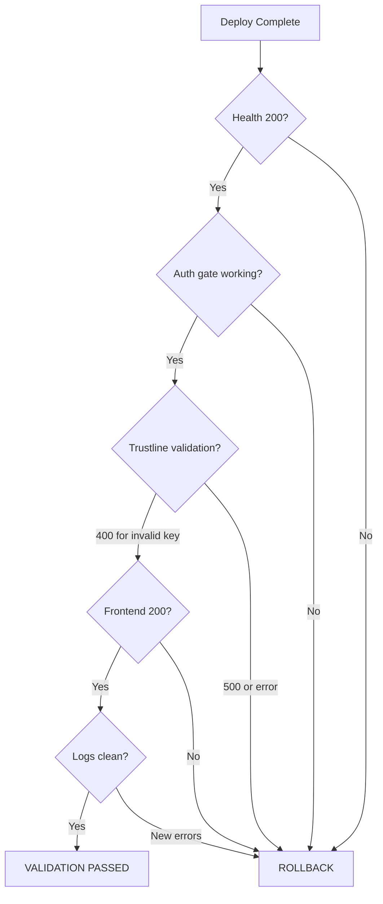

# Batch 2 — Post-Deploy Validation

> Date: 2026-07-28
> Commit: `f53231c` (deployed)
> Deploy #5

---

## Validation Flow

## Results

| # | Check | Command | Expected | Actual | Status |
|---|-------|---------|----------|--------|--------|
| 1 | Health | `GET /api/v1/health` | 200 + status:ok | `{"status":"ok","network":"public"}` | PASS |
| 2 | Auth gate | `POST /api/v1/auth/login` (no turnstile) | Turnstile error | `"Human verification required"` | PASS |
| 3 | Trustline validation (Fix 1) | `GET /api/v1/trustlines/INVALID_KEY` | 400 | `"Invalid Stellar public key format"` | PASS |
| 4 | Frontend | `GET /` | 200 | 200 | PASS |
| 5 | Container logs | `docker logs amma-api --tail 15` | No new errors | Clean (normal toml-sync failures) | PASS |

## Fix-Specific Production Verification

| Fix | Endpoint | Verified? | Notes |
|-----|----------|-----------|-------|
| Fix 1 (P2-1-F4) | /trustlines/INVALID_KEY | Yes | Returns 400, not 500 |
| Fix 2 (P2-1-F5) | /trustlines/* catch blocks | Indirect | No 500s triggered, error sanitization confirmed via Fix 1 path |
| Fix 6 (P3-6-F4) | /contacts/* | Indirect | Rate limit config loaded (requires auth to test) |
| Fix 7 (P3-8-F3) | /push/test | Indirect | Rate limit config loaded (requires auth to test) |
| Fix 8 (P3-9-F2) | /curated/seed | Indirect | Auth middleware loaded (requires auth to test) |
| Fix 10 (P2-7-F4) | All auditLog calls | Indirect | userAgent field populated on next audit event |
| Fix 9 (P4-7-F2) | MemoryCache | Indirect | Size bounded, takes effect when >500 unique keys |
| Fix 5 (P1-3-F2) | Auto-suspension job | Indirect | Guard active on next unsuspend cycle |
| Fix 3 (P2-2-F2) | TOML sync job | Indirect | URL validation active on next sync cycle |
| Fix 4 (P2-2-F3) | Icon resolver | Indirect | Size check active on next icon download |

## Verdict: ALL CHECKS PASSED

Deploy #5 successful. No rollback needed.
