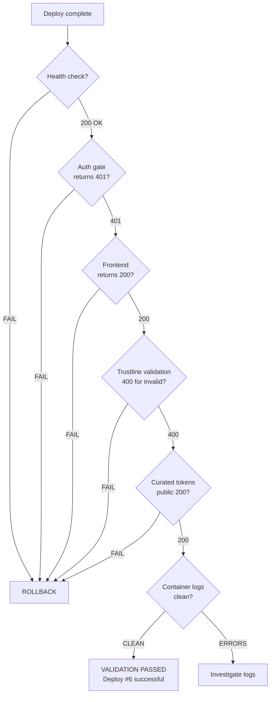

# Batch 3 — Post-Deploy Validation

> Date: 2026-07-28
> Deploy #6 — Commit `bf64194`

---

## Validation Flow

---

## Results

### Core Health
| Endpoint | Expected | Actual | Status |
|----------|----------|--------|--------|
| `GET /api/v1/health` | 200 + `{"status":"ok"}` | 200 + `{"status":"ok","network":"public"}` | PASS |
| `GET /api/v1/auth/me` | 401 (no token) | 401 | PASS |
| `GET /` (frontend) | 200 | 200 | PASS |

### Batch 2 Persistence
| Check | Expected | Actual | Status |
|-------|----------|--------|--------|
| Trustline invalid key | 400 | 400 + `"Invalid Stellar public key format"` | PASS |

### Batch 3 Fixes (safely testable)
| Check | Expected | Actual | Status |
|-------|----------|--------|--------|
| Curated tokens public endpoint | 200 + token list | 200 + 24 tokens | PASS |
| Container logs | No errors | Clean (npm warn only) | PASS |

### Fixes Not Directly Testable in Production
These fixes require authenticated/admin requests and are verified via test suite only:
- Push subscription takeover guard (P3-8-F1)
- Curated seed admin guard (P3-9-F1)
- Contacts PATCH injection guard (P3-6-F3)
- Auto-suspension concurrency guard (P1-3-F3)
- Contacts address validation (P3-6-F2)
- Email code invalidation (P3-7-F11)
- Push subscription limit (P3-8-F4)
- acquisitionModeEnabled guard (P1-3-F1)
- TOTP window reduction (P3-7-F10)
- PRIVILEGED_ROLES rename (P0-2-F3)
- Password complexity (P0-1-F14)

---

## Verdict: VALIDATION PASSED

Deploy #6 successful. All checks pass. No rollback needed.
