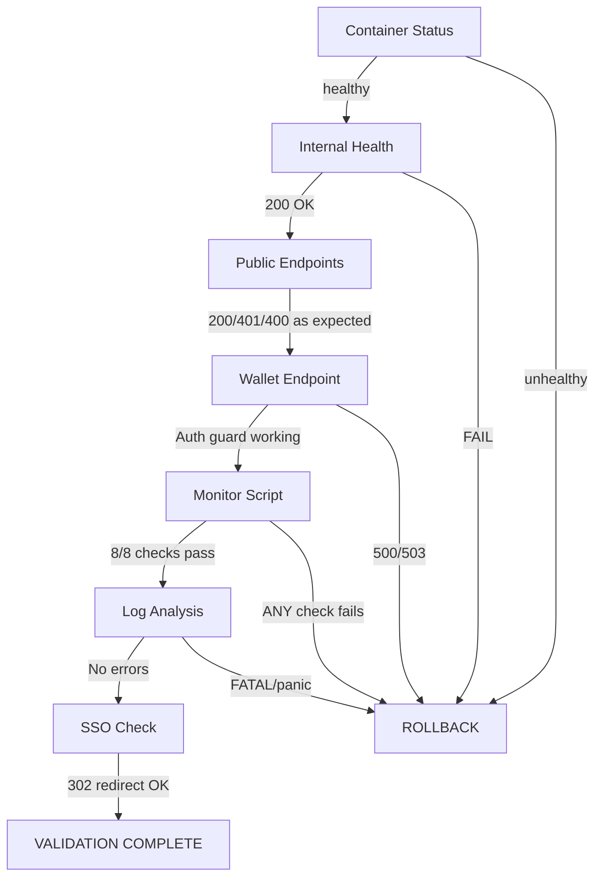

# Batch 4 — Post-Deploy Validation

> Date: 2026-07-29
> Deploy commit: `01d17bd`
> Tag: `batch4-complete-2026-07-29`

---

## Validation Flow

---

## Immediate Checks (T+0 to T+2 min)

| # | Check | Expected | Actual | Status |
|---|-------|----------|--------|--------|
| 1 | Container `amma-api` status | healthy | healthy (Up 22s) | PASS |
| 2 | Docker HEALTHCHECK | 200 on /health | 200 (level:30 log) | PASS |
| 3 | Root URL (ammawallet.com) | 200 | 200 | PASS |
| 4 | POST /api/v1/wallets (no auth) | 400 or 401 | 400 (validation) | PASS |
| 5 | GET /api/v1/wallets (no auth) | 401 | 401 | PASS |
| 6 | No FATAL/panic in logs | 0 | 0 | PASS |

---

## Short-Term Checks (T+2 to T+5 min)

| # | Check | Expected | Actual | Status |
|---|-------|----------|--------|--------|
| 7 | amma-monitor.sh | All checks passed | All checks passed | PASS |
| 8 | amma-db container | healthy | healthy | PASS |
| 9 | SSO redirect (LMS) | 302 | 302 | PASS |
| 10 | LMS ammaWallet.network | public | public | PASS |
| 11 | Token count | >0 pubnet | 474 pubnet | PASS |
| 12 | 500 errors in last 5m | 0 | 0 | PASS |
| 13 | SSO failures in last 5m | 0 | 0 | PASS |

---

## Wallet Creation Endpoint (Billing TOCTOU Focus)

The P1-2-F2 fix affects the wallet creation flow. Post-deploy validation of this endpoint:

| Test | Method | Expected | Actual | Status |
|------|--------|----------|--------|--------|
| Unauthenticated POST | POST /api/v1/wallets | 400/401 | 400 (validation first) | PASS |
| Unauthenticated GET | GET /api/v1/wallets | 401 | 401 | PASS |
| Invalid publicKey | POST with "GABC" | 400 pattern error | 400 pattern error | PASS |
| Validation error detail | Body error message | Pattern mismatch | `^G[A-Z2-7]{55}$` | PASS |

The wallet creation endpoint is functioning correctly with all pre-existing guards intact. The TOCTOU fix adds a FOR UPDATE lock inside the existing transaction — no change to the request/response interface.

---

## Log Analysis

| Log Level | Count | Notes |
|-----------|-------|-------|
| level:30 (info) | Normal | Request logging, toml-sync |
| level:40 (warn) | 0 | None |
| level:50 (error) | 0 | None (test validation is level:30 with err object) |
| FATAL/panic | 0 | None |

Toml-sync fetch failures are normal background operation (external TOML endpoints).

---

## Final Readiness Call

**VALIDATION COMPLETE** — All checks pass. No rollback triggers met.

| Criterion | Status |
|-----------|--------|
| Service healthy | YES |
| Wallet endpoint functional | YES |
| Auth guards working | YES |
| No new errors | YES |
| No regressions | YES |
| SSO functional | YES |
| Monitoring clean | YES |

**Deploy status: SUCCESSFUL**
