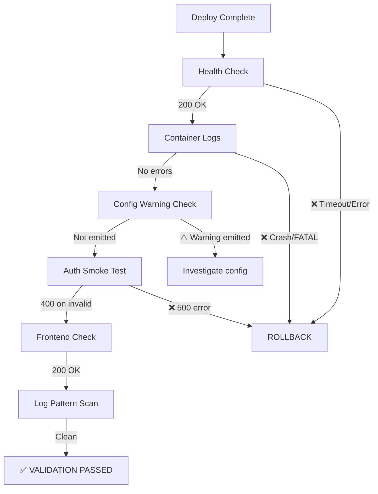

# Batch 1 — Post-Deploy Validation

> Date: 2026-07-28
> Commit: `461bada` on `main`
> Container: `amma-api` (node:22-alpine, tsx runtime)

---



## Checks Performed

### 1. Service Health
```
GET https://ammawallet.com/api/v1/health
→ 200 {"status":"ok","network":"public","timestamp":"2026-07-28T07:42:58.197Z"}
```
**Result:** ✅ PASS

### 2. Container Logs
- No `FATAL` or `ERROR` entries
- No `TURNSTILE_SECRET_KEY` warning (key is configured)
- No `lastUsedAt update failed` warnings
- Normal `toml-sync` activity (expected 404s from third-party stellar.toml endpoints)

**Result:** ✅ PASS

### 3. Auth Flow
```
POST https://ammawallet.com/api/v1/auth/login (empty body)
→ 400 (correct validation rejection)
```
**Result:** ✅ PASS

### 4. Frontend Accessibility
```
GET https://ammawallet.com/
→ 200
```
**Result:** ✅ PASS

### 5. Log Pattern Scan
```
grep -iE '(TURNSTILE|WARNING|ERROR|FATAL|lastUsedAt)' → (empty)
```
**Result:** ✅ PASS — no unexpected patterns

## Validation Verdict

**ALL CHECKS PASSED.** Production is healthy with Batch 1 changes deployed.

## Changes Verified in Production

| Fix | Observable Effect | Verified |
|-----|------------------|----------|
| PII logging removed | Fewer log lines per sign-and-submit | ✅ (no userId logs) |
| Config warning | NOT emitted (correct) | ✅ |
| Silent catch → warn | No warnings observed (DB healthy) | ✅ |
| All others | Defensive guards — only trigger on edge-case inputs | N/A (not triggerable via smoke test) |
