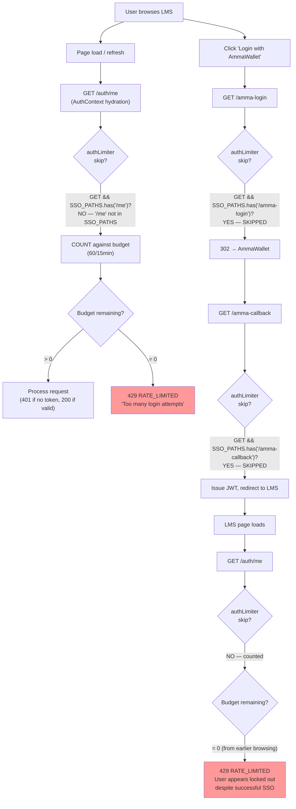
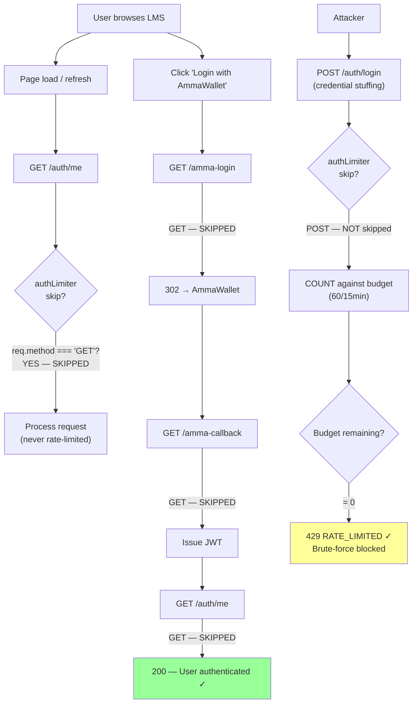
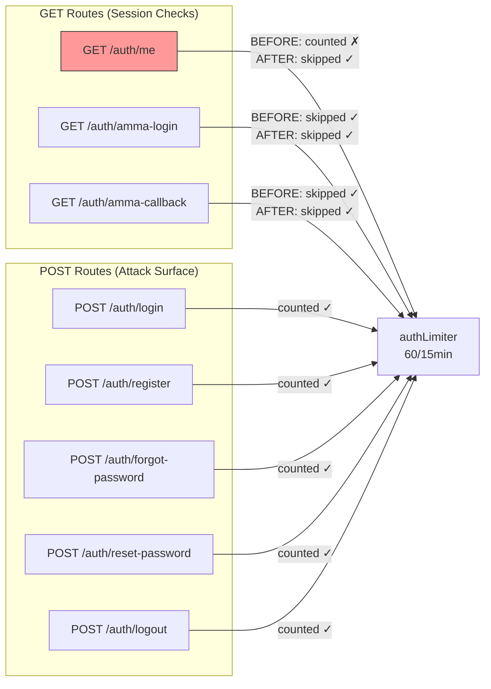
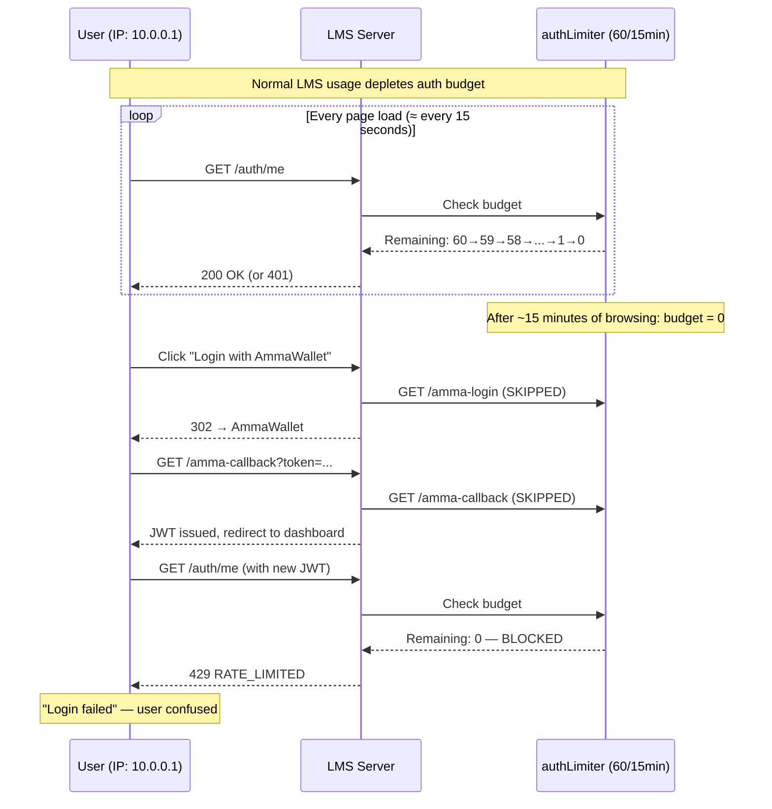
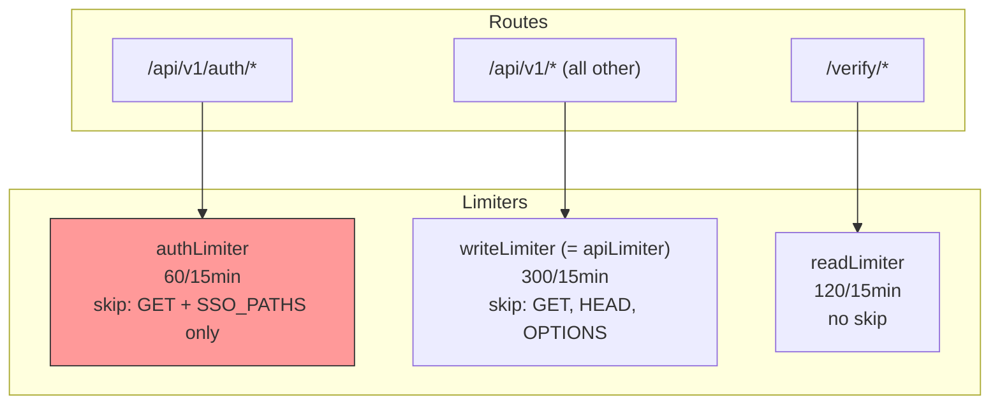

# Amma-Login Rate-Limit Lockout — Diagrams

**Date:** 2026-09-02
**Based on:** Production code at `2895e1b`

---

## 1. Current Bug Flow (Before Fix)

---

## 2. Fixed Flow (After Fix)

---

## 3. Auth Route Rate-Limit Coverage

---

## 4. Budget Depletion Timeline

---

## 5. Limiter Architecture (Current)

