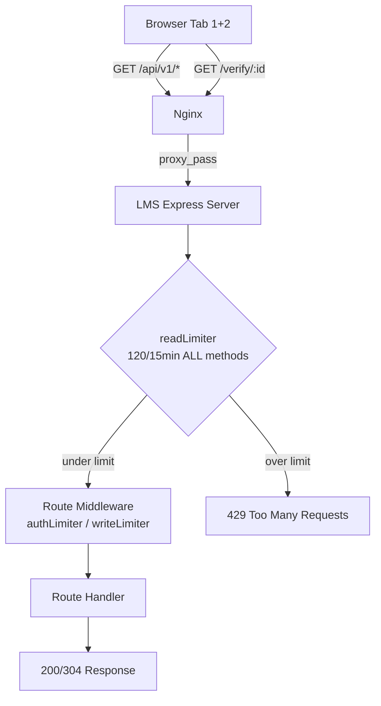
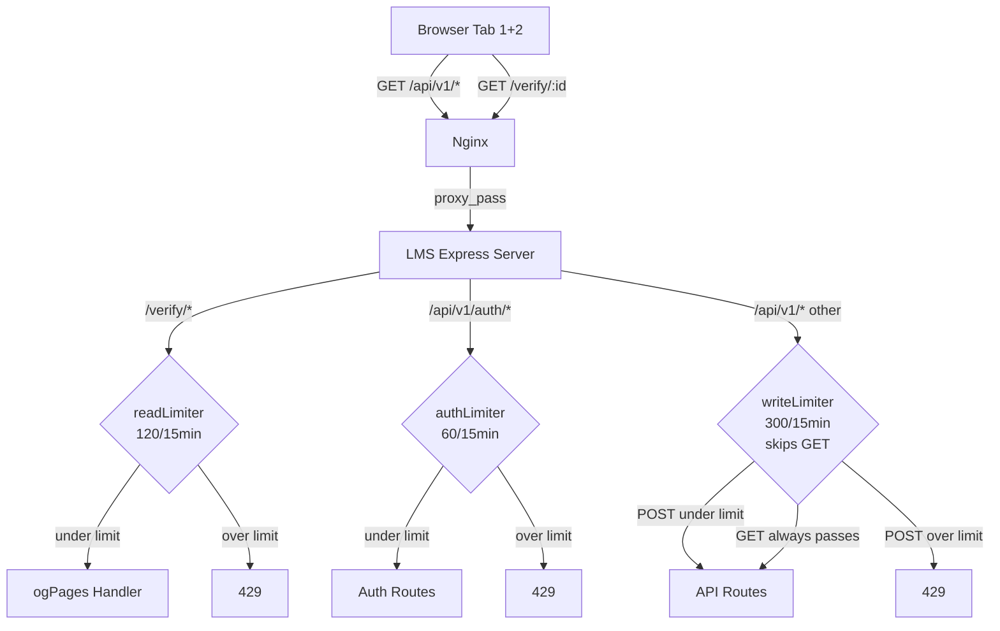
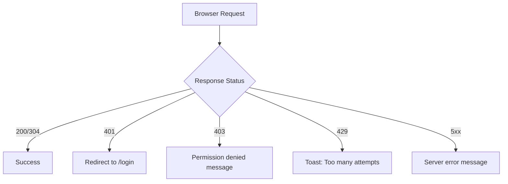

# API Lockout Architecture Diagrams

## 1. Current (Broken) Request Path



**Problem:** readLimiter applies to ALL requests (missing path prefix), so API routes and polling share the 120/15min budget with /verify/* routes.

## 2. Fixed Request Path



## 3. Polling Budget — Before vs After Fix

```mermaid
flowchart LR
    subgraph Before["BEFORE: Shared 120/15min budget"]
        P1[Polling\n~90 req/15min] --> Budget1[120 limit]
        Nav1[Dashboard loads\n~30 req] --> Budget1
        Budget1 -->|exceeded| Block1[ALL requests 429]
    end

    subgraph After["AFTER: Separate budgets"]
        P2[Polling\nGET skipped by writeLimiter] --> Unlimited[No GET limit]
        Nav2[Dashboard loads\nGET skipped by writeLimiter] --> Unlimited
        Verify[/verify/* requests] --> Budget2[120 limit]
    end
```

## 4. Error Handling Flow (Current — Unchanged)


