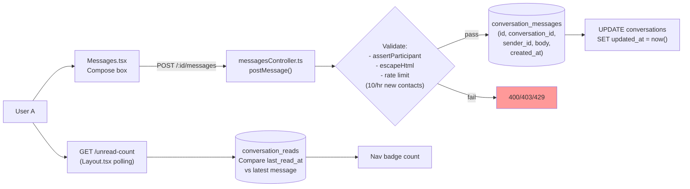
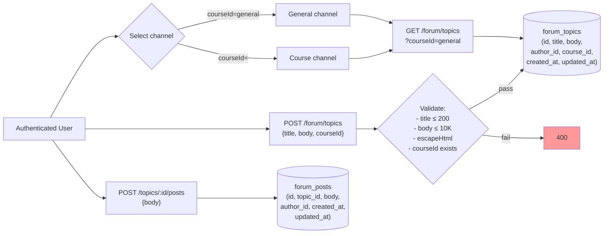
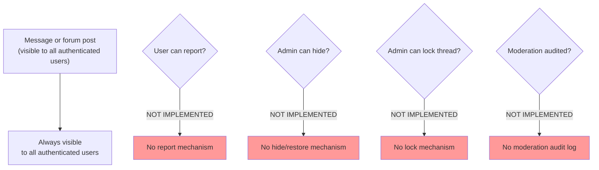
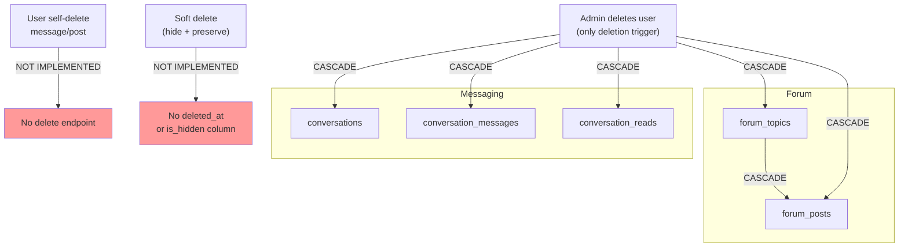
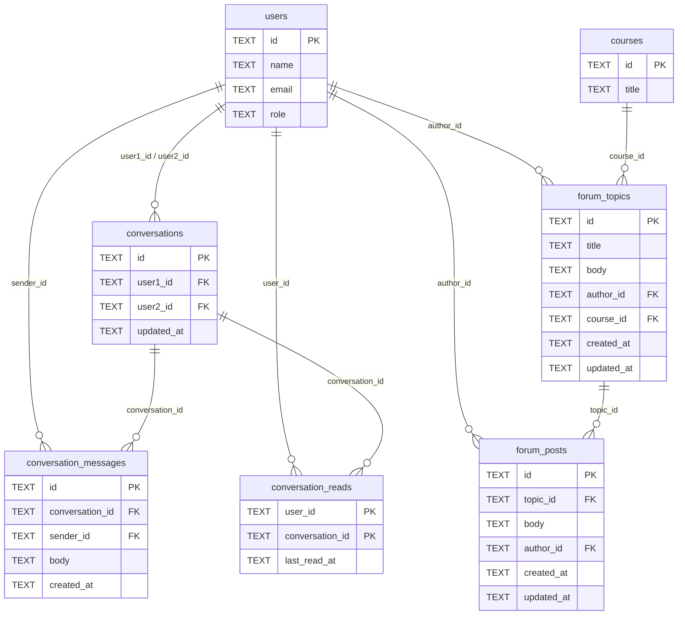
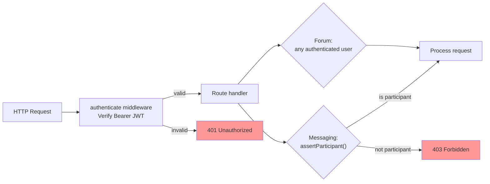

# Messaging and Forum — Current State Diagrams

**Date:** 2026-09-02
**Based on:** Production code at `2895e1b`

All diagrams reflect verified implementation. Elements labeled NOT IMPLEMENTED are absent from the codebase.

---

## 1. Current Messaging Flow

**Not in this flow:**
- Real-time delivery (NOT IMPLEMENTED — requires manual refresh)
- Push notifications (NOT IMPLEMENTED)
- Attachments (NOT IMPLEMENTED)
- Edit/delete (NOT IMPLEMENTED)
- Moderation (NOT IMPLEMENTED)

---

## 2. Current Forum Flow

**Not in this flow:**
- Edit topic/post (NOT IMPLEMENTED — `updated_at` column unused)
- Delete topic/post (NOT IMPLEMENTED — frontend stub only)
- Lock thread (NOT IMPLEMENTED)
- Pin thread (NOT IMPLEMENTED)
- Report content (NOT IMPLEMENTED)
- Search (NOT IMPLEMENTED)

---

## 3. Current Moderation Flow

**Summary:** No moderation workflow exists. Content is visible to all authenticated users with no mechanism to report, hide, restore, lock, or audit.

---

## 4. Current Deletion Model

**Key risk:** User account deletion is the only deletion path, and it permanently destroys all associated content via CASCADE.

---

## 5. Database Entity Relationships

**Missing entities (NOT IMPLEMENTED):**
- `message_reports` / `forum_reports`
- `moderation_actions`
- `message_attachments`
- `forum_attachments`
- `edit_history`

---

## 6. Authentication and Access Flow

**Not present:**
- RBAC permission checks (NOT IMPLEMENTED in production)
- Admin-only moderation routes (NOT IMPLEMENTED)
- Role-based forum channel access (NOT IMPLEMENTED)
