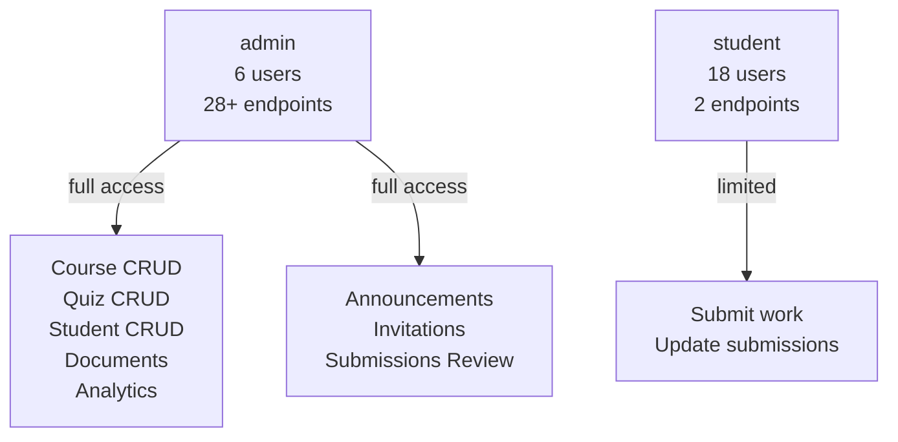
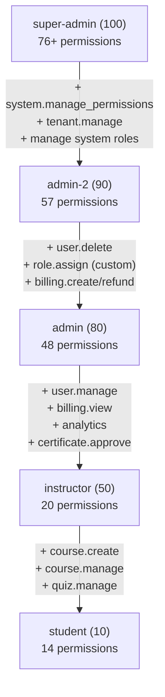
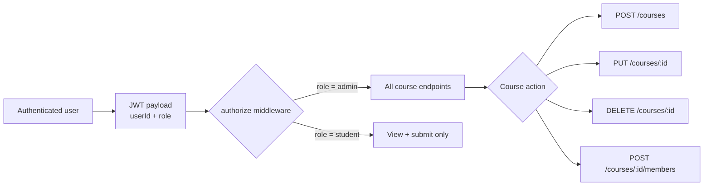
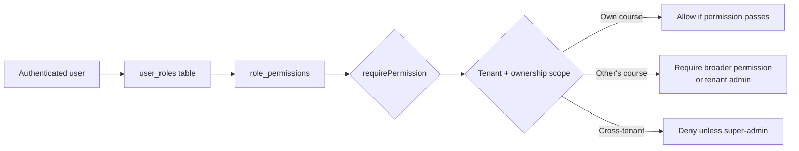

# RBAC and Course Permissions Diagrams

## Production Role System (Legacy)

**Note:** No hierarchy — roles are flat. All admins have identical permissions.

## Codebase RBAC System (Not Deployed)

**Note:** Arrows show capability additions at each tier. Roles are NOT hierarchical in code — each role has explicit permission mappings.

## Course Permission Flow

**Production note:** No ownership check — any admin can act on any course.

## Planned Course Permission Flow (RBAC)

## Access Matrix (Production)

| Action | Student | Admin |
|---|---|---|
| View published courses | Yes | Yes |
| Create course | No | Yes |
| Edit own course | No | Yes (all courses) |
| Edit any course | No | Yes |
| Delete course | No | Yes |
| Publish course | No | Yes |
| Manage students | No | Yes |
| Manage quizzes | No | Yes |
| Review submissions | No | Yes |
| View analytics | No | Yes |
| Manage users | No | Yes |
| Assign roles | No | No (no endpoint) |
| Manage tenants | No | No (not deployed) |
| Manage system settings | No | No (no endpoint) |
| Access wallet admin | No | No (separate system) |

## Access Matrix (Codebase RBAC — Not Deployed)

| Action | Student | Instructor | Admin | Admin-2 | Super-Admin |
|---|---|---|---|---|---|
| View published courses | Yes | Yes | Yes | Yes | Yes |
| Create course | No | Yes | Yes | Yes | Yes |
| Edit own course | No | Yes | Yes | Yes | Yes |
| Edit any course | No | No | Yes | Yes | Yes |
| Publish course | No | Yes | Yes | Yes | Yes |
| Manage users | No | No | Yes | Yes | Yes |
| Delete users | No | No | No | Yes | Yes |
| Assign roles | No | No | No | Custom only | Yes |
| Moderate content | No | No | Yes | Yes | Yes |
| Manage tenants | No | No | No | No | Yes |
| Manage system settings | No | No | No | No | Yes |
| Certificate approval | No | Yes | Yes | Yes | Yes |
| Billing management | No | No | View only | Full | Full |
