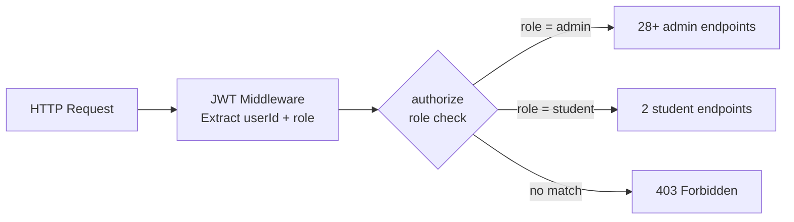
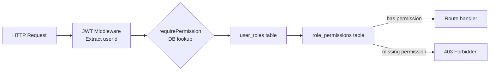
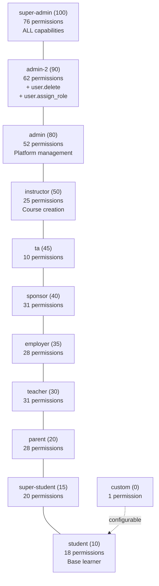
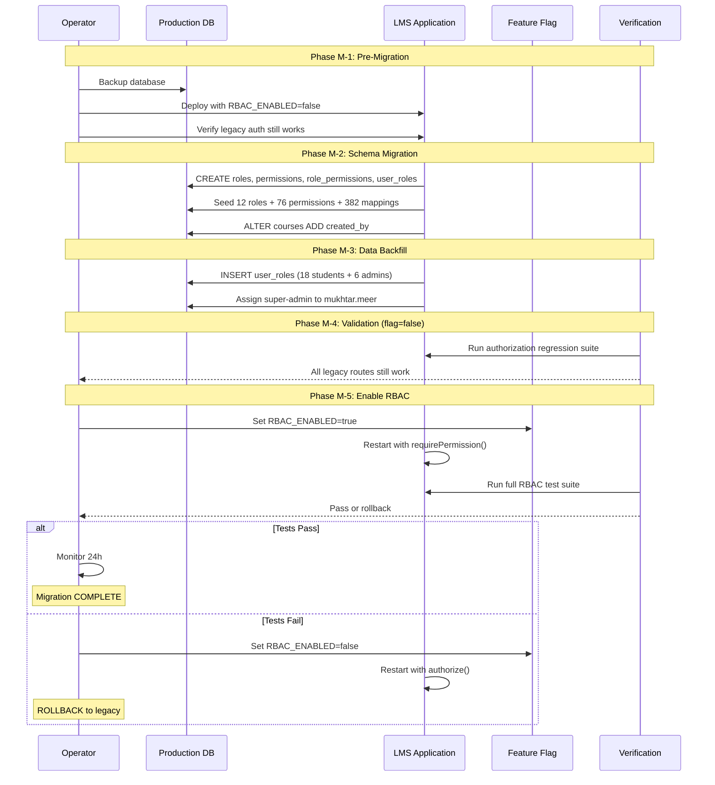
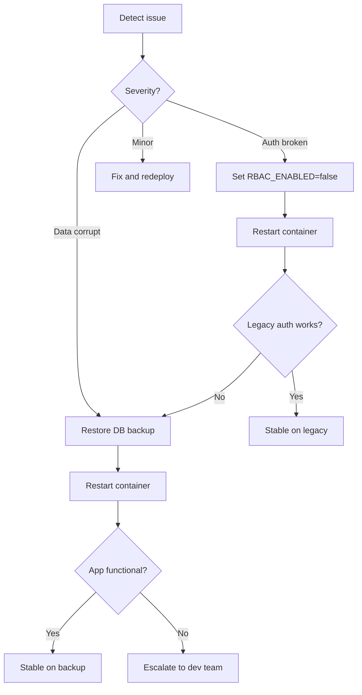
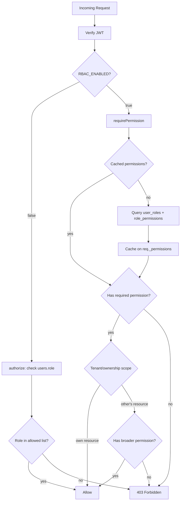
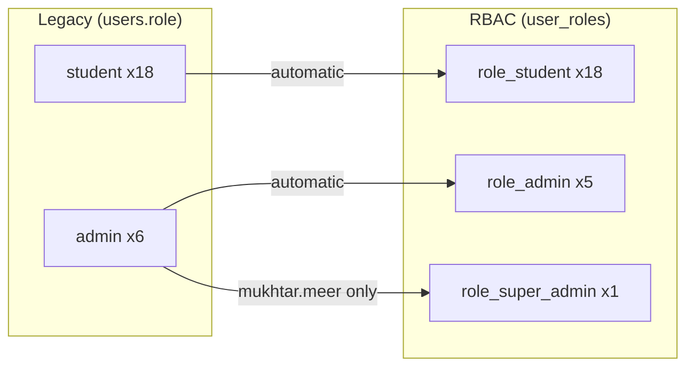
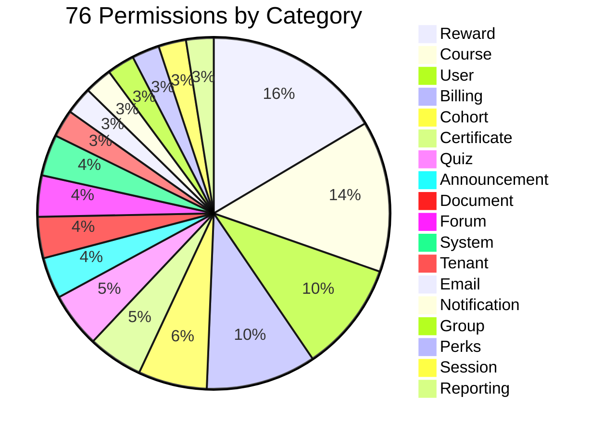

# RBAC Production Migration Diagrams

## 1. Current Production Authorization

## 2. Target RBAC Authorization

## 3. Target Role Hierarchy

**Note:** Roles are NOT hierarchical (no permission inheritance). Each role has explicit permission assignments. Lines show privilege level ordering only.

## 4. Migration Sequence

## 5. Rollback Path

## 6. Authorization Decision Flow (Post-Migration)

## 7. User Migration Mapping

## 8. Permission Category Breakdown

