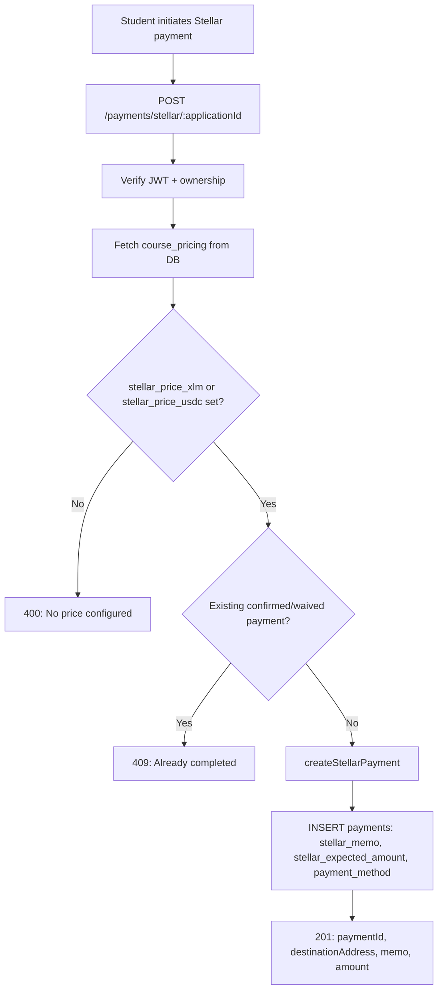
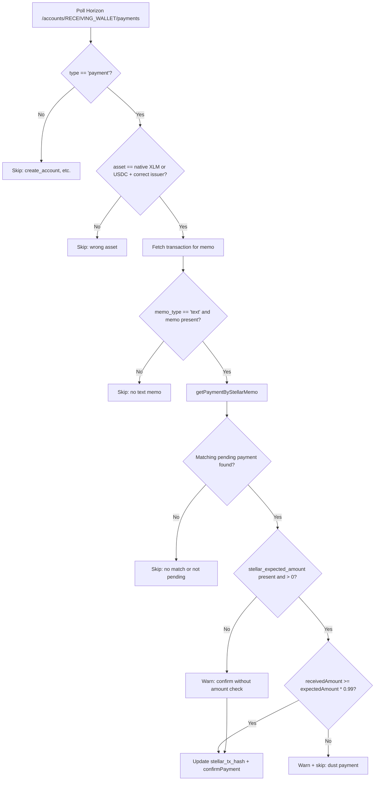

# Stellar Payment Verification Flow

**Date:** 2026-09-03 | **Source:** stellarPaymentMonitor.ts, paymentService.ts, payments.ts

---

## Payment Record Creation (Server-Side)

**Trusted amount source:** `pricing.stellar_price_xlm` or `pricing.stellar_price_usdc` from `course_pricing` table (admin-only write via `setCourseStellarPricing`). The client never provides or modifies the expected amount.

---

## Payment Monitor Verification (Background Poller)

---

## Validation Checks Present

| Check | Present? | Implementation |
|---|---|---|
| Asset filter (XLM or USDC) | YES | Lines 129-131: `isXlm \|\| isUsdc` |
| USDC issuer validation | YES | Line 130: `payment.asset_issuer === USDC_ISSUER` |
| Destination scoping | IMPLICIT | Horizon API scoped to RECEIVING_WALLET account |
| Text memo matching | YES | Lines 146-150 |
| Status guard (pending only) | YES | Line 150 |
| Amount threshold (99%) | YES | Lines 156-169 |
| Legacy fallback | YES | Lines 170-178 |
| Tx hash persistence | YES | Lines 181-183 |

## Validation Gaps (Defense-in-Depth)

| Gap | Risk | Mitigation |
|---|---|---|
| `parseFloat()` not decimal-safe | Floating-point precision on large amounts | Amounts in practice < 10000; rounding error negligible at this scale |
| No asset-method cross-check | XLM payment against USDC expected or vice versa | Price difference (~1000x) would fail 99% threshold naturally |
| No explicit `to` field check | Outgoing payments from receiving wallet could match | Outgoing payments wouldn't have matching memos |
| No tx_hash uniqueness guard | Theoretical replay | Stellar tx_hashes are unique on-chain; cursor prevents re-processing |
| Tests verify arithmetic only | AMT-3/4/5 test threshold logic inline, not the full monitor path | Monitor is integration-heavy (Horizon API); unit arithmetic tests adequate for the comparison logic |
