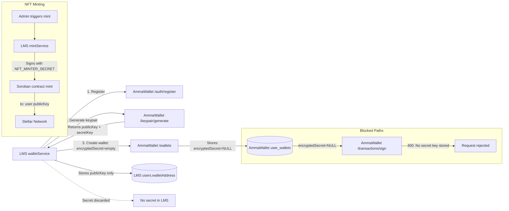

# Stellar Wallet Control and Signing Verification

**Date:** 2026-09-03 | **Source:** walletService.ts, mintService.ts, AmmaWallet wallets.ts + server.ts

---

## Wallet Provisioning and Signing Architecture

---

## Data Flow Table

| Step | System | Data | Stored? | Transmitted? | Needed Later? |
|---|---|---|---|---|---|
| 1. Register user | LMS → AmmaWallet | email, random password | AW: user record | Yes (HTTPS) | accessToken for steps 2-3 |
| 2. Generate keypair | AmmaWallet → LMS | publicKey, secretKey | Not persisted | Yes (HTTPS response) | publicKey: yes. secretKey: no |
| 3. Create wallet | LMS → AmmaWallet | publicKey, encryptedSecret="" | AW: wallet with encryptedSecret=NULL | Yes (HTTPS) | publicKey for NFT destination |
| 4. Store wallet address | LMS | publicKey → users.walletAddress | LMS DB | No | Yes (NFT recipient) |
| 5. Discard secret | LMS | secretKey from step 2 | NO | NO | NO — minting uses platform key |
| 6. NFT mint | LMS mintService | NFT_MINTER_SECRET signs, user publicKey is `to:` | tx_hash in nft_credentials | Soroban RPC | One-time |

---

## Signing Authority Verification

| Question | Answer | Evidence |
|---|---|---|
| Who signs NFT mint transactions? | Platform minter keypair (`NFT_MINTER_SECRET`) | mintService.ts:162, 271 |
| Does LMS ever sign Stellar transactions? | NO | No signing code exists in LMS |
| Does AmmaWallet sign NFTs? | NO — AmmaWallet NFT routes are read-only (RPC queries, unsigned XDR) | nft.service.ts: simulation-only |
| Can the LMS wallet be used for delegated signing? | NO — encryptedSecret=NULL → AmmaWallet returns 400 | server.ts:1279, 1415 |
| Is the discarded secret recoverable? | NO — never stored, never logged, never returned to frontend | walletService.ts:164 returns publicKey only |
| Does the user need the secret for refunds? | NO — refunds handled by admin (paymentService.refundPayment) | Not Stellar-based |
