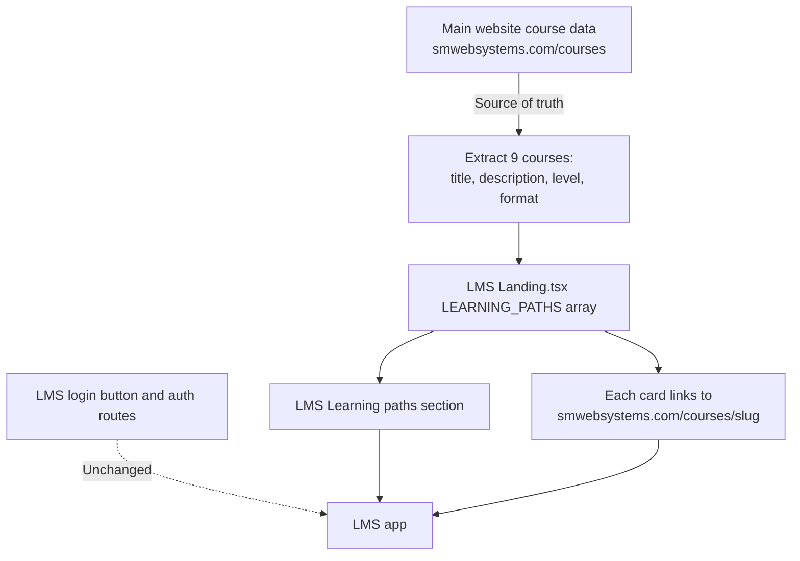
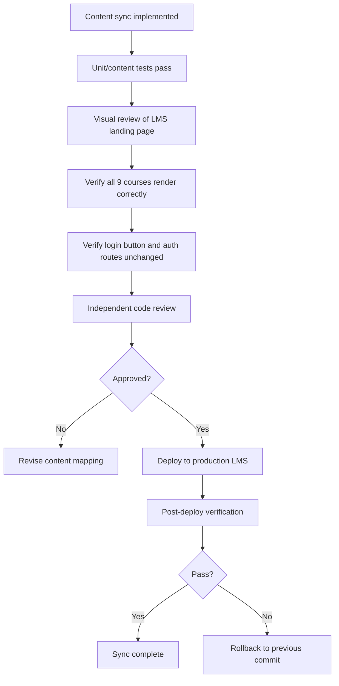

# LMS Course Content Sync Spec

**Date:** 2026-08-26
**Status:** Draft

---

## Goal

Update the LMS landing page "Learning paths" section to show all 9 real courses from the main website (`smwebsystems.com/courses`), replacing the current stale 4-entry list. No authentication, routing, or infrastructure changes.

---

## ADR-1: Content Sync Strategy

**Decision:** Static duplication
**Status:** Accepted
**Context:** The LMS landing page shows 4 stale course entries hardcoded in `Landing.tsx`. The main website has 9 live courses defined in `app/courses/data.ts`. We need to synchronize the LMS listing.
**Options considered:**
1. Static duplication — copy course data into LMS as a static array
2. Shared data source — extract to shared JSON consumed by both apps
3. API fetch — LMS reads from main website API

**Selected approach:** Option 1 — Static duplication
**Rationale:** Simplest, lowest-risk change. No new cross-app dependencies. The CRM foundation work established a pattern of deliberate contracts before coupling systems. A shared data source is a valid future improvement but unnecessary for a one-time content sync of 9 courses.
**Data ownership:** Main website `app/courses/data.ts` remains the source of truth. LMS copy is a point-in-time snapshot.
**Maintenance implications:** LMS content may drift if main site courses change. This is acceptable for v1.
**Rollback:** Revert the single commit touching `Landing.tsx`.
**Verification:** Automated tests assert exactly 9 courses with correct titles. Visual check of live LMS.
**Follow-up:** If content changes frequently, implement Option 2 (shared data source) as a separate task.

## ADR-2: Course Detail Page Routing

**Decision:** Link to main website course pages
**Status:** Accepted
**Context:** The current LMS has no public course detail pages. Entries link to `/login` or external sites.
**Selected approach:** Each course card links to `https://smwebsystems.com/courses/{slug}` (opens in new tab). This matches the existing pattern where "Blockchain for Beginners" links externally.
**Rationale:** No new LMS pages to build or maintain. Users see the authoritative course content on the main site. Sign-in CTA remains visible on the LMS landing page.

## ADR-3: "Coming Soon" Badge Policy

**Decision:** Remove all "Coming soon" badges
**Status:** Accepted
**Context:** All 9 courses on the main website have `status: "live"`. The two "Coming soon" entries in the current LMS ("Ethereum & security", "Solana & automation") are stale placeholders that don't correspond to any real course.
**Selected approach:** All 9 entries show their level badge (e.g., "Beginner", "Intermediate"). No "Coming soon" badges.

---

## Content Sync Data Flow

## Before/After Course Listing

```mermaid
flowchart LR
    subgraph Before[Current LMS - stale]
        B1[Stellar and Soroban]
        B2[Blockchain for Beginners]
        B3[Ethereum and security - Coming soon]
        B4[Solana and automation - Coming soon]
    end

    subgraph After[Updated LMS - synced]
        A1[Introduction to Autonomous Robotics]
        A2[Introduction to Electronics]
        A3[Stellar Vibe-Coding Crash Course]
        A4[Blockchain-Vibe-Coding: Stellar Zero to dApp]
        A5[Ethereum From Zero to Smart Contracts]
        A6[Vibe Hack 101]
        A7[Build on Stellar - Soroban Crash Course]
        A8[Rust Crash Course]
        A9[Build on Stellar]
    end

    Before -.->|Full replacement| After
```

## Verification and Rollback Flow

---

## Iterative To-Do List

### Assessment
- [x] Locate LMS repository and course-content source.
- [x] Locate main website course-content source.
- [x] Extract full content for all 9 courses.
- [x] Document current stale LMS "Learning paths" content verbatim.
- [x] Determine current LMS course detail-page routing pattern.
- [x] Determine "Coming soon" accuracy for each course.
- [x] Write assessment document.

### Design
- [x] Decide content-sync strategy (static duplication).
- [x] Decide "Coming soon" badge policy (remove all).
- [x] Decide course detail-page routing approach (link to main site).
- [x] Record ADRs in spec document.
- [x] Add Mermaid diagrams to spec.

### Test-driven implementation
- [ ] Write test asserting LMS renders exactly 9 course entries.
- [ ] Write test asserting each course title matches main site exactly.
- [ ] Write test asserting no stale course titles remain.
- [ ] Write test asserting no "Coming soon" badges appear.
- [ ] Write test asserting login button is unchanged.
- [ ] Implement the LEARNING_PATHS replacement.
- [ ] Update footer link.
- [ ] Run all new tests; confirm pass.
- [ ] Run full existing LMS frontend test suite; confirm no regressions.

### Verification
- [ ] Visually confirm all 9 courses on LMS landing page.
- [ ] Confirm login button still works.
- [ ] Confirm main website /courses page unmodified.
- [ ] Run production build with zero new errors.

### Review and deployment
- [ ] Independent code review.
- [ ] Resolve all findings.
- [ ] Present deployment packet.
- [ ] Obtain explicit approval before deploying.
- [ ] Deploy and verify production.

### Explicitly out of scope
- [x] Do not change LMS authentication or session handling.
- [x] Do not redirect/proxy LMS domain to main website.
- [x] Do not modify main website's /courses page.
- [x] Do not implement Amma Wallet SSO.
- [x] Do not touch CRM code or database.
