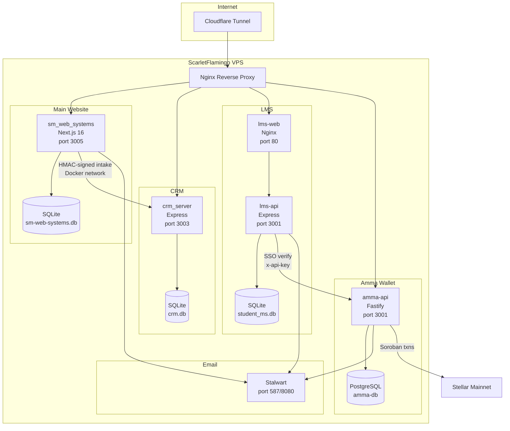
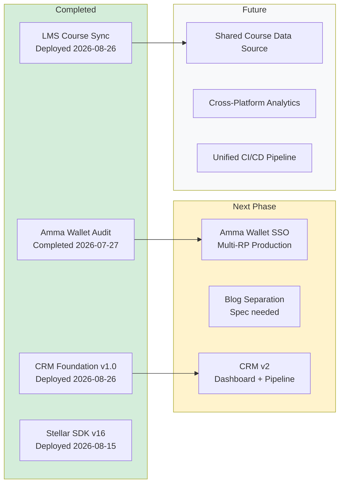
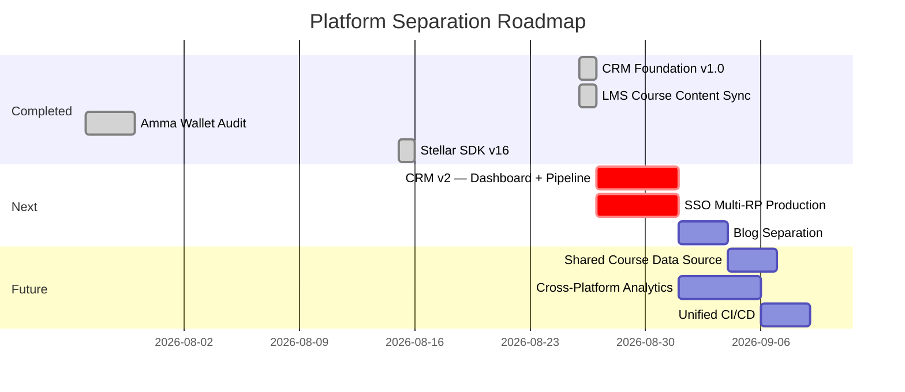

# SM Web Systems — Platform Separation Roadmap

**Date:** 2026-08-26
**Status:** Living document

---

## Platform Overview

SM Web Systems operates five interconnected applications on a single VPS (ScarletFlamingo), each in its own Docker container with isolated data stores. The platform separation project decouples these applications into independently deployable services with well-defined integration contracts.

**Architecture:** Docker Compose orchestration, Nginx reverse proxy, Cloudflare Tunnel, per-app SQLite or PostgreSQL databases, SMTP relay via Stalwart.

---

## Current State

### Application Inventory

| App | URL | Stack | Database | Container(s) | Tests | Last Deploy |
|---|---|---|---|---|---|---|
| Main Website | smwebsystems.com | Next.js 16, React 19, TS | SQLite (WAL) | `sm_web_systems` | — | 2026-08-26 |
| CRM | crm.smwebsystems.com | Express, TS, better-sqlite3 | SQLite (WAL) | `crm_server` | 35 | 2026-08-26 |
| LMS | lms.smwebsystems.com | Express + Vite/React, TS | SQLite | `lms-api`, `lms-web` | 1390+ | 2026-08-26 |
| Amma Wallet | ammawallet.com | Fastify, Drizzle, React/Vite | PostgreSQL 16 | `amma-api`, `amma-db` | 515 | 2026-07-29 |
| Blog | smwebsystems.com/blog | Next.js (integrated) | SQLite (shared) | `sm_web_systems` | — | 2026-08-26 |

### Integration Map

### Platform Separation Status

---

## Completed Milestones

### 1. CRM Foundation v1.0 — DEPLOYED 2026-08-26

**Spec:** `SM-Web-CRM/docs/superpowers/specs/` | **Deployment report:** `specs/deployment-status.md` (main website repo)

| Deliverable | Status |
|---|---|
| Express + TypeScript + better-sqlite3 app | Done |
| HMAC-SHA256 signed intake endpoint (`POST /internal/intake`) | Done |
| Lead + audit tables with idempotency | Done |
| 35 tests (4 test files) | Done |
| Docker container (`crm_server`, port 3003) | Done |
| Nginx config (`crm.conf`) blocking `/internal/*` externally | Done |
| Website fire-and-forget CRM intake on form submissions | Done |
| Daily backup cron (03:30 UTC) | Done |
| GitHub repo: `SM-Web-Systems/SM-Web-Systems-CRM` | Done |

**Commits:** 7 (`967abac..8e35c12`)
**Rollback:** Stop container, remove env vars, restart website (crm-client.ts gracefully skips).

### 2. LMS Course Content Sync — DEPLOYED 2026-08-26

**Spec:** `specs/2026-08-26-lms-course-content-sync-spec.md` | **Assessment:** `specs/2026-08-26-lms-course-content-sync-assessment.md`

| Deliverable | Status |
|---|---|
| Replace 4 stale `LEARNING_PATHS` entries with 9 real courses | Done |
| Each card links to `smwebsystems.com/courses/{slug}` (new tab) | Done |
| Remove all "Coming soon" badges | Done |
| 21 content accuracy tests | Done |
| Footer link updated to smwebsystems.com/courses | Done |
| Code review: 0 blockers, 0 high, 3 LOW (all resolved) | Done |
| Full test suite: 227/227 frontend tests pass | Done |
| Production deployment verified | Done |

**Commit:** `0f43e30` | **ADRs:** 3 (static duplication, link to main site, remove badges)

### 3. Amma Wallet Security Audit — COMPLETED 2026-07-27

319 findings, 97 fixed, 67 INFO, 155 deferred. All CRITICALs + exploitable HIGHs resolved. 7 zero-downtime deploys. Tags: `audit-complete-2026-07-27` through `batch4-complete-2026-07-29`.

### 4. Stellar SDK v16 Upgrade — DEPLOYED 2026-08-15

@stellar/stellar-sdk 15.1.0 → 16.2.0, axios 1.15.0 → 1.18.0 (28 CVEs resolved). npm audit: 0 vulns. Tag: `stellar-sdk-v16-upgrade-2026-08-15`.

### 5. LMS Feature Development — Phases 3-27 COMPLETE

26 phases of feature development from 2026-08-03 to 2026-08-19. Key capabilities: RBAC (12 roles, 60+ permissions), multi-tenant architecture, payment system (Paystack + Stellar), NFT certificates (Soroban mainnet), cohort management, email templates, observability (pino structured logging), E2E testing (Playwright), deploy pipeline, API documentation (OpenAPI 3.0.3). Total: 1390+ automated tests.

---

## Existing SSO Patterns (Amma Wallet as IdP)

**Status:** Implemented in AmmaWallet, integrated with LMS. Not yet multi-RP.

| Component | Location | Description |
|---|---|---|
| IdP token endpoint | `amma-wallet/packages/backend/src/routes/sso.ts` | `POST /sso/token` — issues one-time assertion JWT (60s TTL) |
| IdP verify endpoint | `amma-wallet/packages/backend/src/routes/sso.ts` | `POST /sso/verify` — server-to-server token exchange (x-api-key) |
| RP callback | `LMS-AmmaWallet/LMS-Server/src/routes/auth.ts` | `ammaCallback` handler sets `walletAddress` + `wallet_linking_status` |
| SSO secret | `SSO_SECRET` env var | JWT signing key |
| Callback whitelist | `SSO_CALLBACK_WHITELIST` env var | Fail-closed: empty = reject all |
| JTI blacklist | In-memory Set | Cleared every 60s (single-instance only) |
| Claims | JWT payload | `id`, `email`, `firstName`, `lastName`, `isEmailVerified`, `mainnetWalletAddress` |
| LMS config | `LMS-Server/.env` | `AMMA_WALLET_URL=https://ammawallet.com/` |

**Known limitations:**
- JTI blacklist is in-memory (not suitable for multi-instance)
- SSO_CALLBACK_WHITELIST is a flat list (no per-RP configuration)
- No refresh token flow
- No consent screen

---

## Roadmap Sequencing

---

## Master To-Do List

### Completed
- [x] CRM Foundation v1.0 — Express app, HMAC intake, 35 tests, Docker, deployed
- [x] LMS Course Content Sync — 9 courses, 21 tests, deployed
- [x] Amma Wallet Security Audit — 319 findings, all CRITICALs resolved
- [x] Stellar SDK v16 Upgrade — 28 CVEs resolved
- [x] LMS Feature Development (Phases 3-27) — 1390+ tests

### Next Phase (requires spec + approval)
- [ ] CRM v2 — Admin dashboard, lead pipeline, search/filter, export
- [ ] SSO Multi-RP Production — Per-RP configuration, consent screen, refresh tokens, JTI persistence
- [ ] Blog Separation — Extract blog from main website into standalone app

### Future (requires brainstorming)
- [ ] Shared Course Data Source — Replace static duplication (ADR-1 follow-up)
- [ ] Cross-Platform Analytics — Unified metrics across CRM, LMS, Amma Wallet
- [ ] Unified CI/CD Pipeline — GitHub Actions across all repos
- [ ] CRM ↔ LMS Integration — Student enrollment → CRM lead enrichment

### Explicitly Out of Scope (permanent)
- [x] Do not merge applications back together
- [x] Do not share databases between applications
- [x] Do not bypass HMAC signing for CRM intake
- [x] Do not auto-deploy without explicit approval

---

## Infrastructure

### Docker Containers (15 total)

| Container | App | Port | Database | Status |
|---|---|---|---|---|
| `sm_web_systems` | Main Website | 3005 | SQLite | Healthy |
| `crm_server` | CRM | 3003 | SQLite | Healthy |
| `lms-api` | LMS Backend | 3001 | SQLite | Healthy |
| `lms-web` | LMS Frontend | 80 | — | Running |
| `lms_server` | LMS (saplingx) | 3001 | SQLite | Healthy |
| `lms_frontend` | LMS FE (saplingx) | 80 | — | Healthy |
| `amma-api` | Amma Wallet | 3001 | PostgreSQL | Healthy |
| `amma-db` | Amma DB | 5432 | — | Healthy |
| `amma-api-testnet` | Amma Testnet | 3002 | PostgreSQL | Healthy |
| `amma-db-testnet` | Amma Testnet DB | 5432 | — | Healthy |
| `nginx_server` | Reverse Proxy | 80, 443 | — | Running |
| `mail_server` | Node.js Mail | — | — | Running |
| `mariadb_server` | MariaDB | 3306 | — | Running |
| `certbot` | TLS Certs | — | — | Running |
| `stalwart` | Email Server | 587, 8080 | — | Running |

### Backup Schedule

| App | Script | Schedule | Retention |
|---|---|---|---|
| Main Website | `backup-sm-web-db.sh` | 03:15 UTC daily | 30 days |
| CRM | `backup-crm-db.sh` | 03:30 UTC daily | 30 days |
| LMS | (container volume) | — | Manual |
| Amma Wallet | (PostgreSQL dump) | — | Manual |

### GitHub Repositories

| Repo | Branch | Latest Commit |
|---|---|---|
| `SM-Web-Systems/SM-Web-Systems-CRM` | main | `8e35c12` |
| `SM-Web-Systems/lms-crypto-production` | main | `abce56a` |
| `SM-Web-Systems/amma-wallet-production` | main | `9694726` |

---

## Conventions

- **Spec-first:** Every feature gets a spec with ADRs before implementation
- **TDD:** Tests written before implementation code
- **Static duplication over premature coupling:** Prefer point-in-time snapshots over shared infrastructure until coupling is justified
- **HMAC-signed contracts:** Server-to-server integration uses HMAC-SHA256 with protocol versioning
- **Approval gates:** No production deployment without explicit approval
- **Isolated databases:** Each application owns its database; no cross-app DB access
- **Docker isolation:** Each app runs in its own container with minimal network exposure
