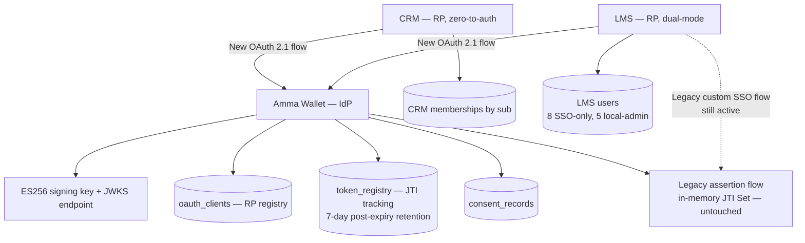
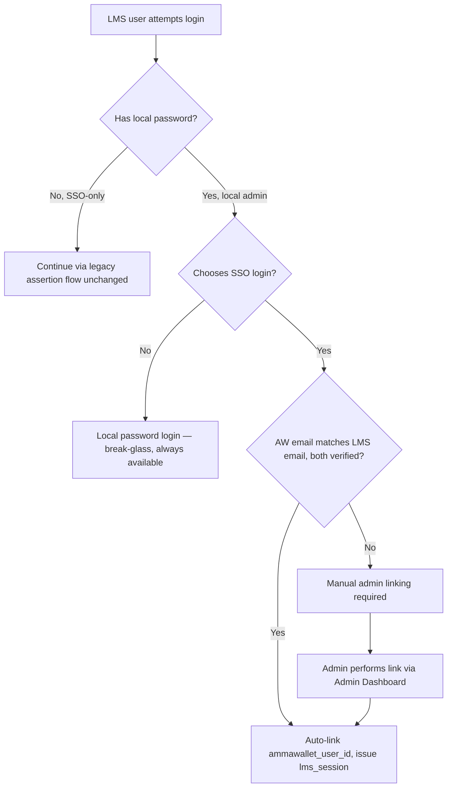
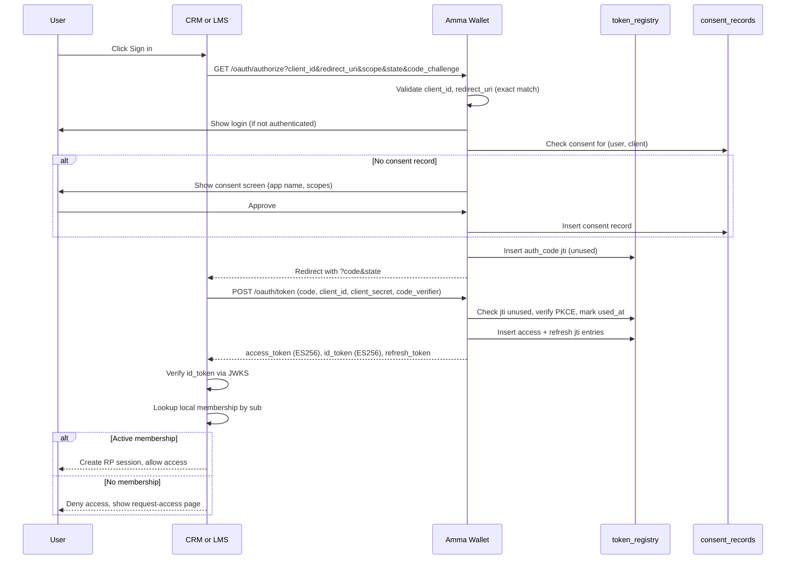
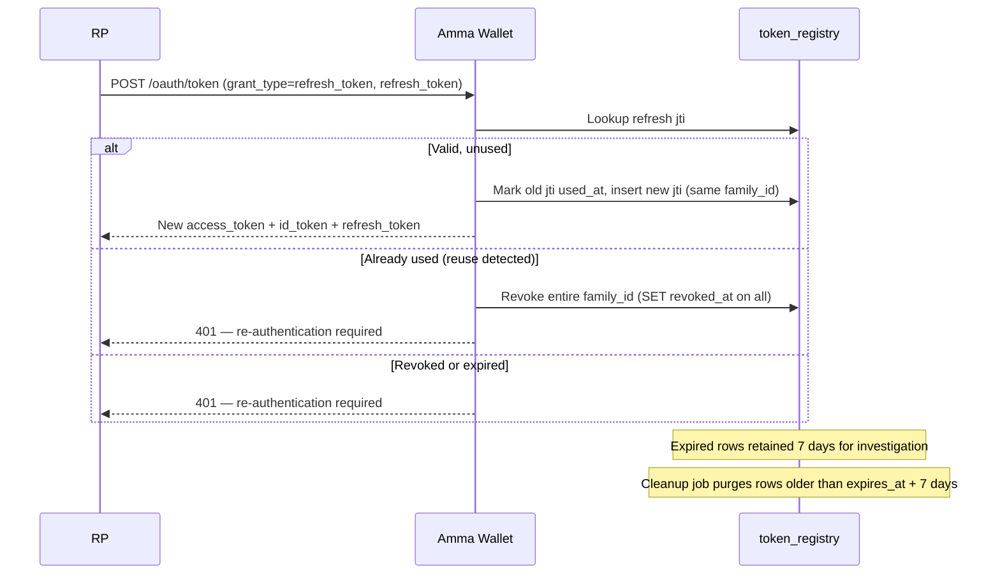
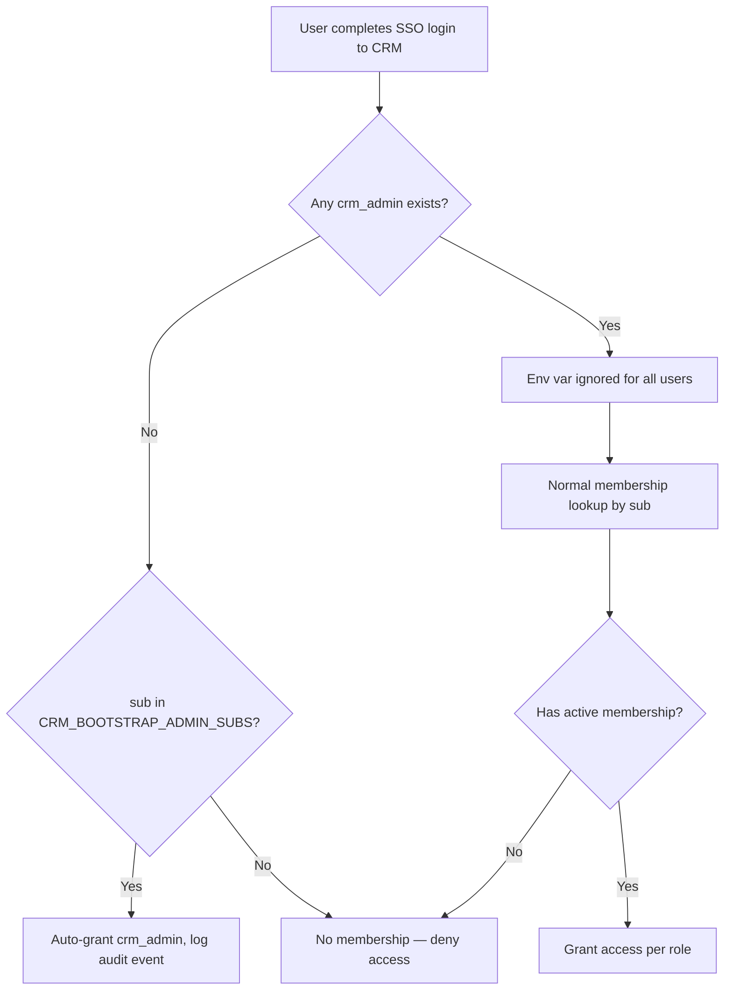

# SSO Multi-RP — Design Specification

**Date:** 2026-08-26
**Status:** Approved
**Version:** 1.0

---

## Overview

Implement Amma Wallet as a production-grade, multi-relying-party OAuth 2.1 / OIDC-inspired identity provider, with CRM and LMS as its first two relying parties. The existing custom SSO assertion flow remains fully operational (dual-mode) throughout this phase and is only disabled in a separate, future approval gate.

**Key principle:** Amma Wallet owns identity (sub, email, email_verified, wallet addresses) and token issuance. Each RP owns its local membership, role model, session cookie, and authorization decisions.

---

## ADR-001: Key Algorithm

**Decision:** ES256 (ECDSA P-256)
**Status:** Approved
**Context:** The current system uses HS256 (symmetric shared secret) for all JWTs. Multi-RP requires RPs to self-verify tokens without sharing a secret with each other or calling a verify endpoint.
**Options considered:**
1. RS256 (RSA 2048+) — widely supported, larger keys (256 bytes), slower
2. ES256 (ECDSA P-256) — modern standard, smaller keys (32 bytes), faster sign/verify
3. Stay on HS256 — each RP gets its own shared secret (no JWKS possible)
**Selected approach:** ES256
**Rationale:** Smaller keys, faster operations, modern best practice. `jsonwebtoken` v9 supports ES256 natively. JWKS endpoint can publish the public key without exposing the private key.
**Security implications:** Private key stored as PEM in env var (`OAUTH_SIGNING_KEY`), never committed. Public key derived at startup and served via JWKS.
**Operational implications:** Key rotation: generate new key pair, add new `kid` to JWKS, old `kid` remains until all tokens signed with it expire. Single active signing key initially.
**Rollback:** Revert to HS256 by reconfiguring the signing service. Legacy flow continues to use `SSO_SECRET` (HS256) unchanged.
**Verification:** Test that tokens signed with ES256 verify correctly with the published JWKS. Test that tokens signed with the wrong key are rejected.

---

## ADR-002: LMS Migration Strategy

**Decision:** Auto-link by verified email with manual fallback
**Status:** Approved
**Context:** LMS has 13 users: 8 SSO-only (`auth_provider='ammawallet'`, `ammawallet_user_id` set), ~5 local-password admins. The 8 SSO-only users continue using the existing legacy assertion flow unchanged. The ~5 local admins need a path to link their Amma Wallet identity for the new OAuth flow.
**Options considered:**
1. Big-bang cutover — all users re-authenticate on a set date
2. Dual-mode transition — old and new flows coexist, auto-link on first new-flow login
3. Email-matching auto-migration — auto-link by verified email, manual fallback for mismatches
**Selected approach:** Option 2+3 combined — dual-mode with auto-link by email
**Rationale:** Zero disruption. SSO-only users keep using the legacy flow. Local admins who choose to use the new OAuth flow are auto-linked if emails match. Mismatches handled manually. Legacy flow stays active until explicitly disabled in a future, separate phase.
**Security implications:** Auto-link only occurs when both the AW and LMS emails are verified. Unverified emails require manual admin linking.
**Data ownership:** LMS owns the `ammawallet_user_id` column in its `users` table. AW does not store LMS user IDs.
**Rollback:** Remove the new OAuth login option from LMS. Legacy flow continues unchanged.
**Verification:** Test auto-link on email match. Test manual flow on mismatch. Test that SSO-only users are completely unaffected.

### Manual Linking Process for Mismatched Local Admins

**Who performs the link:** Any user with the `admin` role in LMS (or equivalent `user.manage` RBAC permission).

**UI flow:**
1. Admin navigates to LMS Admin Dashboard → Users panel.
2. Selects the unlinked local-admin user.
3. Clicks "Link Amma Wallet Identity" action.
4. Enters the target `ammawallet_user_id` (obtained from the AW admin panel or directly from the user).
5. System validates that the `ammawallet_user_id` is not already linked to another LMS user.
6. System sets `ammawallet_user_id`, `auth_provider='ammawallet'`, `wallet_linking_status='linked'` on the user record.
7. An audit log entry is created: `event_type='user.wallet_linked_manual'`, `entity_type='user'`, `entity_id=<lms_user_id>`, `actor_id=<admin_user_id>`, `metadata_json='{"ammawallet_user_id":"<id>","method":"manual_admin"}'`.

**Account state while unlinked:** The local-admin user can continue to log in via local password (per ADR-003). They have full access to all features their role grants. They simply cannot use the new OAuth flow until linked. No functional degradation.

**Edge cases:**
- If the target `ammawallet_user_id` is already linked to another LMS user: reject with a clear error message.
- If the admin links the wrong AW user by mistake: admin can re-link to a different `ammawallet_user_id` (overwrite). The old link becomes void. Audit log captures both operations.

---

## ADR-003: LMS Local Password Fallback

**Decision:** Keep permanently as break-glass
**Status:** Approved
**Context:** ~5 local-admin accounts use password login today. SSO-only users have `password_hash='$sso$'` and cannot use password login.
**Selected approach:** Keep local password login forever for accounts that have real password hashes.
**Rationale:** Zero cost, high safety value. If AW is down, admins can still access LMS. SSO-only users are unaffected.
**Security implications:** Password accounts retain bcrypt hashing, rate limiting, and existing security measures.
**Rollback:** N/A — this is a non-change.
**Verification:** Test that local password login continues to work for admin accounts. Test that SSO-only accounts are rejected with `SSO_REQUIRED`.

---

## ADR-004: CRM Bootstrap Admin

**Decision:** Env var seeding via `CRM_BOOTSTRAP_ADMIN_SUBS`
**Status:** Approved
**Context:** CRM currently has zero auth. When SSO is added, the first `crm_admin` must be granted somehow to avoid chicken-and-egg lockout.
**Options considered:**
1. Env var seeding — explicit, auditable, no permanent backdoor
2. First-login auto-grant — dangerous, any user could become admin
3. CLI migration script — requires manual intervention each time
**Selected approach:** Env var `CRM_BOOTSTRAP_ADMIN_SUBS` (comma-separated `ammawallet_user_id` values)
**Rationale:** On first successful SSO login, if `sub` matches an entry AND no `crm_admin` exists yet, auto-grant `crm_admin`. Once at least one `crm_admin` exists, the env var is completely ignored for all subsequent logins regardless of `sub` match.
**Security implications:** The env var is a one-time bootstrap. It creates no permanent backdoor. Once an admin exists, only that admin can grant further memberships.
**Operational implications:** Set the env var before first CRM SSO login. After bootstrap, the var can be removed (or left — it has no effect).
**Rollback:** Delete the `memberships` row. Re-run bootstrap by clearing all `crm_admin` rows and restarting with the env var.
**Verification:** Test that bootstrap grants admin when no admin exists. Test that bootstrap is ignored when any admin already exists (even if `sub` matches). Test that non-matching `sub` gets no membership.

---

## ADR-005: RP Registry

**Decision:** Separate `oauth_clients` table in Amma Wallet database
**Status:** Approved
**Context:** AW already has a `tenant_api_keys` table for billing/tenant isolation. OAuth client credentials serve a different purpose with different fields.
**Options considered:**
1. Extend `tenant_api_keys` — reuse existing table, risk conflation
2. New `oauth_clients` table — clean separation, proper OAuth-specific fields
3. Config file — hardcoded, requires AW redeploy to add RPs
**Selected approach:** New `oauth_clients` table
**Rationale:** Different purpose (OAuth vs billing), different fields (redirect_uris, grant_types, PKCE). Clean separation prevents confusion. Adding future RPs (Blog, main website) requires only a DB insert, not a redeploy.

### `oauth_clients` Schema (Drizzle)

```typescript
export const oauthClients = pgTable("oauth_clients", {
  id: bigserial("id", { mode: "number" }).primaryKey(),
  clientId: text("client_id").notNull().unique(),          // e.g., "crm-smwebsystems"
  clientSecretHash: text("client_secret_hash").notNull(),   // bcrypt hash
  clientName: text("client_name").notNull(),                // "SM Web CRM"
  redirectUris: text("redirect_uris").notNull(),            // JSON array of exact URIs
  scopes: text("scopes").notNull().default("openid profile email"), // space-delimited
  grantTypes: text("grant_types").notNull().default("authorization_code refresh_token"),
  requirePkce: boolean("require_pkce").notNull().default(true),
  accessTokenTtlSeconds: integer("access_token_ttl_seconds").notNull().default(900),
  refreshTokenTtlSeconds: integer("refresh_token_ttl_seconds").notNull().default(2592000),
  isActive: boolean("is_active").notNull().default(true),
  createdAt: timestamp("created_at", { withTimezone: true }).defaultNow(),
  updatedAt: timestamp("updated_at", { withTimezone: true }).defaultNow(),
});
```

**Security implications:** `client_secret_hash` uses bcrypt (same as user passwords). Raw secret never stored. `redirect_uris` enforces exact-match — no wildcards or partial matching.
**Rollback:** Drop the table. Legacy flow is unaffected.
**Verification:** Test CRUD operations. Test that invalid `client_id` or `redirect_uri` is rejected. Test that inactive clients cannot authenticate.

---

## ADR-006: Token Lifetimes

**Decision:** Confirmed defaults
**Status:** Approved

| Token | Lifetime | Notes |
|---|---|---|
| Authorization code | 5 minutes | Single-use, bound to `client_id` and `redirect_uri` |
| Access token | 15 minutes | JWT, ES256-signed, contains `aud`, `sub`, `scope` |
| ID token | 15 minutes | JWT, ES256-signed, contains `sub`, `email`, `email_verified`, standard OIDC claims |
| Refresh token | 30 days | Opaque, stored server-side, rotated on every use |

**Rationale:** Short access/ID token lifetimes limit exposure. 30-day refresh tokens allow convenient session persistence with revocation support.
**Per-RP override:** `oauth_clients` table has `access_token_ttl_seconds` and `refresh_token_ttl_seconds` columns for per-client customization.
**Rollback:** Adjust TTL values in the client config.
**Verification:** Test that expired tokens are rejected. Test that refresh rotation issues tokens with correct new lifetimes.

---

## ADR-007: OIDC Compliance Level

**Decision:** OAuth 2.1 + OIDC-inspired
**Status:** Approved
**Context:** Full OIDC Core 1.0 compliance requires discovery, userinfo, and many optional features. Not needed for two known RPs.
**Selected approach:** Implement JWKS endpoint and standard ID token claims. Defer `/.well-known/openid-configuration` and `/userinfo` to a future phase.
**What is implemented:**
- `GET /api/v1/oauth/.well-known/jwks.json` — public keys for token verification
- `GET /api/v1/oauth/authorize` — authorization code flow with PKCE
- `POST /api/v1/oauth/token` — code exchange and refresh exchange
- ID token claims: `iss`, `sub`, `aud`, `exp`, `iat`, `jti`, `email`, `email_verified`
**What is deferred:**
- `GET /.well-known/openid-configuration` — OIDC discovery document
- `GET /api/v1/oauth/userinfo` — claims endpoint
- `POST /api/v1/oauth/revoke` — token revocation endpoint (tokens are revoked server-side via token_registry)
- `POST /api/v1/oauth/introspect` — token introspection endpoint
**Rollback:** Remove the new OAuth routes. Legacy flow continues unchanged.
**Verification:** Test JWKS endpoint returns valid JWK. Test ID token contains all required claims. Test that tokens verify against the published JWKS.

---

## JTI Transition and Token Registry

**Decision:** Persistent `token_registry` table with 7-day post-expiry retention
**Status:** Approved
**Context:** Current JTI tracking is an in-memory `Set<string>` cleared every 60s. This is sufficient for 60-second assertion tokens but inadequate for 5-minute authorization codes and 30-day refresh tokens across restarts and potential multi-instance deployments.

### `token_registry` Schema (Drizzle)

```typescript
export const tokenRegistry = pgTable("token_registry", {
  jti: text("jti").primaryKey(),
  tokenType: text("token_type").notNull(),    // 'auth_code' | 'access' | 'refresh'
  sub: text("sub").notNull(),                  // AW user ID
  clientId: text("client_id").notNull(),       // oauth_clients.client_id
  familyId: text("family_id"),                 // links refresh chains for family revocation
  codeChallenge: text("code_challenge"),       // PKCE S256 challenge (auth_code only)
  redirectUri: text("redirect_uri"),           // bound redirect_uri (auth_code only)
  scope: text("scope"),                        // granted scope
  issuedAt: timestamp("issued_at", { withTimezone: true }).notNull(),
  expiresAt: timestamp("expires_at", { withTimezone: true }).notNull(),
  usedAt: timestamp("used_at", { withTimezone: true }),      // set on first use
  revokedAt: timestamp("revoked_at", { withTimezone: true }), // set on revocation
  createdAt: timestamp("created_at", { withTimezone: true }).defaultNow(),
});
```

### Lifecycle Rules

**Authorization codes:**
- Inserted on issuance with `token_type='auth_code'`, `used_at=null`.
- On exchange: `used_at` is set. If `used_at` is already set (replay), reject and revoke the entire `family_id`.
- `code_challenge` and `redirect_uri` are bound at issuance and verified at exchange.

**Refresh tokens:**
- Inserted with `token_type='refresh'`, `family_id` linking the entire refresh chain.
- On rotation: old token's `used_at` is set, new token is inserted with the same `family_id`.
- Reuse detection: if a refresh token with `used_at` already set is presented, revoke the entire family (`SET revoked_at = now() WHERE family_id = ? AND revoked_at IS NULL`).

**Access tokens:**
- Inserted with `token_type='access'`. Not checked on use (stateless JWT verification via JWKS). Recorded for audit only.

### Cleanup Job

```sql
-- Purge rows older than 7 days past their expiry
DELETE FROM token_registry
WHERE expires_at < NOW() - INTERVAL '7 days';
```

- Runs as a scheduled task (e.g., daily or hourly via Fastify onReady hook or cron).
- Rows are retained for 7 days past `expires_at` for incident investigation.
- Revoked rows are never deleted before the 7-day window.
- Test: a row with `expires_at` 6 days ago is retained. A row with `expires_at` 8 days ago is purged.

### Legacy Flow

The existing in-memory `usedJtis` Set in `routes/sso.ts` is completely untouched. It continues to operate for the legacy 60-second assertion flow. It is only removed when the legacy flow is explicitly disabled in a future, separate phase.

---

## Consent Recording

### `consent_records` Schema (Drizzle)

```typescript
export const consentRecords = pgTable("consent_records", {
  id: bigserial("id", { mode: "number" }).primaryKey(),
  userId: bigint("user_id", { mode: "number" }).notNull().references(() => users.id, { onDelete: "cascade" }),
  clientId: text("client_id").notNull(),       // oauth_clients.client_id
  scopesGranted: text("scopes_granted").notNull(), // space-delimited
  grantedAt: timestamp("granted_at", { withTimezone: true }).defaultNow(),
  revokedAt: timestamp("revoked_at", { withTimezone: true }),
}, (table) => [
  uniqueIndex("idx_consent_user_client").on(table.userId, table.clientId),
  index("idx_consent_client").on(table.clientId),
]);
```

### Consent Flow

1. On `/authorize`, check for an active consent record for `(userId, clientId)` where `revoked_at IS NULL`.
2. If found and `scopes_granted` includes all requested scopes: skip consent screen, proceed directly.
3. If not found or scopes expanded: show consent screen with:
   - Requesting application name (from `oauth_clients.client_name`)
   - Requested scopes in plain language
   - Approve / Deny buttons
4. On approve: insert or update `consent_records` with `scopes_granted` and `granted_at`.
5. On deny: redirect back to RP with `error=access_denied`.
6. Revocation: admin or user sets `revoked_at`. Next login to that RP requires re-consent.

---

## Mermaid Diagrams

### Amma Wallet Core Architecture



### Dual-Mode LMS Transition



### Authorization Code Flow with Consent and Refresh



### Refresh Token Rotation and Family Revocation



### CRM Bootstrap Admin Flow



---

## Iterative To-Do List

### Spec finalization
- [x] All 7 ADRs written with full rationale.
- [x] JTI transition section includes 7-day post-expiry retention rule.
- [x] Q2 manual-linking process subsection fully documented.
- [x] Mermaid diagrams added and verified against approved decisions.

### Amma Wallet core — test-driven implementation
- [ ] Write tests for `oauth_clients` table CRUD (create/read RP config).
- [ ] Write tests for ES256 key generation/loading and JWKS endpoint output.
- [ ] Write tests for `/authorize`: valid request, invalid `client_id`, invalid `redirect_uri` (exact match only).
- [ ] Write tests for authorization code issuance and single-use enforcement via `token_registry`.
- [ ] Write tests for `/token` code-exchange happy path and ID token claims correctness.
- [ ] Write tests for refresh token issuance, rotation on use, and `family_id` lineage.
- [ ] Write tests for refresh token reuse triggering full family revocation.
- [ ] Write tests for `token_registry` cleanup job: expired rows before 7 days retained, rows older than 7 days past expiry purged.
- [ ] Write tests for consent recording: first-time consent shown, subsequent logins skip, revocation clears.
- [ ] Write tests confirming legacy in-memory JTI assertion flow is completely unaffected.
- [ ] Implement `oauth_clients` table and RP registry service.
- [ ] Implement ES256 signing and JWKS endpoint.
- [ ] Implement `/authorize` endpoint.
- [ ] Implement `token_registry` and `/token` endpoint (code exchange + refresh exchange).
- [ ] Implement consent storage and screen backend.
- [ ] Implement `token_registry` cleanup job with 7-day retention.
- [ ] Run full Amma Wallet test suite (new + existing legacy tests); confirm 100% pass, zero regressions.

### CRM integration — do not start until Amma Wallet core suite passes 100%
- [ ] Write tests for CRM OAuth client/callback handling.
- [ ] Write tests for CRM membership lookup by sub (member/non-member).
- [ ] Write tests for `CRM_BOOTSTRAP_ADMIN_SUBS` behavior, including confirming env var is ignored once any `crm_admin` exists.
- [ ] Write tests for `crm_session` issuance and isolation.
- [ ] Implement CRM-side OAuth client, callback, membership lookup, bootstrap logic.
- [ ] Run full CRM test suite; confirm no regression to existing lead-intake functionality.

### LMS integration — do not start until CRM integration suite passes 100%
- [ ] Write tests for dual-mode behavior: SSO-only users unaffected, local-admin password login still works.
- [ ] Write tests for auto-link-by-email on first OAuth login for local admins.
- [ ] Write tests for the manual-linking flow when emails mismatch.
- [ ] Write tests confirming legacy assertion-flow login continues to work throughout.
- [ ] Implement LMS-side OAuth client and dual-mode logic.
- [ ] Implement manual-linking admin flow (Admin Dashboard UI).
- [ ] Run full LMS test suite (227+ existing tests plus new ones); confirm zero regressions.

### Explicitly deferred, not in this phase
- [ ] Production deployment of any component.
- [ ] Disabling the legacy assertion flow.
- [ ] Full OIDC discovery document and `/userinfo` endpoint.
- [ ] Blog extraction.
- [ ] LMS `/courses` reverse-proxy migration.

---

## Explicitly Out of Scope

- Blog extraction to its own container.
- LMS `/courses` reverse-proxy/basePath migration.
- CRM v2 features (dashboard, pipeline, search/export) beyond auth wiring.
- Main website contact-form-to-CRM intake changes (HMAC-signed, unrelated to SSO).
- Main website becoming a relying party.
